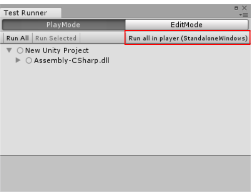
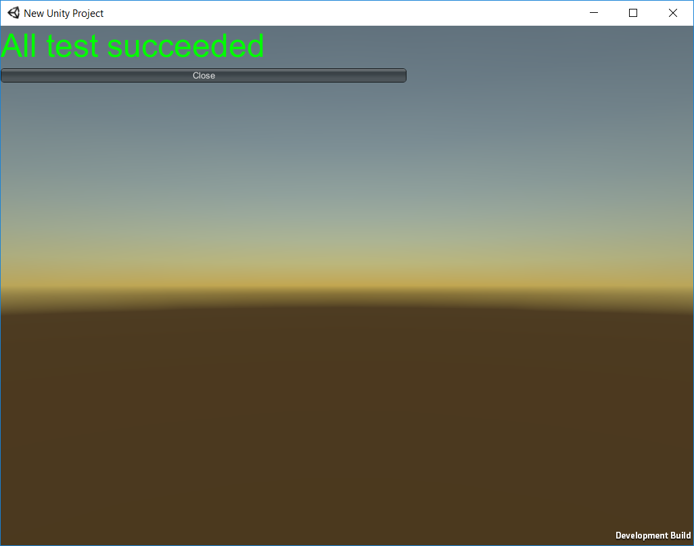

# 在 Unity Test Runner 中编写和执行测试

Unity Test Runner 在 __Edit__ 模式和 __Play__ 模式下以及在目标平台（如独立平台、Android 或 iOS）上测试您的代码。

本页面上的文档将讨论在 Unity Test Runner 中编写和执行测试，并假设您了解[脚本](CreatingAndUsingScripts.html)和 [Unity Test Runner](testing-editortestsrunner.html)。

Unity 以 XML 格式提供测试结果。有关更多信息，请参阅有关 [NUnit 文档关于 XML 格式测试结果的说明](https://github.com/nunit/docs/wiki/Test-Result-XML-Format)。

## UnityTestAttribute

[UnityTestAttribute](../ScriptReference/TestTools.UnityTestAttribute.html) 要求您返回 `IEnumerator`。在 __Play__ 模式下，以[协程](../ScriptReference/Coroutine.html)的形式执行测试。在 __Edit__ 模式下，可从测试中产生 `null`，这将跳过当前帧。

__注意：__WebGL 和 WSA 平台不支持 `UnityTestAttribute`。

### 常规 NUnit 测试（在 Edit 模式和 Play 模式下运行）

```
[Test]
public void GameObject_CreatedWithGiven_WillHaveTheName()
{
    var go = new GameObject("MyGameObject");
    Assert.AreEqual("MyGameObject", go.name);
}
```

### Play 模式下的示例

```
[UnityTest]
public IEnumerator GameObject_WithRigidBody_WillBeAffectedByPhysics()
{
    var go = new GameObject();
    go.AddComponent<Rigidbody>();
    var originalPosition = go.transform.position.y;

    yield return new WaitForFixedUpdate();

    Assert.AreNotEqual(originalPosition, go.transform.position.y);
}
```

### Edit 模式下的示例：

```
[UnityTest]
public IEnumerator EditorUtility_WhenExecuted_ReturnsSuccess()
{
    var utility = RunEditorUtilityInTheBackgroud();

    while (utility.isRunning)
    {
        yield return null;
    }

    Assert.IsTrue(utility.isSuccess);
}
```

## UnityPlatformAttribute

使用 [UnityPlatformAttribute](../ScriptReference/TestTools.UnityPlatformAttribute.html) 可根据执行平台来过滤测试。行为类似于 [NUnit ](http://nunit.org/docs/2.5/platform.html)[PlatformAttribute](http://nunit.org/docs/2.5/platform.html)。

```
[Test]
[UnityPlatform (RuntimePlatform.WindowsPlayer)]
public void TestMethod1()
{
   Assert.AreEqual(Application.platform, RuntimePlatform.WindowsPlayer);
}

[Test]
[UnityPlatform(exclude = new[] {RuntimePlatform.WindowsEditor })]
public void TestMethod2()
{
   Assert.AreNotEqual(Application.platform, RuntimePlatform.WindowsEditor);
}
```

要仅在给定平台上执行 Editor 测试，还可以使用 `UnityPlatform`。

### PrebuildSetupAttriubte

如果需要在测试开始之前执行任何额外设置，请使用 [PrebuildSetupAttribute](../ScriptReference/TestTools.PrebuildSetupAttribute.html)。为此，请指定用于实现 [IPrebuildSetup](../ScriptReference/TestTools.IPrebuildSetup.html) 接口的类类型。如果需要运行整个类的设置代码（例如，如果要在测试开始之前执行某些代码，如资源准备或特定测试所需的设置），请在用于测试的类中实现 `IPrebuildSetup` 接口。

```
public class TestsWithPrebuildStep : IPrebuildSetup
{
    public void Setup()
    {
        // 在执行测试之前运行此代码
    }

    [Test]
    //可跳过 PrebuildSetupAttribute，因为它已在同一个类中实现
    [PrebuildSetup(typeof(TestsWithPrebuildStep))]
    public void Test()
    {
        (...)
    }
}
```

在进入 Play 模式或构建播放器之前执行 `IPrebuildSetup` 代码。安装程序可使用 UnityEditor 命名空间及其函数，但为了避免编译错误，必须将其放在 *Editor* 文件夹中，或使用 `#if UNITY_EDITOR` 指令对其进行保护。

## LogAssert

如果 Unity 记录除常规日志或警告消息之外的消息，表明测试失败。使用 [LogAssert](../ScriptReference/TestTools.LogAssert.html) 类可在日志中发出一条预期的消息，确保在 Unity 记录该消息时测试不会失败。

如果未显示预期消息，或者 Unity 未记录任何常规日志或警告消息，测试也会报告为失败。

### 示例

```
[Test]
public void LogAssertExample()
{
    //预期会出现一条常规日志消息
    LogAssert.Expect(LogType.Log, "Log message");
    //预期会出现一条日志消息，如果没有以下行，
    //测试将失败
    Debug.Log("Log message");
    //输出错误日志
    Debug.LogError("Error message");
    //如果不做错误日志的预期，测试将失败
    LogAssert.Expect(LogType.Error, "Error message");
}
```

## MonoBehaviourTest

[MonoBehaviourTest](../ScriptReference/TestTools.MonoBehaviourTest_1.html) 是一个[协程](../ScriptReference/Coroutine.html)，也是编写 [MonoBehaviour](../ScriptReference/MonoBehaviour.html) 测试的 helper 函数。从 [UnityTest](../ScriptReference/TestTools.UnityTestAttribute.html) 属性中生成 `MonoBehaviourTest` 即可实例化指定的 MonoBehaviour 并等待其完成执行。实现 [IMonoBehaviourTest](../ScriptReference/TestTools.IMonoBehaviourTest.html) 接口可指示测试何时完成。

### 示例

```
[UnityTest]
public IEnumerator MonoBehaviourTest_Works()
{
    yield return new MonoBehaviourTest<MyMonoBehaviourTest>();
}

public class MyMonoBehaviourTest : MonoBehaviour, IMonoBehaviourTest
{
    private int frameCount;
    public bool IsTestFinished
    {
        get { return frameCount > 10; }
    }

     void Update()
     {
        frameCount++;
     }
}
```

## 在平台上运行测试

在 __Play__ 模式下，可在特定平台上运行测试。目标平台始终是在 [Build Settings](BuildSettings.html)（菜单：__File__ > __Build Settings__）中选择的当前平台。单击 __Run all in the player__ 即可在当前激活的目标平台上构建并运行测试。

请注意，当前的平台会显示在按钮上的括号中。例如，在下面的截屏中，按钮显示为 __Run all in player (StandaloneWindows)__，因为当前平台是 Windows。

 

测试完成后，测试结果将立即显示在构建中。

 

要将测试结果从平台传送到运行测试的 Editor，两者需要在同一网络上。在平台上运行的应用程序将回报测试结果，显示执行的测试，并关闭。

请注意，有些平台不支持使用 [Application.Quit](../ScriptReference/Application.Quit.html) 关闭应用程序。这些平台在报告测试结果后继续运行应用程序。

如果 Unity 无法实例化连接，您可以直观地看到测试在正在运行的应用程序中成功。请注意，在此状态下，使用参数在平台上运行测试不会提供 XML 测试结果。

## 从命令行中运行

要执行此操作，请使用以下[命令行](CommandLineArguments.html)[参数](CommandLineArguments.html)运行 Unity：

* `runTest` - 在项目中执行测试。

* `testPlatform` - 要运行测试的平台。

    * 可用平台：

        * `playmode` 和 `editmode`。请注意，如果未指定，则默认情况下，测试在 `editmode` 中运行。

        * 平台/类型约定来自 [BuildTarget](../ScriptReference/BuildTarget.html) 枚举。经过测试且官方支持的平台：

            * [StandaloneWindows](../ScriptReference/BuildTarget.StandaloneWindows.html)

            * [StandaloneWindows64](../ScriptReference/BuildTarget.StandaloneWindows64.html)

            * [StandaloneOSXIntel](../ScriptReference/BuildTarget.StandaloneOSXIntel.html)

            * [StandaloneOSXIntel64](../ScriptReference/BuildTarget.StandaloneOSXIntel64.html)

            * [iOS](../ScriptReference/BuildTarget.iOS.html)

            * [tvOS](../ScriptReference/BuildTarget.tvOS.html)

            * [Android](../ScriptReference/BuildTarget.Android.html)

            * [PS4](../ScriptReference/BuildTarget.PS4.html)

            * [XboxOne](../ScriptReference/BuildTarget.XboxOne.html)

* `testResults` - 指示 Unity 应保存结果文件的路径。默认情况下，Unity 将其保存在项目的根文件夹中。

### 示例

以下示例可在 Windows 上显示一个命令行参数。具体代码行可能因操作系统而异。


```
>Unity.exe -runTests -projectPath PATH_TO_YOUR_PROJECT -testResults C:\temp\results.xml -testPlatform editmode
```

__提示：__在 Windows 上，为了读取已执行命令的结果代码，请运行以下命令：

`start /WAIT Unity.exe ARGUMENT_LIST`

## 比较实用程序

[UnityEngine.TestTools.Utils](../ScriptReference/TestTools.Utils.Utils.html) 命名空间包含实用程序类以便使用 NUnit 约束来比较 [Vector2](../ScriptReference/Vector2.html)、[Vector3](../ScriptReference/Vector3.html)、[Vector4](../ScriptReference/Vector4.html)、[Quaternion](../ScriptReference/Quaternion.html)、[Color](../ScriptReference/Color.html) 和 `float` 类型。

---

* <span class="page-edit"> 2018-03-21  Page amended with [editorial review](DocumentationEditorialReview.html)
</span>
