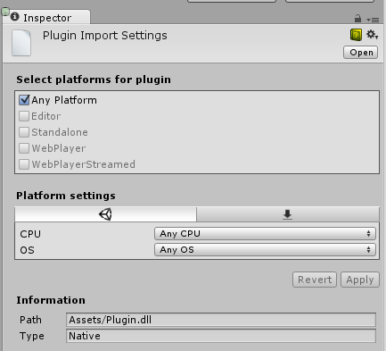

#Plugin Inspector

Plugin Inspector 用于选择和管理项目插件的目标平台。只需选择一个插件文件即可查看其 Inspector。

在 __Select platforms for plugin__ 下，通过选中相应的复选框选择要使用该插件的平台。如果选中 __Any Platform__，该插件将应用于所有平台，包括 Unity Editor。

选择平台后，可从下面单独的 __Platform Settings__ 部分中选择其他选项，例如 CPU 类型和特定操作系统。此处包含通过复选框选定的每个平台的选项卡。大多数平台没有设置，或只有少数设置（例如 CPU 和操作系统选择）。

在 `PluginImporter::CanLoadPathNameFile()` 中可以找到被视为插件并会在 Unity Editor 中显示 Plugin Inspector 的文件扩展名的当前列表。以下文件扩展名表示将文件视为插件：

* .dll
* .winmd
* .so
* .jar
* .aar
* .xex
* .def
* .suprx
* .prx
* .sprx
* .rpl
* .cpp
* .cc
* .c
* .h
* .jslib
* .jspre
* .bc
* .a
* .m
* .mm
* .swift
* .xib

某些文件夹被视为单个捆绑包插件。此类文件夹中不会检测到其他插件。以下扩展名表示将文件夹视为捆绑包插件：

* .framework
* .bundle
* .plugin

## 默认设置
为了方便从早期 Unity 版本进行转换，Unity 将尝试根据插件所在的文件夹来设定默认插件设置。

| **文件夹** | **默认设置** |
|:---|:---|
|**Assets/\../Editor**| 将插件设置为仅与 Editor 兼容，在构建到平台时不会使用。|
|**Assets/\../Editor/**（**x86** 或 **x86_64** 或 **x64**）| 将插件设置为仅与 Editor 兼容，根据子文件夹分配 CPU 值。|
|**Assets/\../Plugins/**（**x86_64** 或 **x64**）| 将 x64 独立平台插件设置为兼容。|
|**Assets/\../Plugins/x86**| 将 x86 独立平台插件设置为兼容。|
|**Assets/Plugins/Android/**（**x86** 或 **armeabi** 或 **armeabi-v7a**）| 将插件设置为仅与 Android 兼容，如果存在 CPU 子文件夹，还会设置 CPU 值。|
|**Assets/Plugins/iOS**| 将插件设置为仅与 iOS 兼容。|
|**Assets/Plugins/WSA/**（**x86** 或 **ARM**） | 将插件设置为仅与通用 Windows 平台兼容，如果存在 CPU 子文件夹，还会设置 CPU 值。可使用 Metro 关键字代替 WSA。|
|**Assets/Plugins/WSA/**（**SDK80** 或 **SDK81** 或 **PhoneSDK81**）| 同上，还会设置 SDK 值，此后也可以添加 CPU 子文件夹。出于兼容性原因，SDK81 - Win81，PhoneSDK81 - WindowsPhone81。|
|**Assets/Plugins/Tizen**| 将插件设置为仅与 Tizen 兼容。|
|**Assets/Plugins/PSVita**| 将插件设置为仅与 Playstation Vita 兼容。|
|**Assets/Plugins/PS4**| 将插件设置为仅与 Playstation 4 兼容。|

## 特定于设备的设置

####Editor 设置

例如，如果选择 **CPU X86**，则插件将仅用于 **32 位 Editor**，而不会用于 **64 位 Editor**。

如果选择 **OS Windows**，则插件将仅用于 **Windows Editor**，而不会用于 **OS X Editor**。

#### 独立平台设置
请参阅[独立平台播放器设置](class-PlayerSettingsStandalone.html)。

#### 通用 Windows 平台
请参阅：

* [通用 Windows 平台：.NET 脚本后端上的插件](windowsstore-plugins.html "Plugins")

* [通用 Windows 平台：IL2CPP 脚本后端上的插件](windowsstore-plugins-il2cpp.html "Plugins")

#### Android
目标构建平台为 Android 时，父级路径与 __Assets/Plugins/Android/__ 完全匹配的文件夹将被视为 Android 库插件文件夹。然后，对这些文件夹的处理方式与具有特殊扩展名 .plugin、.bundle 和 .framework 的文件夹相同。

#### iOS

---

* 2017-11-20  Page amended with no [editorial review](DocumentationEditorialReview.html)
 

* 删除了三星电视支持。

