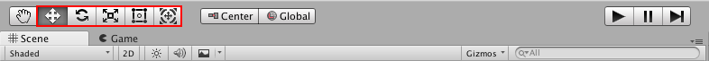
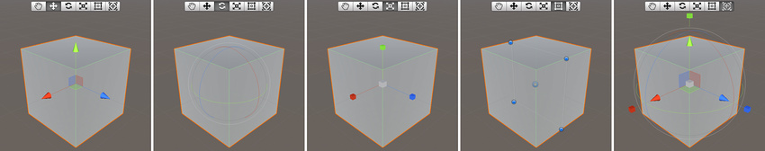
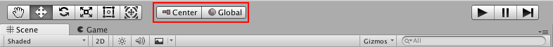

# 游戏对象定位

要选择游戏对象，请在 [Scene 视图](UsingTheSceneView.html)中单击该游戏对象，或在 [Hierarchy 窗口](Hierarchy.html)中单击其名称。要选择或取消选择多个游戏对象，请在单击时按住 __Shift__ 键，或拖拽一个矩形来框选多个游戏对象。

选择的游戏对象在 Scene 视图中将突出显示。默认情况下，此突出显示效果是围绕游戏对象的橙色轮廓；要更改突出显示的颜色和样式，请选择 __Unity__ > __Preferences__ > __Color__，然后编辑 __Selected Wireframe__ 和 __Selected Outline__ 颜色。请参阅有关 [Gizmo 菜单](GizmosMenu.html)的文档以进一步了解轮廓和线框选择可视化。如果选择了四个变换组件工具之一，则选择的游戏对象还会在 Scene 视图中显示__辅助图标__：

## 移动、旋转、缩放和矩形变换

 

工具栏中的第一个工具__手形工具 (Hand Tool)__ 用于平移场景。__移动 (Move)__、__旋转 (Rotate)__、__缩放 (Scale)__、__矩形变换 (Rect Transform)__ 和__变换 (Transform)__ 工具用于编辑各个游戏对象。要更改游戏对象的[变换](class-Transform.html)组件，请使用鼠标操纵任何辅助图标轴，或直接在 Inspector 中的__变换__组件的数字字段中输入值。

或者，也可以使用热键选择四个__变换__模式之一：__W__ 表示移动，__E__ 表示旋转，__R__ 表示缩放，__T__ 表示矩形变换，__Y__ 表示变换。

### 移动
在__移动__辅助图标的中心，有三个小方块可用于在单个平面内拖动游戏对象（意味着可一次移动两个轴，而第三个保持静止）。

如果在移动辅助图标的中心单击并拖动时按住 Shift，则辅助图标的中心将变为平面方块。平面方块表示可相对于 Scene 视图摄像机所面向的方向在平面上移动游戏对象。

### 旋转

选择__旋转__工具后，通过单击并拖动围绕游戏对象显示的线框球体辅助图标的轴来更改游戏对象的旋转。与移动辅助图标一样，更改的最后一个轴将显示为黄色。红色、绿色和蓝色圆圈可视为围绕在移动模式中出现的红色、绿色和蓝色轴进行旋转（红色表示 x 轴，绿色表示 y 轴，蓝色表示 z 轴）。最后，使用最外面的圆圈围绕 Scene 视图 z 轴旋转游戏对象。可将此行为视为在屏幕空间中旋转。

### 缩放

使用__缩放__工具，可通过单击并拖动辅助图标中心的立方体，在所有轴上均匀地重新缩放游戏对象。也可以单独缩放每个轴，但如果在有子游戏对象的情况下执行此操作，则应该注意，因为效果看起来会很奇怪。

### 矩形变换

[矩形变换](class-RectTransform.html)通常用于定位 2D 元素（如精灵或 [UI 元素](UIBasicLayout.html)），但也可用于操作 3D 游戏对象。此工具将移动、缩放和旋转功能整合到了同一个辅助图标中：

* 在矩形辅助图标中单击并拖动可移动游戏对象。
* 单击并拖动矩形辅助图标的任何角或边可缩放游戏对象。
* 拖动某条边可沿一个轴缩放游戏对象。
* 拖动某个角可在两个轴上缩放游戏对象。
* 要旋转游戏对象，请将光标放在矩形的某个角之外。光标变为显示旋转图标。单击并从此区域拖动可旋转游戏对象。

请注意，在 2D 模式下，无法使用辅助图标更改场景中的 z 轴。但是，某些脚本技术可将 z 轴用于其他目的，因此仍然可以使用 Inspector 中的变换组件设置 z 轴。

有关变换游戏对象的更多信息，请参阅关于[变换组件](class-Transform.html)的文档。

###变换

__变换__工具组合了__移动__、__旋转__和__缩放__工具。该工具的辅助图标提供了用于移动和旋转的控制柄。当 __Tool Handle Rotation__ 设置为 __Local__（见下方）时，变换组件工具还提供用于缩放所选游戏对象的控制柄。

## 辅助图标控制柄位置开关

 

__辅助图标控制柄位置开关__可定义变换组件工具辅助图标的位置以及用于操纵辅助图标本身的控制柄。

### 位置

单击左侧的 __Pivot__/__Center__ 按钮可在 __Pivot__ 和 __Center__ 之间切换。

* __Pivot__ 将辅助图标定位在网格的实际轴心点。
* __Center__ 将辅助图标定位在游戏对象渲染边界的中心。

### 旋转

单击右侧的 __Local__/__Global__ 按钮可在 __Local__ 和 __Global__ 之间切换。

* __Local__ 保持辅助图标相对于游戏对象的旋转。
* __Global__ 将辅助图标固定在世界空间方向。

### 单位对齐

使用__移动__工具或__变换__工具拖动任何辅助图标轴时，按住 __Control__ 键（Mac 上为 __Command__ 键）可对齐到 __Snap Settings__（菜单：__Edit__ > __Snap Settings...__）中定义的增量

 

### 表面对齐

使用__移动__工具或__变换__工具在中心拖动时，按住 __Shift__ 和 __Control__（Mac 上为 __Command__）可快速将游戏对象对齐到任何__碰撞体__的交叉点。

### 观察旋转

使用__旋转__工具或__变换__工具时，按住 __Shift__ 和 __Control__（Mac 上为 __Command__）可将游戏对象朝任何__碰撞体__表面上的一个点旋转。

### 顶点对齐

使用__顶点对齐__可快速组合场景：从给定的网格中获取任何顶点，并将该顶点放置在与您选择的任何其他网格中的任何顶点相同的位置。例如，使用顶点对齐在赛车游戏中精确对齐路段，或者在网格的顶点定位能量块。

按照以下步骤使用顶点对齐：

1.选择要操作的网格，并确保__移动__工具或__变换__工具处于活动状态。

2.按住 __V__ 键激活顶点对齐模式。

3.将光标移动到网格上要用作轴心点的顶点上。

4.当光标位于所需顶点上方时按住鼠标左键，将网格拖动到另一个网格上的任何其他顶点旁边。

5.对结果感到满意时，松开鼠标按键和 __V__ 键（__Shift+V__ 用作此功能的开关）。

**注意：**可将顶点对齐到顶点，将顶点对齐到表面，将轴心对齐到顶点。

### 屏幕空间变换

使用__变换__工具时，按住 __Shift__ 键启用屏幕空间 (Screen Space) 模式。当游戏对象出现在屏幕上而不是在场景中时，可使用此模式来移动、旋转和缩放游戏对象。

---

* 在 [2017.3](https://docs.unity3d.com/2017.3/Documentation/Manual/30_search.html?q=newin20173) 中添加了变换组件工具 NewIn20173

*  2017-05-18  Page amended with [editorial review](DocumentationEditorialReview.html)

