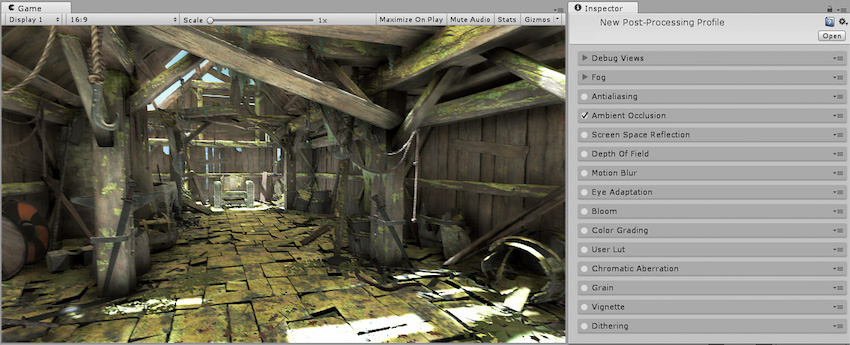
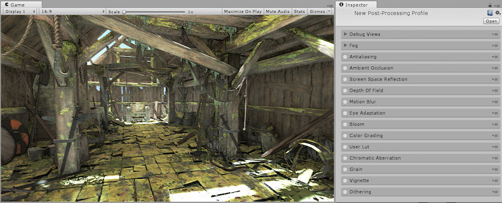

## 环境光遮蔽

本页的效果描述是指在后期处理堆栈中找到的默认效果。

环境光遮挡后处理效果作为全屏幕后处理效果，非常接近实时的[环境光遮挡](http://en.wikipedia.org/wiki/Ambient_occlusion)。挨着折痕线、小孔、相交线和平行表面的地方变暗。在现实生活中，这些区域往往会阻挡或遮挡周围的光线，因此它们会显得更暗。

请注意，在处理时间方面，环境遮挡效果非常昂贵，一般只能在桌面平台硬件或游戏主机硬件上使用。它的成本完全依赖于屏幕分辨率和效果参数，而不像真正的环境遮挡一样依赖于场景的复杂性。

### 属性

| __属性：__| __功能：__ |
|:---|:---| 
| __Intensity__| 效果产生的黑暗程度。 |
| __Radius__| 采样点的半径，影响变暗区域的范围。 |
| __Sample Count__| 采样点数量，影响质量和性能。 |
| __Downsampling__| 将效果的分辨率减半，以牺牲视觉质量为代价提高性能。 |
| __Force Forward Compatibility__| 使用延迟渲染路径时强制与前向渲染对象兼容。 |
| __High Precision (Forward)__| 允许借助前向渲染路径使用更高精度的深度纹理（可能会影响性能）。对延迟渲染路径没有影响。 |
| __Ambient Only__| 启用仅环境模式，此情况下的效果仅影响环境光照。此模式仅适用于延迟渲染路径和 HDR 渲染。 |

### 优化

* 减小半径大小

* 减少样本数量

* 启用 Downsampling

* 如果使用延迟渲染，请禁用 Force Forward Compatibility（这样会在计算环境光遮挡时不使用前向渲染对象）

* 如果使用前向渲染，请禁用 High Precision（这样将使效果使用较低精度的深度纹理，因此会影响视觉质量）

### 详细信息

请注意，此效果的成本可能会非常高，尤其是在非常靠近摄像机的情况下观看时。因此，建议始终启用 Downsampling 并选用较小的半径设置。在半径较小的情况下，环境光遮挡效果将仅对裁剪空间中靠近源像素的像素进行采样，这有利于提高性能，因为可以高效缓存这些像素。使用较大的半径时，生成的样本将距离源像素更远，并且不会受益于缓存，从而减慢效果的运行速度。由于摄像机的视角原因，前平面附近的对象将使用比远处的对象更大的半径，因此计算靠近摄像机的对象的环境光遮挡 pass 时，计算速度低于仅占据屏幕几个像素的较远对象。

使用延迟渲染路径时，可将环境光遮挡直接渲染到环境 G 缓冲区，以便 Unity 在光照 pass 期间考虑其影响。请注意，此设置要求摄像机启用 HDR。

当使用前向渲染路径时，您可能会遇到一些关于深度精度的质量问题。可通过切换 High Precision 选项来克服这些问题，但只有在真正需要时才应这样做，因为启用此选项会降低性能。

### 要求

* 深度和法线纹理

* Shader Model 3

请参阅[图形硬件功能和仿真](GraphicsEmulation.html)页面，查看更多详细信息和兼容硬件列表。

---

*  2017-05-24  Page published with no [editorial review](DocumentationEditorialReview.html)

* 5.6 中的新功能
