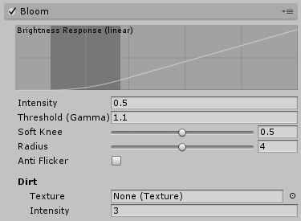
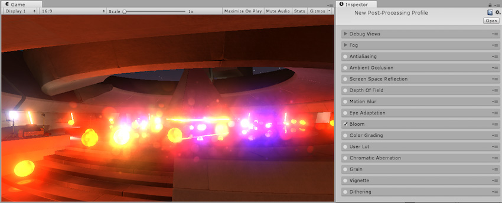

## 泛光 (Bloom)

本页的效果描述是指在后期处理堆栈中找到的默认效果。

泛光是用于再现真实摄像机成像瑕疵的效果。该效果会产生从图像明亮区域边界向外延伸的光线条纹，给人的感觉是极其明亮的光线压制住了摄像机或是透过眼睛看到该场景。

在 HDR 渲染中，泛光效果应当仅影响亮度高于 LDR 范围（大于 1）的区域（通过将 __Threshold__ 参数设置为高于此值）。

### 属性

| __属性：__| __功能：__ |
|:---|:---| 
| __Intensity__| 泛光过滤器的强度。 |
| __Threshold__| 滤除低于此亮度级别的像素。 |
| __Soft Knee__| 使下限/上限阈值之间的过渡为渐变过渡（0 = 硬阈值，1 = 软阈值）。 |
| __Radius__| 使用与屏幕分辨率无关的方式改变模糊效果的范围。 |
| __Anti Flicker__| 使用额外的过滤器降低闪烁噪点。 |

### 优化

* 减小半径

### 详细信息

对于正确曝光的 HDR 场景，__Threshold__ 应设置为 ~1，以便只有值大于 1 的像素才会渗入周围对象。在使用 LDR 时，您可能希望丢弃此值，否则效果将不可见。

__Anti Flicker__ 通过预先在图片上运行额外的过滤器来减少闪烁噪点（通常称为“萤火虫”）。此选项将影响性能，在启用[时间抗锯齿 (Temporal Anti-aliasing)](PostProcessing-Antialiasing.html) 的情况下应将其禁用。

## 镜头脏污 (Lens Dirt)

__镜头脏污__应用全屏污迹或灰尘层来衍射泛光效果。常用于现代第一人称射击游戏。

### 属性

| __属性：__| __功能：__ |
|:---|:---| 
| __Texture__| 用于为镜头添加污迹或灰尘的脏污纹理。 |
| __Intensity__| 镜头脏污程度 |

### 优化

* 降低__镜头脏污__纹理的分辨率

### 详细信息

__镜头脏污__需要输入纹理才能用作全屏层。[后期处理栈](PostProcessing-Stack.html)中提供了四种__镜头脏污__纹理，应该能涵盖常见用例。这些纹理以 3840x2160 分辨率提供以实现最高质量，并应根据项目和平台进行缩放。您可以在任何图像编辑软件中创建自定义__镜头脏污__纹理。

### 要求

* Shader Model 3

请参阅[图形硬件功能和仿真](GraphicsEmulation.html)页面，查看更多详细信息和兼容硬件列表。

---

*  2017-05-24  Page published with no [editorial review](DocumentationEditorialReview.html)

* 5.6 中的新功能
