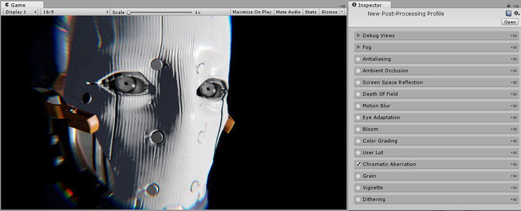
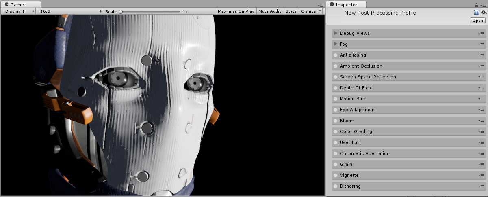
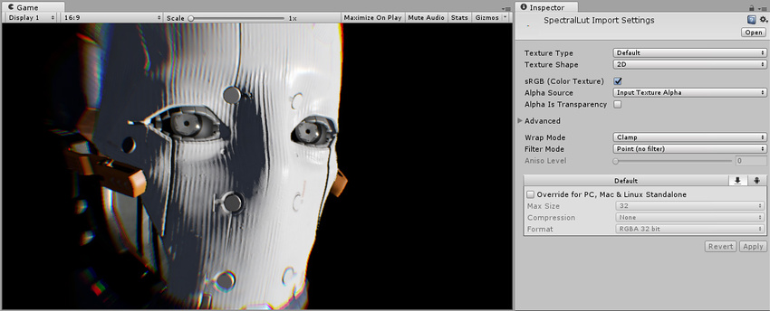

## 色差 (Chromatic Aberration)

本页的效果描述是指在后期处理堆栈中找到的默认效果。

在摄影中，色差是由于摄像机镜头未能将所有颜色会聚到同一个点而产生的结果。它沿着图像明暗分隔边界显示为“条纹”。

色差效果用于复现这种摄像机缺陷，此外还经常用于产生艺术效果，如摄像机碰撞或中毒效果。该实现方案支持红/蓝和绿/紫边纹以及通过输入纹理支持用户定义的颜色边纹。

### 属性

| __属性：__| __功能：__ |
|:---|:---| 
| __Intensity__| 色差强度。 |
| __Spectral Texture__| 用于自定义边纹颜色的纹理（留空时将使用默认值） |

### 优化

* 降低 __Intensity__

### 详细信息

性能取决于 __Intensity__ 值（此值越高，渲染速度越慢，因为它需要更多样本来渲染平滑的色差）。

色差使用 __Spectral Texture__ 输入进行自定义边缘处理。通过[后期处理栈](PostProcessing-Stack.html)提供了四个示例光谱纹理：

* 红/蓝（默认值）

* 蓝/红

* 绿/紫

* 紫/绿

可以在任何图像编辑软件中创建自定义光谱纹理。__光谱纹理__分辨率不受约束，但建议尽可能小（例如提供 3x1 纹理）。

通过手动将输入纹理的 __Filter Mode__ 设置为 __Point (no filter)__，可实现不太平滑的效果。

### 要求

* Shader Model 3

请参阅[图形硬件功能和仿真](GraphicsEmulation.html)页面，查看更多详细信息和兼容硬件列表。

---

*  2017-05-24  Page published with no [editorial review](DocumentationEditorialReview.html)

* 5.6 中的新功能
