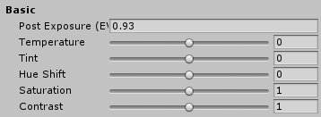
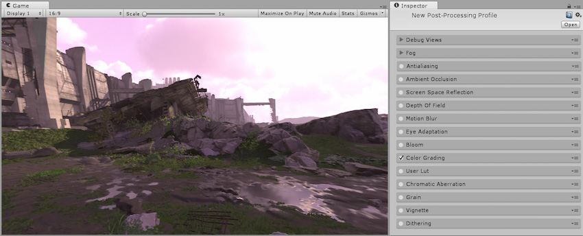
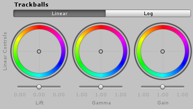
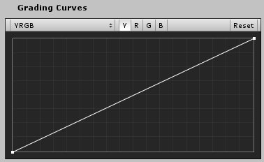
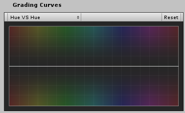
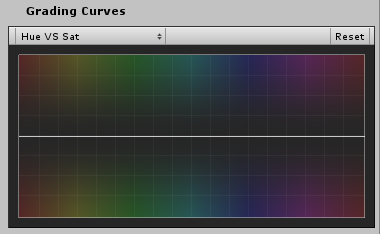
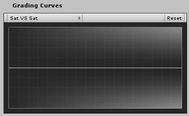
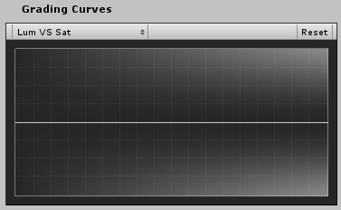

## 颜色分级 (Color Grading)

本页的效果描述是指在后期处理堆栈中找到的默认效果。

颜色分级是改变或校正最终图像的颜色和亮度的过程。可将其想象为在 Instagram 等软件中应用滤镜。

后期处理栈中包含的颜色分级工具是完全实时的 HDR 工具，且内部处理在 [ACES](http://www.oscars.org/science-technology/sci-tech-projects/aces) 颜色空间中完成。

后期处理栈中提供的颜色分级工具分为五个部分：

* 色调映射 (Tonemapping)

* 基本 (Basic)

* 通道混合器 (Channel Mixer)

* 轨迹球 (Trackballs)

* 分级曲线 (Grading Curves)

### 要求

* RGBAHalf 纹理格式

* Shader Model 3

请参阅[图形硬件功能和仿真](GraphicsEmulation.html)页面，查看更多详细信息和兼容硬件列表。

## 色调映射

色调映射是将图像的 HDR 值重新映射到适合在屏幕上显示的范围内的过程。使用 HDR 摄像机时应始终应用色调映射，否则会将高于 1 的颜色强度值钳制为 1，从而改变场景亮度平衡。

后期处理栈附带提供三种色调映射模式：

* None（不应用色调映射；在 LDR 中工作时选择此项）

* Neutral

* Filmic (ACES)

## Neutral Tonemapper

Neutral Tonemapper（中性色调映射器）仅进行范围重新映射，对色调和饱和度的影响最小，通常作为进行广泛颜色分级的良好起点。此色调映射器基于 John Hable 和 Jim Hejl 的成果，提供了对色调映射曲线的完全参数控制，是大多数情况下使用的推荐色调映射器。

### 属性

| __属性：__| __功能：__ |
|:---|:---| 
| __Black In__| 黑点的内控点。 |
| __White In__| 白点的内控点。 |
| __Black Out__| 黑点的外控点。 |
| __White Out__| 白点的外控点。 |
| __White Level__| 预曲线白点调整。 |
| __White Clip__| 后曲线白点调整。 |

## Filmic (ACES) Tonemapper

Filmic (ACES) Tonemapper 使用参考 ACES 色调映射器的近似值来获得更强的电影效果。因此，该选项比中性 (Neutral) 选项更具对比度，并对实际色调和饱和度有影响。这种色调映射器最简单易用，因为它不需要用户输入就可以为场景提供标准的电影效果。

## 基本 (Basic)

Basic 部分提供最简单的颜色分级工具，如温度 (Temperature) 和对比度 (Contrast)。这是进行颜色校正的推荐起点。

### 属性

| __属性：__| __功能：__ |
|:---|:---| 
| __Post Exposure__| 调整场景的整体曝光（以 EV 为单位）。此设置在 HDR 效果之后和色调映射之前应用，因此不会影响链中的先前效果。 |
| __Temperature__| 将白平衡设置为自定义色温。 |
| __Tint__| 设置白平衡以补偿绿色或洋红色。 |
| __Hue Shift__| 改变所有颜色的色调。 |
| __Saturation__| 推动所有颜色的强度。 |
| __Contrast__| 扩大或缩小音调值的整体范围。 |

## 通道混合器 (Channel Mixer)

通道混合器用于修改每个输入颜色通道对输出通道整体混合的影响。例如，增加绿色通道对红色通道整体混合的影响将调整包含绿色（包括中性/单色）的图像的所有区域，使其在色调中变得更偏红。

### 属性

| __属性：__| __功能：__ |
|:---|:---| 
| __Channel__| 选择要修改的输出通道 |
| __Red__| 修改整个混合中红色通道的影响 |
| __Green__| 修改整个混合中绿色通道的影响 |
| __Blue__| 修改整个混合中蓝色通道的影响 |

## 轨迹球 (Trackballs)

轨迹球用于在线性 (Linear) 或对数 (Log) 空间中执行三向颜色分级。在 LDR 中工作时，建议使用线性轨迹球以获得更好的体验。在 HDR 中工作时，建议使用对数轨迹球以实现更好的控制，但线性轨迹球仍然有用。

调整轨迹球上点的位置具有在给定色调范围内将图像色调移向该颜色的效果。不同的轨迹球用于影响图像内的不同范围。调整轨迹球下方的滑动条会偏移该范围的颜色亮度

## 对数 (Log)

对数模式分级可压缩颜色和对比度图像数据的分布，从而模拟可由光学胶片打印机完成的颜色调整过程。这种方式通常是进行类似胶片分级的首选方式，强烈建议在使用 HDR 值时选用此选项。

### 属性

| __属性：__| __功能：__ |
|:---|:---| 
| __Slope__| 增益函数 |
| __Power__| 伽马函数 |
| __Offset__| 对整个信号进行移位 |

## 线性 (Linear)

这是对数控制的另一种优化的三向变换，可处理线性编码的数据。在 LDR 中工作时首选此方法。

### 属性

| __属性：__| __功能：__ |
|:---|:---| 
| __Lift__| 将整个信号进行更高或更低的移位。对阴影有更明显的影响。 |
| __Gamma__| 控制中音音调的幂函数。 |
| __Gain__| 增加信号。使高光更加明亮 |

## 分级曲线 (Grading Curves)

渐变曲线（也称为对比曲线）是一种调整图像色调、饱和度或亮度的特定范围的高级方法。通过调整五个图形上的曲线，即可实现特定色调替换的效果，使某些亮度降低等等。

后期处理栈中提供了五种分级曲线类型：

* YRGB

* Hue vs Hue

* Hue vs Sat

* Sat vs Sat

* Lum vs Sat

## YRGB 曲线

影响整个图像中选定的输入通道强度。可在 Y、R、G 和 B 之间选择输入通道，其中 Y 是应用于所有通道的全局强度偏移。图的 X 轴表示输入强度，Y 轴表示输出强度。这可用于进一步调整基本属性（如对比度和亮度）的外观。

## Hue vs Hue 曲线

用于在特定范围内进行色调移位。该曲线根据输出色调（Y 轴）移动输入色调（X 轴）。这可用于微调特定范围的色调或执行颜色替换。

## Hue vs Sat 曲线

用于调整特定范围内色调的饱和度。该曲线根据输入色调（X 轴）调整饱和度（Y 轴）。这可用于调低特别明亮的区域或创建艺术效果，例如除单一主色外的单色。

## Sat vs Sat 曲线

用于调整某些饱和度区域的饱和度。该曲线根据输入饱和度（X 轴）调整饱和度（Y 轴）。这可用于微调使用基本颜色分级进行的饱和度调整。

## Lum vs Sat 曲线

用于调整某些亮度区域的饱和度。该曲线根据输入亮度（X 轴）调整饱和度（Y 轴）。这可用于使黑暗区域去饱和，从而提供有趣的视觉对比。

---

*  2017-05-24  Page published with no [editorial review](DocumentationEditorialReview.html)

* 5.6 中的新功能
