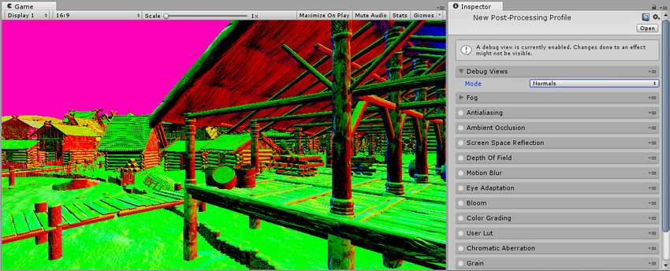
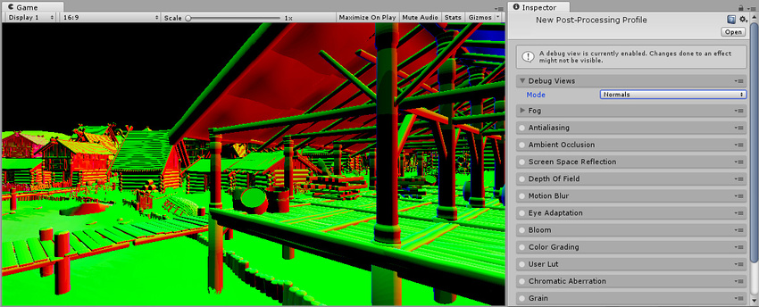
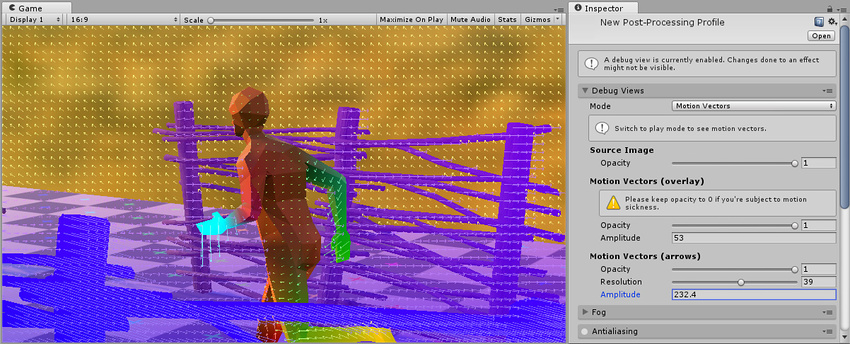
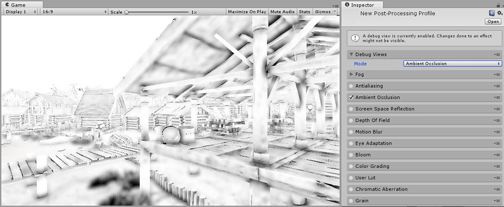
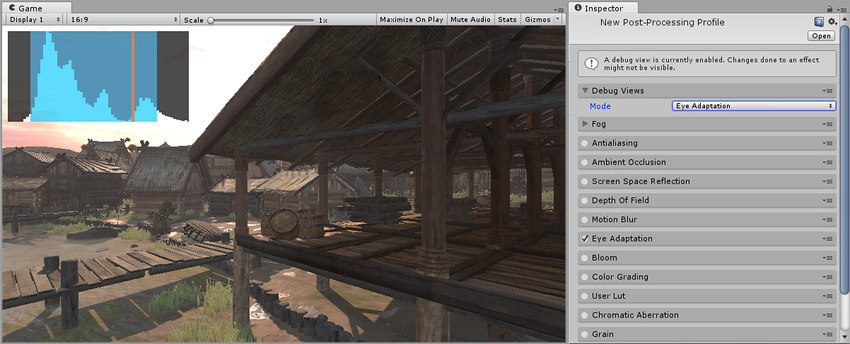
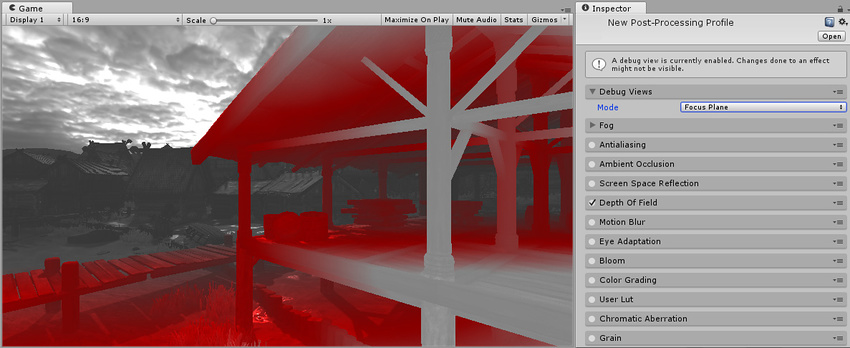
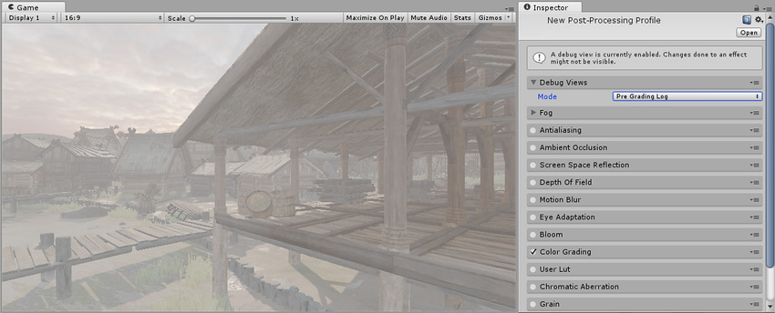
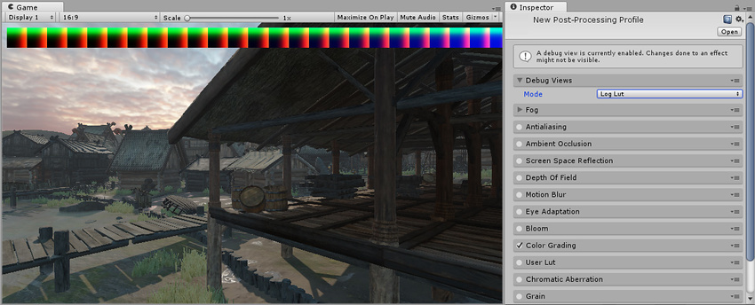
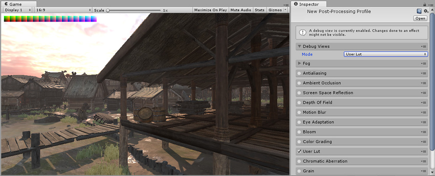

## 调试视图

[后期处理栈](PostProcessing-Stack.html)附带一系列调试视图，用于查看特定效果或 pass（如深度、法线和运动矢量）。这些视图可在后期处理配置文件的顶部找到。调试视图将影响其他效果在 Game 视图中的应用。

后期处理栈中包含的调试视图为：

* Depth

* Normals

* Motion Vectors

* Ambient Occlusion

* Eye Adaptation

* Focus Plane

* Pre Grading Log

* Log Lut

* User Lut

### 属性

| __属性：__| __功能：__ |
|:---|:---| 
| __Mode__| 当前选择的调试视图 |

### Depth

Depth 调试视图显示屏幕上像素的深度值。通过调整 Scale 值可以移动这些值以便于查看。

调试视图可用于识别使用[深度纹理](SL-DepthTextures.html)的所有效果（例如[环境光遮挡](PostProcessing-AmbientOcclusion.html)和[景深](PostProcessing-DepthOfField.html)）中的问题。

### 属性

| __属性：__| __功能：__ |
|:---|:---| 
| __Scale__| 在显示深度贴图之前缩放摄像机远平面。 |

### Normals

Normals 调试视图显示用于各种效果的法线纹理。此调试视图在不同渲染路径之间有所差异。在[延迟渲染路径](RenderTech-DeferredShading.html)中，此视图显示 G 缓冲区法线 (G-Buffer Normals) 纹理，其中包括来自对象法线贴图的细节。在前向渲染路径中，此视图仅显示对象的顶点法线。

此调试视图可用于识别使用法线纹理的所有效果（例如[屏幕空间反射](PostProcessing-ScreenSpaceReflection.html)和[环境光遮挡](PostProcessing-AmbientOcclusion.html)）中的问题。

### Motion Vectors

Motion Vectors 调试视图显示[运动矢量](../ScriptReference/DepthTextureMode.MotionVectors.html)纹理的可视化。Motion Vectors 调试视图中有两种类型的可视化。

叠加可视化类型可显示屏幕上每个像素的运动矢量颜色。不同的颜色显示不同的运动方向，而更大的饱和值表示更高的速度。箭头可视化类型在屏幕上绘制箭头以指示运动的方向和速度，这不是太精确但更便于辨识。

此调试视图可用于识别时间效果（例如[运动模糊](PostProcessing-MotionBlur.html)和[时间抗锯齿](PostProcessing-Antialiasing.html)）的问题。

### 属性

| __属性：__| __功能：__ |
|:---|:---| 
| __(Source Image) Opacity__| 源渲染的不透明度。 |
| __(Motion Vectors (overlay)) Opacity__| 每像素运动矢量的不透明度 |
| __(Motion Vectors (overlay)) Amplitude__| 由于运动矢量主要是非常小的矢量，因此可使用此设置使这些矢量更加明显。 |
| __(Motion Vectors (arrows)) Opacity__| 运动矢量箭头的不透明度。 |
| __(Motion Vectors (arrows)) Resolution__| 屏幕上的箭头密度。 |
| __(Motion Vectors (arrows)) Amplitude__| 调整箭头长度。 |

### Ambient Occlusion

Ambient Occlusion 调试视图显示[环境光遮挡](PostProcessing-AmbientOcclusion.html)效果的最终结果，而不会在场景顶部对其进行倍增。这对于识别环境光遮挡中的问题非常有用。

### Eye Adaptation

Eye Adaptation 调试视图显示用于[人眼适应](PostProcessing-EyeAdaptation.html)的直方图表示。此视图指示直方图对数和亮度的最小值和最大值以及该效果计算的当前平均亮度。它们将覆盖屏幕的亮度值，并进行实时更新以指示人眼适应效果。

这对于微调人眼适应效果非常有用。

### Focus Plane

Focus Plane 调试视图显示用于[景深](PostProcessing-DepthOfField.html)的焦距和光圈范围。

这对于设置景深效果非常有用。

### Pre Grading Log

Pre Grading Log 调试视图在对数空间中显示源图像。这是用于大多数[颜色分级](PostProcessing-ColorGrading.html)控件的输入。它显示当前 HDR 视图的对数/压缩视图。

这对于识别颜色分级中的问题很有用。

### Log Lut

Log Lut 调试视图显示[颜色分级](PostProcessing-ColorGrading.html)的输出 LUT。这是由颜色分级效果基于用户设置的参数生成的 LUT。

这对于识别颜色分级中的问题很有用。

### User Lut

User Lut 调试视图显示[用户 LUT](PostProcessing-UserLut.html) 的输出 LUT。这是由 __Contribution__ 参数调整的 Lut 字段中设置的纹理。

这对于识别用户 LUT 中的问题很有用。

---

*  2017-05-24  Page published with no [editorial review](DocumentationEditorialReview.html)

* 5.6 中的新功能
