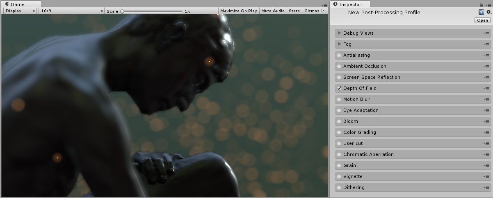
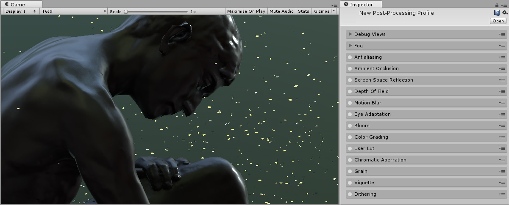

## 景深

本页的效果描述是指在后期处理堆栈中找到的默认效果。

景深是一种常见的后处理效果，可模拟摄像机镜头的对焦属性。在现实生活中，摄像机只能在特定距离的对象上清晰聚焦；距离摄像机更近或更远的物体会在一定程度上失焦。这种模糊效果不仅提供了关于对象距离的视觉提示，而且还引入了散景，这是一种讨人喜欢的视觉瑕疵，出现在图像失焦的明亮区域周围。

在下面的图像中可以看到景深效果的示例，其中显示了中间地带聚焦但背景和前景散焦的结果。

### 属性

| __属性：__| __功能：__ |
|:---|:---| 
| __Focus Distance__| 到焦点的距离。 |
| __Aperture__| 孔径比，也称为 f 值 (f-stop) 或 f 数 (f-number)。值越小，景深越浅。 |
| __Focal Length__| 镜头和胶片之间的距离。值越大，景深越浅。 |
| __Use Camera FOV__| 根据摄像机上设置的视野值自动计算焦距。 |
| __Kernel Size__| 散景滤镜的卷积核大小，决定了散景的最大半径。它还会影响性能（核越大，所需的 GPU 时间就越长）。 |

### 优化

* 减小 Kernel Size

### 要求

* [深度纹理](SL-DepthTextures.html)

* Shader Model 3

请参阅[图形硬件功能和仿真](GraphicsEmulation.html)页面，查看更多详细信息和兼容硬件列表。

---

*  2017-05-24  Page published with no [editorial review](DocumentationEditorialReview.html)

* 5.6 中的新功能
