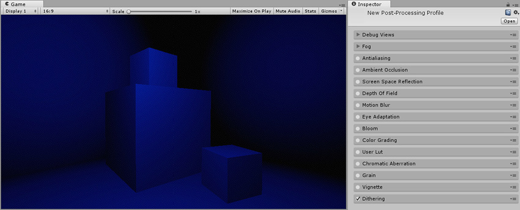
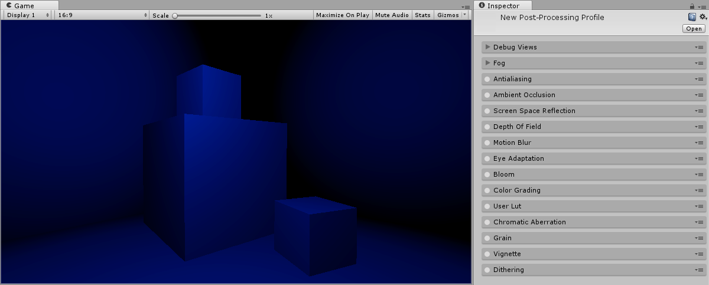

## 抖动

本页的效果描述是指在后期处理堆栈中找到的默认效果。

__抖动__是故意应用噪点来随机化[量化误差](https://en.wikipedia.org/wiki/Quantization_error)的过程。这样可防止大尺寸图案，例如图像中的色带。

### 要求

* Shader Model 3

请参阅[图形硬件功能和仿真](GraphicsEmulation.html)页面，查看更多详细信息和兼容硬件列表。

---

*  2017-05-24  Page published with no [editorial review](DocumentationEditorialReview.html)

* 5.6 中的新功能
