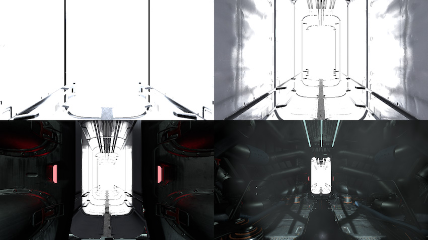

## 人眼适应 (Eye Adaptation)

本页的效果描述是指在后期处理堆栈中找到的默认效果。

在眼睛生理学中，适应是眼睛适应各种黑暗和光线水平的能力。人眼可在非常黑暗到非常明亮的光线水平下发挥作用。然而，在任何给定的时刻，眼睛只能感觉到总体范围的大约百万分之一的对比度。为了能够扩大此范围，需要眼睛调整其对黑色的定义。

此效果根据图像包含的亮度级别范围来动态调整图像的曝光。这种调整会在一段时间内逐渐进行，因此，当从黑暗的隧道中出来时，玩家可能会因明亮的室外光线而短暂感到目眩。同样，当从明亮的场景移动到黑暗的场景时，“眼睛”需要一些时间适应。

在内部，此效果会在每个帧上生成直方图，并对其进行过滤以查找平均亮度值。此直方图以及此类效果需要[计算着色器](ComputeShaders.html)支持。

### 属性

| __属性：__| __功能：__ |
|:---|:---| 
| Luminosity Range ||
| __Minimum (EV)__ | 生成的直方图的亮度范围下限（以 EV 为单位）。最小值和最大值之间的差距越大，精度越低。 |
| __Maximum (EV)__| 生成的直方图的亮度范围上限（以 EV 为单位）。最小值和最大值之间的差距越大，精度越低。 |
| Auto exposure ||
| __Histogram Filtering__| 这些值是直方图的下限和上限百分比，用于查找稳定的平均亮度。超出此范围的值将被丢弃，不会对平均亮度有影响。 |
| __Minimum (EV)__| 自动曝光所考虑的最小平均亮度（以 EV 为单位）。 |
| __Maximum (EV)__| 自动曝光所考虑的最大平均亮度（以 EV 为单位）。 |
| __Dynamic Key Value__| 将此项设置为 true 可让 Unity 根据平均亮度自动处理键值。 |
| __Key Value__| 曝光补偿。使用此项可抵消场景的全局曝光。 |
| Adaptation ||
| __Adaptation Type__| 如果要对自动曝光进行动画化，请使用 Progressive。否则，使用 Fixed。 |
| __Speed Up__| 从黑暗到明亮环境的适应速度。 |
| __Speed Down__| 从明亮到黑暗环境的适应速度。 |

### 详细信息

__Luminosity Range__ __Minimum/Maximum__ 值用于设置可用的直方图范围（采用 EV 单位）。范围越大，精度越低。对于大多数情况，默认值应该能满足要求，但如果要使用非常暗的场景，可能需要降低这两个值以便能聚焦较暗的区域。

使用 __Histogram Filtering__ 范围可以排除图像中最暗和最亮的部分。要计算平均亮度，通常不希望非常暗和非常亮的像素对结果的影响太大。值以百分比表示。

__Auto Exposure Minimum/Maximum__ 值可将计算出的平均亮度限制在给定范围内。

通过调整曝光补偿（也称为__键值 (Key Value)__）可调整亮度偏移。

如果不需要人眼适应效果，也可将 __Adaptation Type__ 设置为 __Fixed __，其行为将类似于自动曝光设置。

设置此效果时，建议使用 Eye Adaptation [调试视图](PostProcessing-DebugViews.html)。

### 要求

* [计算着色器](ComputeShaders.html)

* Shader Model 5

请参阅[图形硬件功能和仿真](GraphicsEmulation.html)页面，查看更多详细信息和兼容硬件列表。

---

*  2017-05-24  Page published with limited [editorial review](DocumentationEditorialReview.html)

* 5.6 中的新功能
