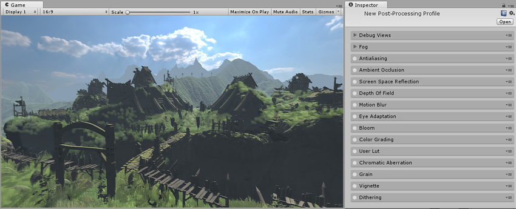
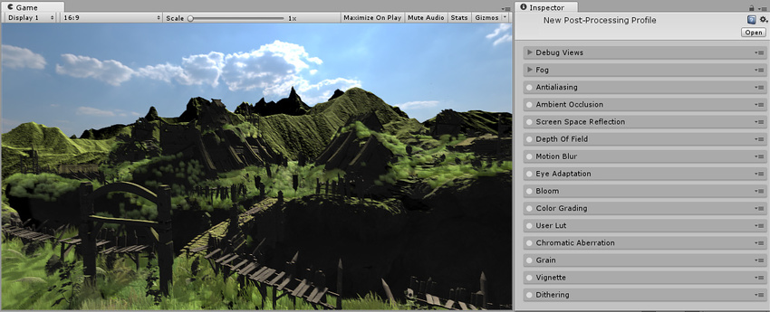
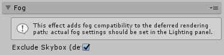

## 雾效 (Fog)

本页的效果描述是指在后期处理堆栈中找到的默认效果。

雾效是根据与摄像机的距离将颜色叠加到对象上的效果。这种效果用于模拟室外环境中的雾或雾气，通常还用于在摄像机的远剪裁面向前移动以提高性能时隐藏对象的剪裁。

雾效根据摄像机的[深度纹理](SL-DepthTextures.html)产生屏幕空间雾。此效果支持线性 (Linear)、指数 (Exponential) 和指数平方 (Exponential Squared) 雾效类型。应在 __Lighting__ 窗口的 __Scene__ 选项卡中进行雾效设置。

### 属性

| __属性：__| __功能：__ |
|:---|:---| 
| __Exclude Skybox__| 雾效应该影响天空盒吗？ |

### 详细信息

此效果仅应用于延迟渲染路径中。使用任一渲染路径时，应使用场景设置 (Scene Settings) 中的雾效 (Fog) 将雾效应用于前向渲染的对象。后处理雾效的参数将对应来自于 __Lighting__ 窗口 __Scene__ 选项卡中设置的 Fog 参数。这可确保在延迟渲染时前向渲染的对象始终会获得相同的雾效。

### 要求

* [深度纹理](SL-DepthTextures.html)

* Shader Model 3

请参阅[图形硬件功能和仿真](GraphicsEmulation.html)页面，查看更多详细信息和兼容硬件列表。

---

*  2017-05-24  Page published with no [editorial review](DocumentationEditorialReview.html)

* 5.6 中的新功能
