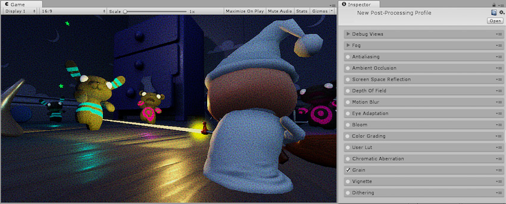
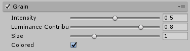

## 颗粒

本页的效果描述是指在后期处理堆栈中找到的默认效果。

由于电影胶片的金属银中存在小颗粒，因此薄膜颗粒是摄影胶片的随机光学纹理。

[后期处理栈](PostProcessing-Stack.html)中的颗粒 (Grain) 效果基于相干梯度噪点。此效果通常用于模仿电影的明显缺陷，往往在恐怖主题的游戏中夸大恐怖氛围。

### 属性

| __属性：__| __功能：__ |
|:---|:---| 
| __Intensity__| 颗粒强度。较高的值意味着颗粒可见性较高。 |
| __Luminance Contribution__| 根据场景亮度控制噪点响应曲线。较低的值意味着黑暗区域的噪点较少。 |
| __Size__| 颗粒的粒子大小。 |
| __Colored__| 允许使用有色颗粒。 |

### 优化

* 禁用 Colored 选项

### 要求

* Shader Model 3

请参阅[图形硬件功能和仿真](GraphicsEmulation.html)页面，查看更多详细信息和兼容硬件列表。

---

*  2017-05-24  Page published with no [editorial review](DocumentationEditorialReview.html)

* 5.6 中的新功能
