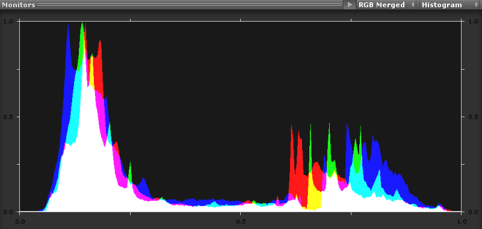
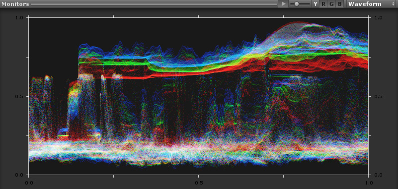
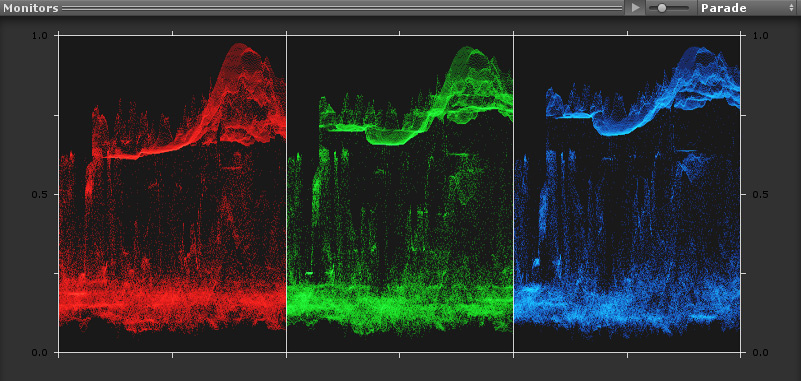
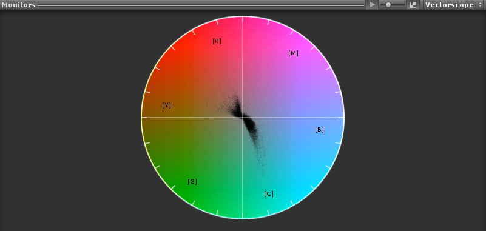

## 监视器

为了帮助美术师控制场景的整体外观和曝光，[后期处理栈](PostProcessing-Stack.html)附带了一组行业标准的监视器。您可以在 __Inspector__ 的预览区域中找到它们。与 __Inspector__ 中的任何其他预览区域一样，可通过单击将其显示/隐藏，并可通过右键单击其标题来取消停靠。

通过单击标题栏中带有播放图标的按钮，可在播放模式下启用每个监视器以进行实时更新。请注意，这会极大地影响 Editor 中场景的性能，因此请谨慎使用。此功能仅适用于已启用[计算着色器](ComputeShaders.html)的平台。

### 直方图

标准伽马直方图，类似于常见图形编辑软件中的直方图。直方图通过绘制每个颜色强度级别的像素数来展示图像中的像素是如何分布的。此图形有助于确定图像是否正确曝光。

### 波形

此监视器将显示渲染中的全部范围的亮度信息。此图的水平轴对应于渲染（从左到右），垂直轴表示亮度。您可以将其视为一种高级直方图（图像的每一列对应一个垂直直方图）。

### 检阅

检阅监视器类似于波形监视器，只是将图像分别分为红色、绿色和蓝色部分。

此监视器可用于查看图像中的整体 RGB 平衡（例如，某个特定通道中存在明显偏移的情况下），并可用于确保镜头中应为黑色或白色的对象和元素为纯黑色或纯白色。纯黑色和纯白色（或纯灰色）将在所有通道上具有相同的值。

### 矢量示波器

此监视器用于测量图像中的色调（标记为黄色、红色、洋红色、蓝色、青色和绿色）和饱和度的整体范围。测量是相对于示波器的中心进行的。

帧中更饱和的颜色可将图形的相应部分拉伸到更远的边缘，而不太饱和的颜色则保持更接近于矢量示波器的中心（中心点代表绝对零饱和度）。通过在不同角度辨别出矢量示波器图中有多少个部分，即可看到图像中有多少种色调。此外，通过判断矢量示波器图的中间位置相对于绝对中心的居中情况，可了解图像中是否存在颜色不平衡问题。如果矢量示波器图偏离中心，则其偏斜的方向可指示渲染中有色偏（色调）。

### 要求

* [计算着色器](ComputeShaders.html)

* Shader Model 3

请参阅[图形硬件功能和仿真](GraphicsEmulation.html)页面，查看更多详细信息和兼容硬件列表。

---

*  2017-05-24  Page published with no [editorial review](DocumentationEditorialReview.html)

* 5.6 中的新功能
