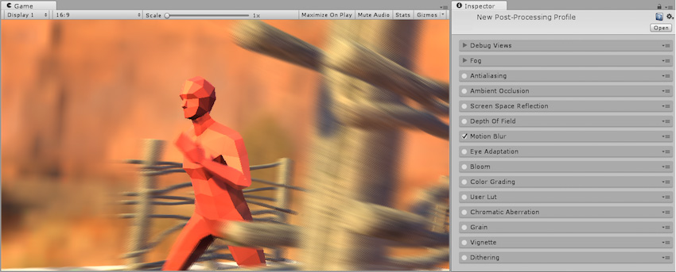
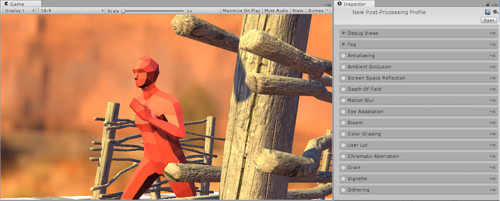
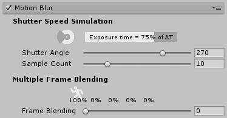

## 运动模糊

本页的效果描述是指在后期处理堆栈中找到的默认效果。

“运动模糊”是一种常见的后期处理效果，可模拟当摄像机拍摄的对象移动得比摄像机的曝光时间快时的图像模糊情况。这种效果可能是由快速移动对象或长曝光时间引起的。运动模糊用于在大多数类型的游戏中产生微妙的效果，但在一些游戏类型（例如赛车游戏）中会进行夸大处理。

后期处理栈中提供的运动模糊技术包括：

* 快门速度模拟 (Shutter Speed Simulation)

* 多帧混合 (Multiple Frame Blending)

## 快门速度模拟 (Shutter Speed Simulation)

快门速度模拟可以更准确地表示摄像机的模糊属性。但是，由于需要[运动矢量](../ScriptReference/DepthTextureMode.MotionVectors.html)的支持，因此成本更高，并且在某些平台上不受支持。建议将此技术用于桌面平台和游戏主机平台。此效果通过将屏幕像素的运动存储到速度缓冲区来估计运动模糊。然后，使用此缓冲区根据像素自绘制最后一帧以来移动的距离来模糊像素。

### 属性

| __属性：__| __功能：__ |
|:---|:---| 
| __Shutter Angle__| 旋转快门的角度。值越大，曝光时间越长，因此模糊效果越强。 |
| __Sample Count__| 采样点数量，影响质量和性能。 |

### 优化

* 减少样本数量

### 限制

* 在 VR 中不受支持

### 要求

* 运动矢量

* 深度纹理

* Shader Model 3

请参阅[图形硬件功能和仿真](GraphicsEmulation.html)页面，查看更多详细信息和兼容硬件列表。

## 多帧混合 (Multiple Frame Blending)

__多帧混合__效果简单地在当前帧上叠加前四帧，从而加权到更近的帧。虽然此效果适用于所有平台（因为它不需要运动矢量和[深度纹理](SL-DepthTextures.html)支持），但它需要存储最后四帧的两个历史缓冲区（亮度和色度），而这会消耗内存。

### 属性

| __属性：__| __功能：__ |
|:---|:---| 
| __Frame Blending__| 多帧混合的强度。先前帧的不透明度由该系数和时间差确定。 |

### 优化

* 无

### 要求

* Shader Model 3

请参阅[图形硬件功能和仿真](GraphicsEmulation.html)页面，查看更多详细信息和兼容硬件列表。

---

*  2017-05-24  Page published with no [editorial review](DocumentationEditorialReview.html)

* 5.6 中的新功能
