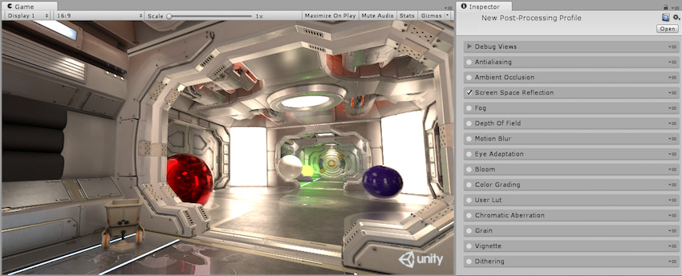
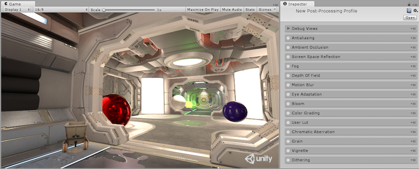
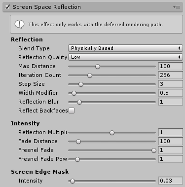
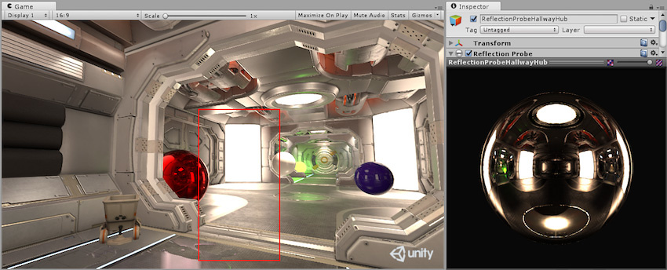
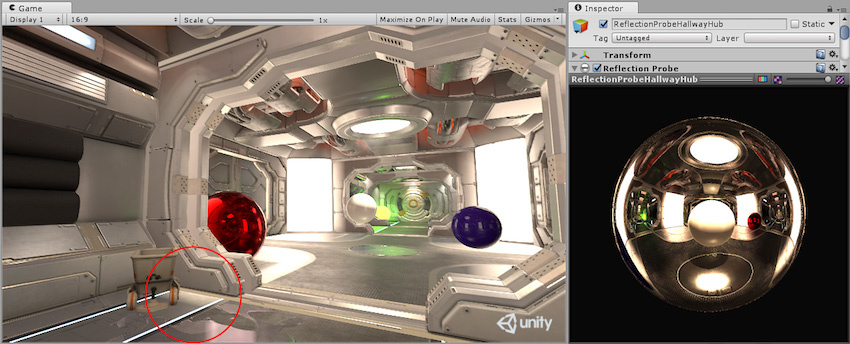

## 屏幕空间反射

本页的效果描述是指在后期处理堆栈中找到的默认效果。

屏幕空间反射 (Screen Space Reflection) 是一种重用屏幕空间数据来计算反射的技术。通常用于产生较微妙的反射，例如在潮湿的地板表面或水坑中。

屏幕空间反射是一种高成本的技术，但正确使用可以产生很好的效果。屏幕空间反射仅在[延迟渲染路径](RenderTech-DeferredShading.html)中可用，因为它依赖于法线 G 缓冲区 (Normals G-Buffer)。由于这是一种成本高昂的效果，因此不建议在移动端使用。

### 属性

| __属性：__| __功能：__ |
|:---|:---| 
| __Blend Type__| 如何将反射混合到渲染中。 |
| __Reflection Quality__| 用于解析的缓冲区的大小。半分辨率 SSR 要快得多，但不太准确。 |
| __Max Distance__| 最大反射距离（采用世界单位）。 |
| __Iteration Count__| 最大射线追踪长度。 |
| __Step Size__| 射线追踪粗略步长。较高的值可追踪更远的距离，而较低的值可提供更好的整体质量。 |
| __Width Modifier__| 反射光线可能通过的柱子、墙壁、家具以及其他对象的典型厚度。 |
| __Reflection Blur__| 反射的模糊度。 |
| __Reflect Backfaces__| 通过剔除所有正面来渲染场景，并使用生成的纹理来估计当从后面照射到深度贴图上的某个点时背面的可能外观。  |
| __Reflection Multiplier__| SSR 反射的非物理乘数。1.0 表示基于物理。 |
| __Fade Distance__| 开始淡化 SSR 时离最大距离有多远。 |
| __Fresnel Fade__| 放大菲涅耳淡出效果。如果地板反射在靠近地面时看起来很好而在地板下较远时很差，则增加。 |
| __Fresnel Fade Power__| 较高的值对应于较快的菲涅耳淡化，因为反射将从掠射角改变。 |
| __(Screen Edge Mask) Intensity__| 较高的值会使 SSR 在屏幕边缘附近淡出，以便在摄像机移动时不会出现反射。 |

### 优化

* 禁用 Reflect Backfaces

* 降低 Reflection Quality

* 减小 Iteration Count（增加步长作为补偿）

* 使用附加反射 (Additive Reflection)

### 限制

* 在 VR 中不受支持

### 详细信息

屏幕空间反射可用于实现比其他方法（如[立方体贴图](class-Cubemap.html)或[反射探针](class-ReflectionProbe.html)）更有细节的反射。使用立方体贴图进行反射的对象无法获得自反射，而反射探针的反射在精度上受到限制。

在上图中，可在红色突出显示的区域中看到不准确的反射。这是由于[摄像机](class-Camera.html)和反射探针之间的移动。另外请注意，由于此反射探针已烘焙，因此无法反射动态对象（如彩色球体）。

 

使用实时反射探针（如上图所示）可捕获动态对象，但如以上示例所示，反射的位置不正确。在红色突出显示的区域中，可看到白色球体的反射。

将这些图像与本页面开头的图像（使用屏幕空间反射）进行比较后，我们可以清楚地看到反射精度的差异，但是这些方法的成本要低得多，在不需要这种高精度时应始终采用这些方法。

屏幕空间反射是通过从深度贴图上的反射点到其他表面的光线追踪 (Ray-marching) 来计算的。对于[深度缓冲区](SL-DepthTextures.html)中的每个反射点，都要计算一个反射矢量。该矢量按步长行进，直到找到与深度缓冲区中另一个反射点的交点。然后，第二点作为反射绘制到原始点。

减小 __Iteration Count__ 可减少针对深度缓冲区进行射线测试的次数，从而大大降低成本。但是，这样做会缩短测试的整体深度，从而缩短反射。增大 __Step Size__ 会增加这些测试之间的距离，重新获得整体深度，但会降低精度。

使用 __Physically Based Blend Type__ 时，反射材质的 BRDF 将被采样并用于改变产生的反射，该过程的成本很高，但会产生更真实的反射，特别是对于较粗糙的表面。

使用 __Reflect Backfaces__ 时，该效果还会沿相反方向进行射线追踪，从而尝试估算对象背面的反射。此过程大大增加了效果的成本，但是当反射对象前面有其他对象时，可用来估算反射对象的反射情况。

### 要求

* [延迟渲染路径](RenderTech-DeferredShading.html)

* [深度和法线纹理](SL-CameraDepthTexture.html)

* Shader Model 3

请参阅[图形硬件功能和仿真](GraphicsEmulation.html)页面，查看更多详细信息和兼容硬件列表。

---

*  2017-05-24  Page published with no [editorial review](DocumentationEditorialReview.html)

* 5.6 中的新功能
