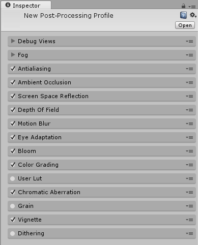
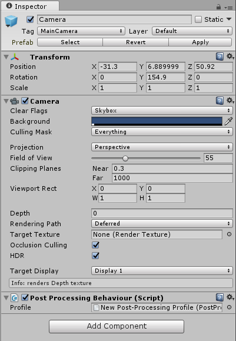
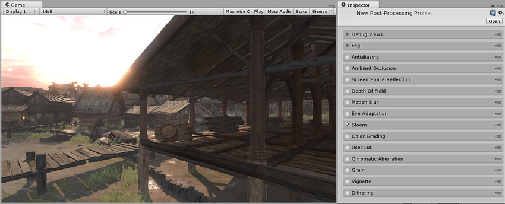

## 设置post-processing stack(后期处理栈)

为了获得最佳的后期处理结果，建议在启用 HDR 的线性颜色空间中工作。此外，建议使用deferred rendering path(延迟渲染路径)（基于某些效果的需要，例如[屏幕空间反射](PostProcessing-ScreenSpaceReflection.html)）。

首先，需要将 Post Processing Behaviour 脚本添加到摄像机。可以通过选择摄像机并使用以下方法之一来实现此目的：

* 将 _PostProcessingBehaviour.cs_ 脚本从 Project 窗口拖到摄像机。

* 使用菜单：__Component__ > __Effects__ > __Post Processing Behaviour__。

* 使用 Inspector 中的 __Add Component__ 按钮。

现在有了一个配置了空配置文件的行为。下一步是使用以下方法之一创建自定义配置文件：

* 在 Project 窗口中单击鼠标右键，然后选择 __Create__ > __Post-Processing Profile__。

* 使用菜单：__Assets__ > __Create__ > __Post-Processing Profile__。

随后将在项目中创建一个新资源。

后期处理配置文件是项目资源，可在场景/摄像机之间以及不同项目之间或 Asset Store 上轻松共享。这样就能更方便地创建预设（如用于桌面平台的高质量预设或用于移动平台的较低设置）。

选中配置文件将显示 Inspector 窗口以便编辑配置文件设置。

要将配置文件分配给行为，可将其从 Project 面板拖动到组件或使用 Inspector 中的对象选择器。

选择配置文件后，可使用 Inspector 中每个效果的复选框来启用或禁用每个效果。可以在每一种效果的文档页面中找到各自的更多相关信息。

---

*  2017-05-24  Page published with limited [editorial review](DocumentationEditorialReview.html)

* 5.6 中的新功能
