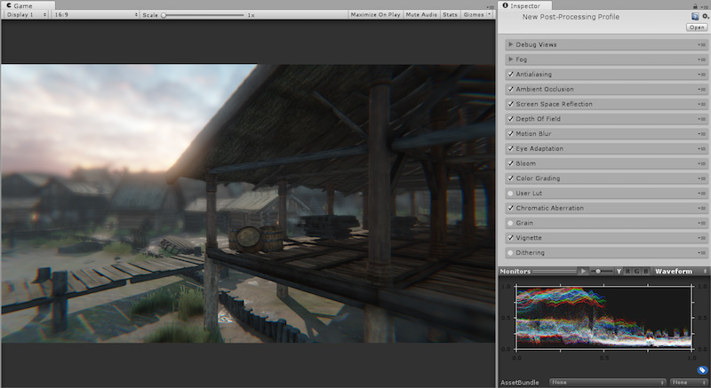

## Post-processing stack（后期处理栈）

post-processing stack（后期处理栈）是一种超级 (über) 效果，将一整套效果组合到一个后处理管线中。这样做有一些优点：

* 始终以正确的顺序配置效果

* 允许将多种效果组合成一个 pass

* 所有效果都在 UI 中分组在一起，因此提供更好的用户体验

Post-processing stack(后期处理栈)还包括一组[监视器](PostProcessing-Monitors.html)和[调试视图](PostProcessing-DebugViews.html)，旨在帮助您正确设置效果并调试输出中的问题。

要使用后期处理，请从 [Asset Store](https://www.assetstore.unity3d.com/en/#!/content/83912) 下载Post-processing stack。

有关如何开始使用Post-processing stack（后期处理栈）的帮助，请参阅[设置后期处理栈](PostProcessing-Stack-SetUp.html)。

### 效果

* [抗锯齿（FXAA 和 TAA）](PostProcessing-Antialiasing.html)
* [环境光遮挡](PostProcessing-AmbientOcclusion.html)
* [屏幕空间反射](PostProcessing-ScreenSpaceReflection.html)
* [雾效](PostProcessing-Fog.html)
* [景深](PostProcessing-DepthOfField.html)
* [运动模糊](PostProcessing-MotionBlur.html)
* [人眼适应](PostProcessing-EyeAdaptation.html)
* [泛光](PostProcessing-Bloom.html)
* [颜色分级](PostProcessing-ColorGrading.html)
* [用户 LUT](PostProcessing-UserLut.html)
* [色差](PostProcessing-ChromaticAberration.html)
* [颗粒](PostProcessing-Grain.html)
* [渐晕](PostProcessing-Vignette.html)
* [抖动](PostProcessing-Dithering.html)

有关Post-processing stack（后期处理栈）中包含的每个单独效果的详细信息，请参阅该效果的页面。

### Post-processing stack version 2

如需提前预览后期处理栈的下一版本，请参阅[Post-processing stack v2](https://github.com/Unity-Technologies/PostProcessing/tree/v2)。

---

*  2017-09-04  Page amended with limited [editorial review](DocumentationEditorialReview.html)

* 5.6 中的新功能
* 添加了Post-processing stack v2 GitHub 分支的链接（该分支在 [2017.1](https://docs.unity3d.com/2017.1/Documentation/Manual/30_search.html?q=newin20171) 中作为预览版提供）NewIn20171
