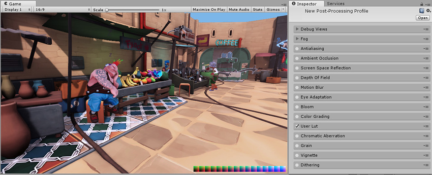
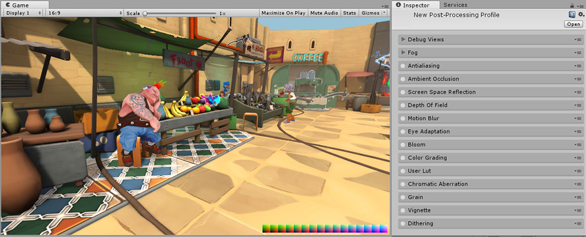
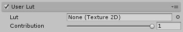
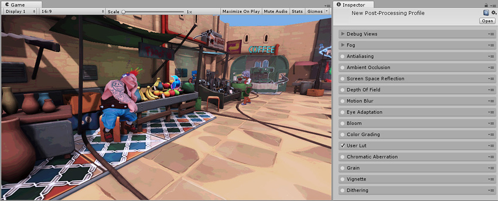

## 用户 LUT

本页的效果描述是指在后期处理堆栈中找到的默认效果。

用户 LUT 是一种更简单的颜色分级方法：将屏幕上的像素由用户提供的 LUT（即查找纹理）中的新值替换。这是一种比[颜色分级](PostProcessing-ColorGrading.html)效果低级得多的方法。但是，由于此方法不需要颜色分级所使用的更高级的纹理格式，因此建议将其作为不支持这些格式的平台的后备方案。

### 属性

| __属性：__| __功能：__ |
|:---|:---| 
| __Lut__| 自定义查找纹理（条带格式，例如 256x16）。 |
| __Contribution__| 混合系数。 |

### 优化

* 如果使用 1024x32 纹理作为输入，请考虑改用 256x16

### 详细信息

用户 LUT 使用“条带格式”纹理作为输入。后期处理栈附带提供两个中性 LUT，一个的分辨率为 256x16，另一个的分辨率为 1024x32。使用较大的输入纹理会影响性能。

要创建 LUT，请将其中一个中性 LUT 随场景截屏一起导入到图像编辑工具（如 Photoshop）中。在这两个图像上以非破坏性方式应用颜色校正，直到您对结果满意为止。请注意，LUT 仅支持像素局部效果，这意味着没有模糊效果和其他效果依赖于相邻像素的值。现在将应用了这些颜色更改的 LUT 导出回到 Unity 以便在用户 LUT 效果中使用。

必要时，用户 LUT 效果将提示您更改纹理的导入设置。

通过手动将输入纹理的 __Filter Mode__ 设置为 __Point (no filter)__，可实现“低保真”效果。

### 要求

* Shader Model 3

请参阅[图形硬件功能和仿真](GraphicsEmulation.html)页面，查看更多详细信息和兼容硬件列表。

---

*  2017-05-24  Page published with no [editorial review](DocumentationEditorialReview.html)

* 5.6 中的新功能
