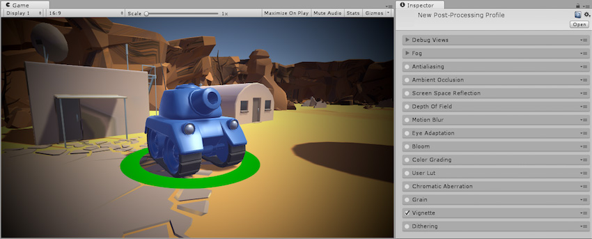
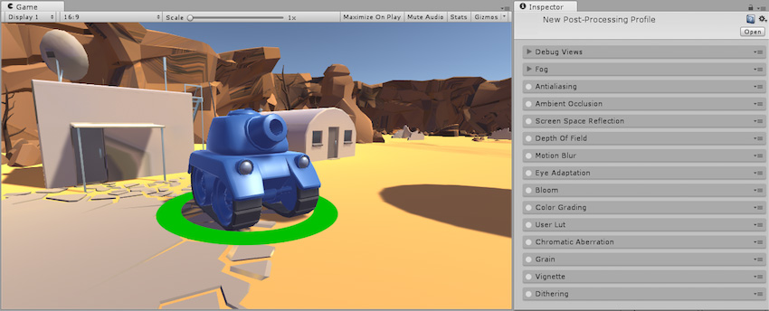
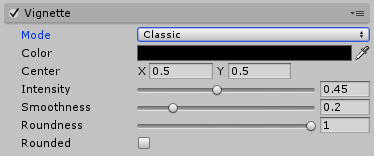
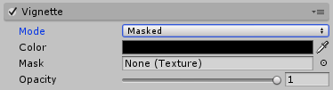

## 渐晕

本页的效果描述是指在后期处理堆栈中找到的默认效果。

在摄影中，“渐晕”一词表示相对于中心朝图像边缘变暗和/或去饱和。这种情况通常是由厚的或堆叠的滤镜、二次镜头和不正确的镜头遮光罩引起的。经常用于表现艺术效果，例如将焦点绘制到图像的中心。

后期处理栈（post-processing stack）中的渐晕效果有两种模式

* Classic

* Masked

## Classic

Classic 模式为渐晕的位置、形状和强度提供参数控制。这是使用该效果的最常见方法。

### 属性

| __属性：__| __功能：__ |
|:---|:---| 
| __Color__| 渐晕颜色。使用 Alpha 通道获得透明度。 |
| __Center__| 设置渐晕中心点（屏幕中心为 [0.5,0.5]）。 |
| __Intensity__| 屏幕上的渐晕量。 |
| __Smoothness__| 渐晕边框的平滑度。 |
| __Roundness__| 较低的值将产生更像方形的渐晕。 |
| __Rounded__| 渐晕应该是完美的圆形还是取决于当前的宽高比？ |

### 优化

* 无

### 要求

* Shader Model 3

请参阅[图形硬件功能和仿真](GraphicsEmulation.html)页面，查看更多详细信息和兼容硬件列表。

## Masked

Masked 模式将自定义纹理遮罩叠加到屏幕上来创建渐晕效果。此模式可用于实现不太常见的渐晕效果。

### 属性

| __属性：__| __功能：__ |
|:---|:---| 
| __Color__| 渐晕颜色。使用 Alpha 通道获得透明度。 |
| __Mask__| 用作渐晕的黑白遮罩。 |
| __Intensity__| 遮罩不透明度。 |

### 优化

* 无

### 要求

* Shader Model 3

请参阅[图形硬件功能和仿真](GraphicsEmulation.html)页面，查看更多详细信息和兼容硬件列表。

---

*  2017-05-24  Page published with no [editorial review](DocumentationEditorialReview.html)

* 5.6 中的新功能
