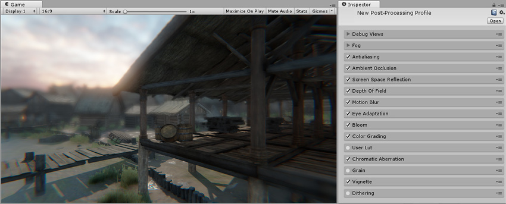
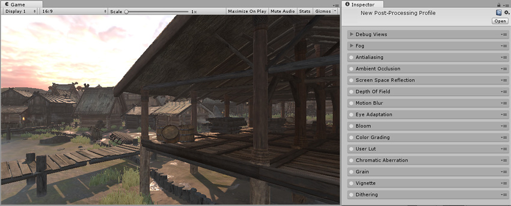

# 后期处理概述

__后期处理__是在将摄像机的图像缓冲区显示到屏幕之前将全屏滤镜和效果应用于图像缓冲区的过程。它可以通过很短的设置时间大幅改善产品的视觉效果。

您可以使用后期处理效果来模拟实际摄像机和胶片属性；例如：__泛光 (Bloom)__、__景深 (Depth of Field)__、__色差 (Chromatic Aberration)__ 或__颜色分级 (Color Grading)__。

### 使用后期处理

要在项目中使用后期处理，可导入 Unity 的[后期处理栈](PostProcessing-Stack.html)。您也可以编写自己的后期处理效果。有关详细信息，请参阅[编写后期处理效果](PostProcessingWritingEffects.html)。

下面的图像展示了应用和未应用后期处理的场景。

    

---

*  2017-05-24  Page published with limited [editorial review](DocumentationEditorialReview.html)

* 5.6 中的新功能

