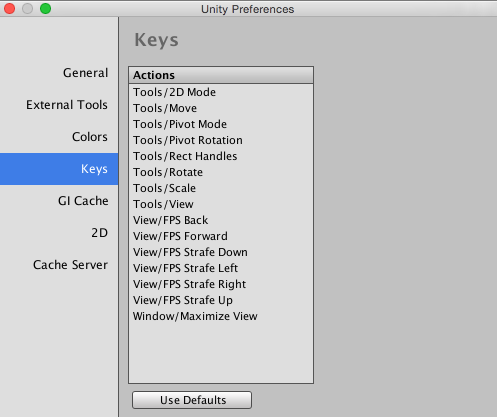

#偏好设置

Unity 提供了许多偏好设置以用于自定义 Unity Editor 的行为。要访问这些设置，请选择 __Unity__ > __Preferences__ (macOS) 或 __Edit__ > __Preferences...__ (Windows)。

##General

 

| __设置__ | __属性__ |
|:---|:---|
|__Auto Refresh__|选中此框可在资源更改时自动更新资源。|
|__Load Previous Project on Startup__|选中此框可始终在启动时加载上一个项目。|
|__Compress Assets on Import__|选中此框可在导入期间自动压缩资源。|
|__OSX Color Picker__ (macOS)| 选中此框可使用原生 macOS 拾色器而不是 Unity 自己的拾色器。|
|__Disable Editor Analytics__ (Pro only)|选中此框可禁止 Editor 自动将信息发送回 Unity。|
|__Show Asset Store search hits__ |选中此框可在 Project Browser 中显示 Asset Store 中的免费/付费资源数量。 |
|__Verify Saving Assets__|如果要在退出 Unity 时单独验证要保存的资源，请选中此框。|
|__Editor Skin__（仅限 Plus/Pro）|从下拉选单中选择要应用于 Unity Editor 的皮肤。选择 __Personal__（浅灰色与黑色文本）或 __Professional__（深灰色与白色文本）。|
|__Enable Alpha Numeric Sorting __|选中此框可在 [Hierarchy](Hierarchy.html) 窗口的右上角启用一个新按钮，允许在变换排序（这是默认行为）和字母数字排序之间切换。|

##External tools

 

| __设置__ | __属性__ |
|:---|:---|
|__External Script Editor__|选择 Unity 应使用哪个应用程序来打开脚本文件。Unity 会自动将正确的参数传递给内置支持的脚本编辑器。Unity 内置支持 Visual Studio (Express)、Visual Studio Code、Xamarin Studio 和 JetBrains Rider。|
|__External Script Editor Args__|Select which arguments to pass to the external script editor. `$(File)` is replaced with a path to a file being opened. `$(Line)` is replaced with a line number that editor should jump to. `$(ProjectPath)` is replaced with the path to the open project.  If not set on macOS, then the default mechanism for opening files is used. Otherwise, the external script editor is only launched with the arguments without trying to open the script file using the default mechanism.   See below for examples of external script editor arguments.|
|__Add .unityproj's to .sln__|选中此框可将 UnityScript (.unityproj) 项目添加到生成的解决方案 (.sln) 文件中。对于 MonoDevelop 和 Xamarin Studio，默认情况下启用此功能，而对于 Visual Studio (Express) 和 Visual Studio Code，默认情况下禁用此功能。|
|__Editor Attaching__|选中此框允许在 Unity Editor 中调试脚本。如果禁用此选项，则无法将脚本调试器附加到 Unity 来调试脚本。|
|__Image application__|选择希望 Unity 使用哪个应用程序来打开图像文件。|
|__Revision Control Diff/Merge__|选择希望 Unity 使用哪个应用程序来解决与 Asset Server 的文件差异。Unity 在工具的默认安装位置检测这些工具（并在 Windows 上检查 TortoiseMerge、WinMerge、PlasticSCM Merge 和 Beyond Compare 4 的注册表项）。 |

###脚本编辑器参数示例

* **Gvim/Vim**：`--remote-tab-silent +$(Line) "$File"`
* **Notepad2**：`-g $(Line) "$(File)"`
* **Sublime Text 2**：`"$(File)":$(Line)`
* **Notepad++**：`-n$(Line) "$(File)"`

##Colors

 

此面板允许选择 Unity 在显示各种用户界面元素时使用的颜色。

##Keys

 

此面板允许设置在 Unity 中激活各种命令的击键。

##GI Cache

 

| __设置__ | __属性__ |
|:---|:---|
|__Maximum Cache Size (GB)__| 使用滑动条来设置最大的 GI 缓存文件夹大小。GI 缓存文件夹将尽可能保持在此大小以下。系统会定期删除未使用的文件以创建更多空间。这是由 Editor 自动执行的，不需要您执行任何操作。|
|__Custom cache location__|选中此框允许设置 GI 缓存文件夹的自定义位置。缓存文件夹将在所有项目之间共享。|
|__Cache compression__|选中此框可快速实时压缩 GI 缓存文件，从而减小生成数据的大小。如果需要访问原始 Enlighten 数据，请禁用 Cache Compression 并清除缓存。|
|__Clean Cache__| 使用此按钮可清除缓存目录。|

##2D

 

| __设置__ | __属性__ |
|:---|:---|
|__Maximum Sprite Atlas Cache Size (GB)__|使用滑动条来设置最大的精灵图集缓存文件夹大小。精灵图集缓存文件夹将尽可能保持在此大小以下。|

##Cache Server

 

| __设置__ | __属性__ |
|:---|:---|
|__Use Cache Server__|选中此框可使用专用的缓存服务器。|
|__IP Address__|如果启用此功能，请在此处输入专用缓存服务器的 IP 地址。|

---
* 2018-03-19  Page amended with limited [editorial review](DocumentationEditorialReview.html)

* 在 2018.1 版中更新了外部脚本编辑器的列表
