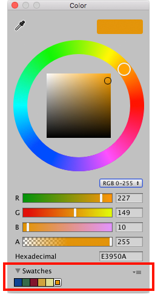
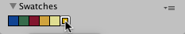

# 样本库

使用样本库可重用、保存和共享颜色、渐变和动画曲线。可在[拾色器 (Color Picker)](EditingValueProperties.html)、[渐变编辑器 (Gradient Editor)](EditingValueProperties.html) 和[曲线编辑器 (Curve Editor)](EditingValueProperties.html) 中保存和选择样本。

样本库是保存在文件中的样本集合。Swatches 部分一次显示一个样本库。

要保存样本，请执行以下操作：

1.打开拾色器、渐变编辑器或曲线编辑器。例如，在 [Hierarchy](Hierarchy.html) 窗口中选择 __Main Camera__。
1.在 [Inspector](UsingTheInspector.html) 窗口中，单击 __Background Color__。
1.在拾色器窗口中，根据喜好调整颜色、渐变或曲线。
1.在 __Swatches__ 中，单击轮廓框。
1.如果视图处于 List 模式，则可以选择输入样本的名称。

拖放样本可更改其顺序。右键单击样本可将其移动到顶部、对进行替换、重命名或删除。也可以通过按住 Alt/Option 并单击样本来将其删除。

使用 __Swatches__ 中的下拉菜单：

* 选择 __List__ 或 __Grid__ 来更改视图。List 视图还显示样本的名称。
* 选择一个样本库。
* 选择 __Create a Library__ 可创建新的样本库以及保存该样本库的位置。
* 选择 __Reveal Current Library Location__ 可在 Windows 资源管理器/Mac OS Finder 中查看当前库。

默认情况下，Unity 将样本库保存在用户偏好设置中。也可以在项目中保存样本库。Unity 将项目样本库保存在 _Assets_ 文件夹的 _Editor_ 文件夹中。要在用户之间共享项目样本库，或将样本库包含在资源包中，请将它们添加到修订控制存储库中。

要编辑项目样本库，请执行以下操作：

1.在 [Project](ProjectView.html) 窗口中选择样本库。
2.在 [Inspector](UsingTheInspector.html) 窗口中，单击 __Edit__。

---
* 2018-04-19  Page amended with [editorial review](DocumentationEditorialReview.html)

* 预设库在 2018.1 版中重命名为样本库
