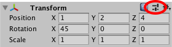
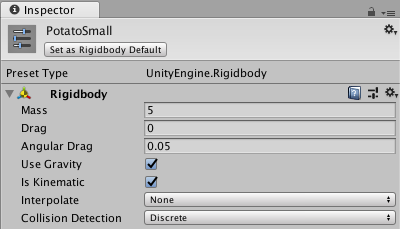

# 预设

使用预设可在多个组件和资源之间重用属性设置。

使用预设还可指定新组件的默认属性以及资源的[导入设置](class-FBXImporter.html)。可使用 [__Preset Manager__](class-PresetManager.html) 查看和选择要用于默认设置的预设。

预设可用于简化团队的工作流程。甚至可以使用预设来指定[设置管理器](comp-ManagerGroup.html)（包括 __Preset Manager__ 本身）的设置。可使用此功能配置某个项目，然后[将其导出](HOWTO-exportpackage.html)作为自定义资源包。团队成员可将此资源包[导入](AssetPackages.html)其项目中。

预设功能只能在 Editor 中使用。可在 Unity Editor 的扩展中[支持预设](SupportingPresets.html)。预设不能在运行时用于 Unity Player。

## 重用属性设置

通过复制和粘贴等方式即可使用预设。但是，不会将设置复制到剪贴板，而是保存设置供以后使用。与粘贴设置一样，将预设应用于某个项会更改此项中的属性。

例如，选择一个游戏对象来编辑其刚体 (RigidBody) 组件的属性。将这些设置保存到预设。然后，可将该预设应用于其他游戏对象中的刚体组件。游戏对象中的其他组件不受影响；预设仅将其设置应用于刚体组件。

可将预设存储在项目的 *Assets* 文件夹中。使用 [__Project__](ProjectView.html) 窗口可查看并选择要在 __Inspector__ 中编辑的预设。

## 将属性设置保存到预设

使用 __Select Preset__ 窗口可保存属性设置。

**提示：**还可以在播放模式下保存预设。

要将设置保存到预设，请执行以下操作：

1.选择要重用设置的游戏对象、资源导入设置或设置管理器。
2.在 __Inspector__ 窗口中，编辑属性。
3.单击 __Inspector__ 窗口右上角的 Preset 图标。  
4.在 Select Preset 窗口中，单击 __Save current to__。  随后将显示一个 File Save 对话框。

5.选择新预设的位置，输入其名称，然后单击 __Save__。

## 应用预设

要应用已保存的预设，可使用 __Select Preset__ 窗口，或者将某个预设从 __Project__ 窗口拖放到游戏对象上。

**注意：**应用预设会将属性从预设复制到该项。此过程不会将预设链接到该项。对预设所做的更改不会影响先前已应用预设的项。

要将预设应用于设置管理器、现有组件或资源导入设置，请执行以下操作：

1.选择要应用预设的设置管理器、游戏对象或资源导入设置。

2.在 __Inspector__ 中，单击 __Preset__ 图标。

3.在 __Select Preset__ 窗口中，搜索并选择要应用的预设。

	选择预设会将其应用于组件、资源或设置管理器。

4.关闭 __Select Preset__ 窗口。

拖放 [__Project__](ProjectView.html) 窗口中的预设，即可将属性应用于游戏对象中的组件：

* 将预设放在 [__Hierarchy__](Hierarchy.html) 窗口中的空字段上。Unity 会创建新的空游戏对象，并添加一个包含从预设复制的属性的组件。

* 将预设放在 __Hierarchy__ 中的现有游戏对象上。Unity 会添加新组件并从预设复制属性。

* 将预设放在 [__Inspector__](UsingTheInspector.html) 窗口中某个游戏对象的末尾。Unity 会添加新组件并从预设复制属性。

* 将预设放在 __Inspector__ 中某个现有组件的名称上。Unity 会从预设复制属性。

## 对动画状态节点的过渡使用预设

可保存和应用[动画状态](class-State.html)节点的预设。但是，预设中的[过渡](class-Transition.html)将在预设以及应用预设的节点之间共享。例如，可将预设应用于 [Animator 窗口](AnimatorWindow.html)中的两个不同节点。在 Inspector 窗口中，编辑第一个节点中某个过渡的设置。所做的更改也会显示在另一个节点中和预设中。

## 使用预设来导入资源

可保存资源[导入设置](# Presets)的预设

使用预设可在多个组件和资源之间重用属性设置。

使用预设还可指定新组件的默认属性以及资源的[导入设置](class-FBXImporter.html)。可使用 [__Preset Manager__](class-PresetManager.html) 查看和选择要用于默认设置的预设。

预设可用于简化团队的工作流程。甚至可以使用预设来指定[设置管理器](comp-ManagerGroup.html)（包括 __Preset Manager__ 本身）的设置。可使用此功能配置某个项目，然后[将其导出](HOWTO-exportpackage.html)作为自定义资源包。团队成员可将此资源包[导入](AssetPackages.html)其项目中。

预设功能只能在 Editor 中使用。可在 Unity Editor 的扩展中[支持预设](SupportingPresets.html)。预设不能在运行时用于 Unity Player。

## 重用属性设置

通过复制和粘贴等方式即可使用预设。但是，不会将设置复制到剪贴板，而是保存设置供以后使用。与粘贴设置一样，将预设应用于某个项会更改此项中的属性。

例如，选择一个游戏对象来编辑其刚体 (RigidBody) 组件的属性。将这些设置保存到预设。然后，可将该预设应用于其他游戏对象中的刚体组件。游戏对象中的其他组件不受影响；预设仅将其设置应用于刚体组件。

可将预设存储在项目的 *Assets* 文件夹中。使用 [__Project__](ProjectView.html) 窗口可查看并选择要在 __Inspector__ 中编辑的预设。

## 将属性设置保存到预设

使用 __Select Preset__ 窗口可保存属性设置。

**提示：**还可以在播放模式下保存预设。

要将设置保存到预设，请执行以下操作：

1.选择要重用设置的游戏对象、资源导入设置或设置管理器。
2.在 __Inspector__ 窗口中，编辑属性。
3.单击 __Inspector__ 窗口右上角的 Preset 图标。  
4.在 Select Preset 窗口中，单击 __Save current to__。  随后将显示一个 File Save 对话框。

5.选择新预设的位置，输入其名称，然后单击 __Save__。

## 应用预设

要应用已保存的预设，可使用 __Select Preset__ 窗口，或者将某个预设从 __Project__ 窗口拖放到游戏对象上。

**注意：**应用预设会将属性从预设复制到该项。此过程不会将预设链接到该项。对预设所做的更改不会影响先前已应用预设的项。

要将预设应用于设置管理器、现有组件或资源导入设置，请执行以下操作：

1.选择要应用预设的设置管理器、游戏对象或资源导入设置。

2.在 __Inspector__ 中，单击 __Preset__ 图标。

3.在 __Select Preset__ 窗口中，搜索并选择要应用的预设。

	选择预设会将其应用于组件、资源或设置管理器。

4.关闭 __Select Preset__ 窗口。

拖放 [__Project__](ProjectView.html) 窗口中的预设，即可将属性应用于游戏对象中的组件：

* 将预设放在 [__Hierarchy__](Hierarchy.html) 窗口中的空字段上。Unity 会创建新的空游戏对象，并添加一个包含从预设复制的属性的组件。

* 将预设放在 __Hierarchy__ 中的现有游戏对象上。Unity 会添加新组件并从预设复制属性。

* 将预设放在 [__Inspector__](UsingTheInspector.html) 窗口中某个游戏对象的末尾。Unity 会添加新组件并从预设复制属性。

* 将预设放在 __Inspector__ 中某个现有组件的名称上。Unity 会从预设复制属性。

## 对动画状态节点的过渡使用预设

可保存和应用[动画状态](class-State.html)节点的预设。但是，预设中的[过渡](class-Transition.html)将在预设以及应用预设的节点之间共享。例如，可将预设应用于 [Animator 窗口](AnimatorWindow.html)中的两个不同节点。在 Inspector 窗口中，编辑第一个节点中某个过渡的设置。所做的更改也会显示在另一个节点中和预设中。

## 使用预设来导入资源

可保存资源[导入设置](class-FBXImporter.html)的预设。但是，对导入设置应用预设不会影响跨平台设置。要应用预设以使其包含跨平台设置，请将[预设设置为默认值](class-PresetManager.html)，然后使用 __Reset__ 命令。

还可以使用[脚本](DefaultPresetsByFolder.html)根据资源在 Project 窗口中的位置将预设应用于该资源。

## 编辑预设

使用 [Inspector](UsingTheInspector.html) 窗口可编辑预设资源。

**注意：**更改预设中的属性不会更新已应用预设的项。例如，如果将刚体组件的预设应用于游戏对象，然后编辑该预设，则刚体组件中的设置不会更改。

 2017-03-27  Page published with limited [editorial review](DocumentationEditorialReview.html)

[2018.1](https://docs.unity3d.com/2018.1/Documentation/Manual/30_search.html?q=newin20181) 中的新增功能 NewIn20181
)。但是，对导入设置应用预设不会影响跨平台设置。要应用预设以使其包含跨平台设置，请将[预设设置为默认值](class-PresetManager.html)，然后使用 __Reset__ 命令。

还可以使用[脚本](DefaultPresetsByFolder.html)根据资源在 Project 窗口中的位置将预设应用于该资源。

## 编辑预设

使用 [Inspector](UsingTheInspector.html) 窗口可编辑预设资源。

**注意：**更改预设中的属性不会更新已应用预设的项。例如，如果将刚体组件的预设应用于游戏对象，然后编辑该预设，则刚体组件中的设置不会更改。

 2017-03-27  Page published with limited [editorial review](DocumentationEditorialReview.html)

[2018.1](https://docs.unity3d.com/2018.1/Documentation/Manual/30_search.html?q=newin20181) 中的新功能 NewIn20181
