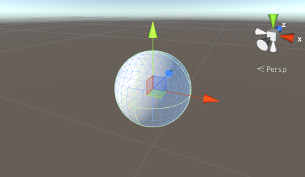
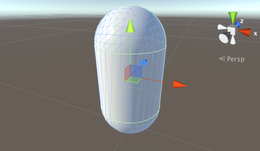

# 原始对象和占位对象

Unity 可以使用通过建模软件创建的任何形状的 3D 模型。但是，还可以直接在 Unity 中创建许多原始对象类型，即__立方体 (Cube)__、__球体 (Sphere)__、__胶囊体 (Capsule)__、__圆柱体 (Cylinder)__、__平面 (Plane)__ 和__四边形 (Quad)__。这些对象本身通常很有用（例如，平面通常用作平坦的地面），但它们也可用于快速创建占位对象和原型以便用于测试。可使用 __GameObject &gt; 3D Object__ 菜单上的相应项将任何这些原始对象添加到场景中。

## 立方体

 

这是一个边长为一个单位的简单立方体，经过纹理化后使图像在六个面中的每个面上重复。就目前而言，立方体在大多数游戏中并不是十分常见的对象，但在经过缩放后，可用于创建墙壁、柱子、盒子、台阶和其他类似物品。此外，立方体也是一个方便的占位对象，供程序员在开发期间成品模型尚不可用时使用。例如，可以使用大致正确尺寸的细长盒体对车身进行粗略建模。虽然这种对象不适合最终游戏，但可作为测试汽车控制代码的简单代表性对象。由于立方体的边长为一个单位，因此可通过在旁边添加立方体并比较尺寸来检查导入到场景中的网格的比例。

## 球体

 

这是一个单位直径（即 0.5 单位半径）的球体，经过纹理化后使整个图像环绕一次，让顶部和底部“收缩”到两极。球体显然可用于表示球、行星和飞弹，但半透明球体也可制作一个很好的 GUI 工具来表示效果的半径。

## 胶囊体

 

胶囊体是一个两端有半球形帽的圆柱体。此对象的直径为一个单位且高度为两个单位（主体为一个单位，两个半球形帽各为半个单位）。胶囊体经过纹理化后使图像恰好环绕一次并收缩到每个半球的顶点。虽然真实世界中没有很多这种形状的对象，但胶囊体是可用于原型设计的占位对象。特别是对于某些任务，圆形对象的物理性质有时优于盒体。

## 圆柱体

 

这是一个高度为两个单元且直径为一个单元的简单圆柱体，经过纹理化后使图像围绕主体的管状环绕一次，但也分别出现在两个扁平的圆形端。圆柱体非常适合用于制作柱子、杆和轮子，但应该注意碰撞体的形状实际上是一个胶囊体（Unity 中没有原始圆柱体碰撞体）。如果需要将精确的圆柱形碰撞体用于物理目的，应在建模程序中创建适当形状的网格，并附加网格碰撞体。

## 平面

 

这是一个边长为十个单位的扁平正方形，位于局部坐标空间的 XZ 平面内。平面经过纹理化后使整个图像在正方形内只出现一次。平面适用于表示大多数平坦表面，例如地板和墙壁。有时也需要使用表面在 GUI 和特殊效果中显示图像或电影。虽然平面_可以_用于这样的目的，但更简单的__四边形__原始对象通常更适合此类任务。

## 四边形

 

四边形原始对象类似于平面，但其边长仅为一个单位，并且表面位于局部坐标空间的 XY 平面中。此外，四边形仅分为两个三角形，而平面包含两百个。在场景对象必须仅用作图像或电影的显示屏幕的情况下，四边形非常有用。简单的 GUI 和信息显示面板可以使用四边形实现，而粒子、精灵和“冒充者”图像（替代远处观看的实体对象）也可以用四边形实现。

---

*  2018-04-25  Page amended with limited [editorial review](DocumentationEditorialReview.html)

