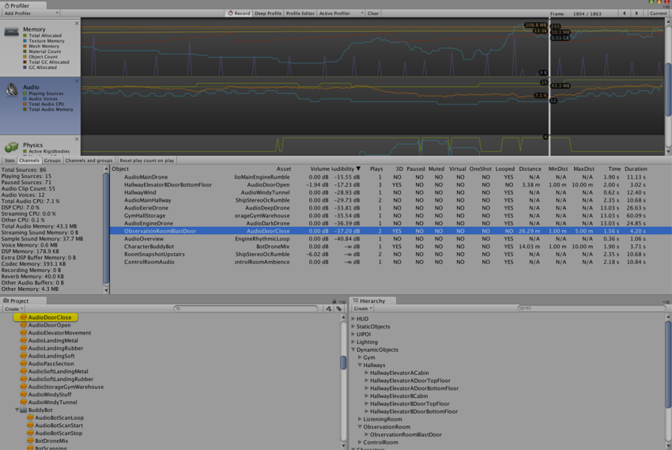
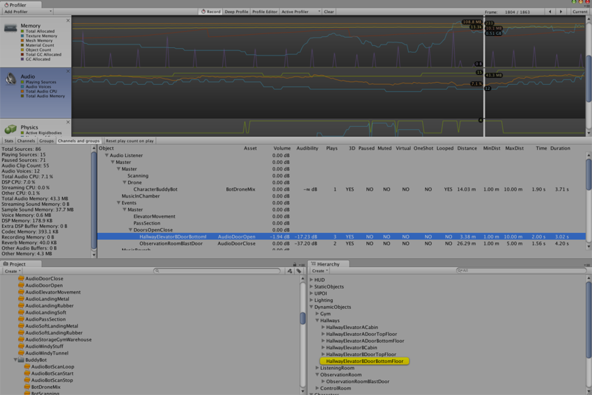

# 音频性能分析器 (Audio Profiler)

在 Profiler 窗口中，有一个名为 Audio 的面板。该面板将显示有关音频系统的重要性能指标，例如总负载和语音计数。突出显示该面板时，窗口的下半部分将变为详细视图，其中包含图表未涵盖的音频系统各个部分。

* __Playing Sources__ 是特定帧在场景中的总播放源。监控此信息可了解音频是否过载。
* __Paused Sources__ 是特定帧在场景中的暂停源。
* __Audio Voice__ 是实际使用的音频（FMOD 通道）语音数。PlayOneShot 表示未显示在 Playing Sources 中的语音。
* __Audio Memory__ 是音频引擎使用的总 RAM。

可在底部看到 CPU 使用率。监控此信息可了解单独的音频是否占用太多 CPU。

单击 __Channels__、__Groups__ 或 __Channels and groups__ 按钮可获取声音事件的每帧详细记录。在此处可以获取和浏览这些事件，就像渲染器和内存图一样。

帧日志中的行会显示诸如哪些音频源播放了哪些剪辑、播放的音量、与监听器的距离以及相对回放时间等信息。
单击其中一行将在 Project Browser 和 Hierarchy 窗口中突出显示关联的音频源和剪辑。

 __Channel__ 视图。单击一行时，首先突出显示音频剪辑资源，然后在层级视图中突出显示播放该资源的音频源。

 __Channels and groups__ 视图。此处突出显示了在所选行中播放声音的音频源。

