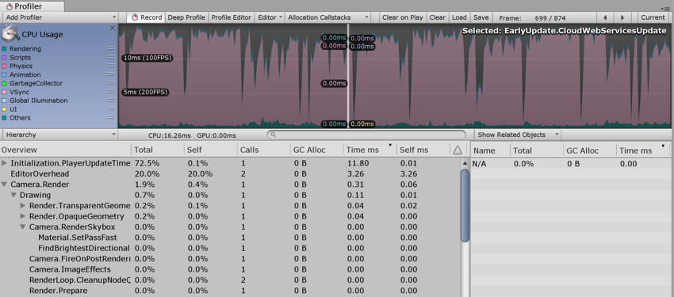
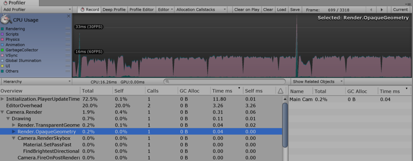
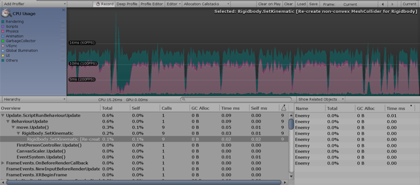
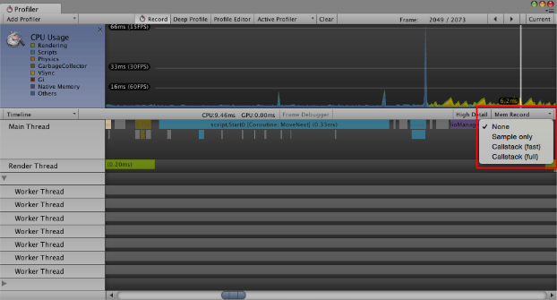
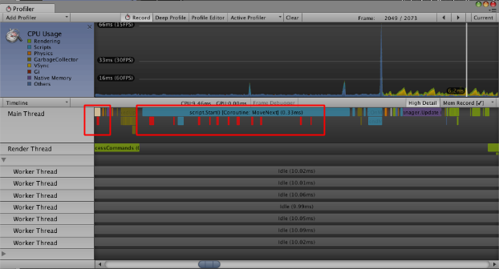
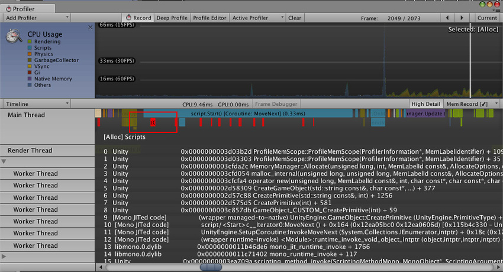
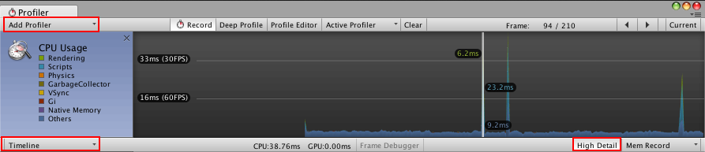
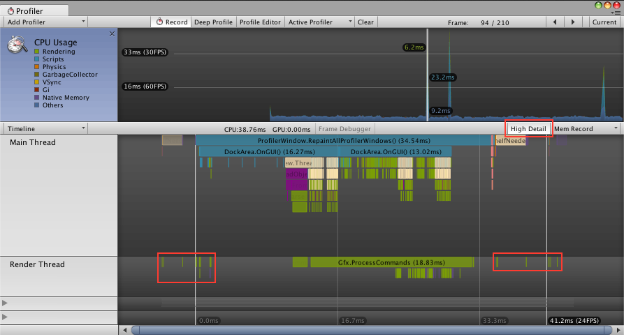
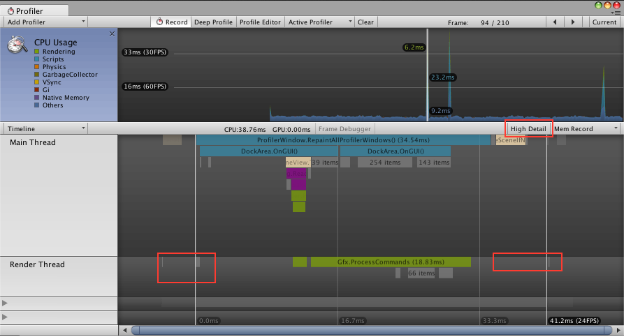

#CPU 使用率性能分析器 (CPU Usage Profiler)

 

CPU Usage Profiler 显示游戏中的时间使用情况。选择此选项后，下方面板将显示所选帧的层级时间数据。请参阅有关 [Profiler 窗口](ProfilerWindow.html)的文档以了解关于 Profiler 时间轴的更多信息。

* **Hierarchy mode：**显示层级时间数据。
* **Group Hierarchy mode：**将时间数据分成逻辑组（例如 Rendering、Physics、Scripts）。由于任何组的子项也可以位于不同的组中（例如，某些脚本也可能调用渲染函数），因此组时间的百分比通常总计超过 100%。

上下拖动图表标签可重新排列 CPU 图表的堆叠方式。

##选择各项

在下方面板中选择某一项时，将突出显示其对 CPU 图表的贡献（其余部分将变暗）。再次单击某一项将取消选择该项。

在层级时间数据中，__Self__ 列表示在特定函数中所用的时间量，不包括调用子函数所用的时间。在上面的截屏中，41.1% 的时间用在了 `Camera.Render` 函数上。此函数做了很多工作，并调用各种绘制和剔除函数。排除所有这些函数之后，只有 2.1% 的时间用在了 `Camera.Render` 函数本身上。

__Time ms__ 和 __Self ms__ 列显示相同的信息，但以毫秒为单位。`Camera.Render` 需要 0.01ms，但包括其调用的所有函数在内一共需要 0.21ms。__GC Alloc__ 列显示当前帧中已分配并稍后由垃圾回收器收集的内存量。将此值保持为零可防止垃圾回收器造成帧率不稳。

CPU 性能分析器的 __Others__ 部分记录不属于 Rendering、Scripts、Physics、Garbage Collection 或 VSync 的所有方面的总和。此部分包括 Animation、AI、Audio、Particles、Networking、Loading 和 PlayerLoop。

##物理标记

下面的描述简要介绍了各种高级 Physics Profiler 标记的含义。

* **Physics.Simulate：**从 `FixedUpdate` 中调用。通过指示物理引擎 (PhysX) 运行其模拟来更新物理系统的当前状态。
* **Physics.Processing：**从 `FixedUpdate` 中调用。处理所有非布料物理作业。扩展此标记可显示物理引擎内部完成的工作的低级细节。
* **Physics.ProcessingCloth：**从 `FixedUpdate` 中调用。处理所有布料物理作业。扩展此标记将显示物理引擎内部完成的工作的低级细节。
* **Physics.FetchResults：**从 `FixedUpdate` 中调用。从物理引擎收集物理模拟结果。
* **Physics.UpdateBodies：**从 `FixedUpdate` 中调用。更新所有物理体的位置和旋转以及发送说明这些更新的消息。
* **Physics.ProcessReports：**从 `FixedUpdate` 中调用。此阶段在物理 `FixedUpdate` 结束后运行，负责处理响应模拟结果的所有不同阶段。更新接触、关节破坏和触发器并发送相关消息。包括四个不同的子阶段：
    * **Physics.TriggerEnterExits：**从 `FixedUpdate` 中调用。处理 `OnTriggerEnter` 和 `OnTriggerExit` 事件。
    * **Physics.TriggerStays：**从 `FixedUpdate` 中调用。处理 `OnTriggerStay` 事件。
    * **Physics.Contacts：**从 `FixedUpdate` 中调用。处理 `OnCollisionEnter`、`OnCollisionExit` 和 `OnCollisionStay` 事件。
    * **Physics.JointBreaks：**从 `FixedUpdate` 中调用。处理与被破坏的关节相关的更新和消息。
* **Physics.UpdateCloth：**从 `Update` 中调用。进行与布料及其蒙皮网格相关的更新。
* **Physics.Interpolation：**从 `Update` 中调用。此阶段处理所有物理对象的位置和旋转的插值。

##性能警告

CPU 性能分析器能够检测并警告一些常见的性能问题。查看 __CPU Usage__ 时，这些问题会显示在下方面板的 __Warning__ 列中。

性能分析器可检测的具体问题包括：

* __Rigidbody.SetKinematic__ [Re-create non-convex MeshCollider for Rigidbody]
* __Animation.DestroyAnimationClip__ [触发 RebuildInternalState]
* __Animation.AddClip__ [触发 RebuildInternalState]
* __Animation.RemoveClip__ [触发 RebuildInternalState]
* __Animation.Clone__ [触发 RebuildInternalState]
* __Animation.Deactivate__ [触发 RebuildInternalState]

在上面的截屏中，性能分析器显示了 __Static Collider.Move__ 警告。__Warning__ 列显示此警告已在当前帧中触发 12 次。术语“延迟成本”意味着，虽然性能分析器中的条目可能显示低成本（在此情况下为 0.00ms），但该操作可能会在以后触发更多消耗系统资源的操作。

##CPU Profiler Timeline

###Mem Record：本机内存性能分析

本机内存性能分析允许在 Unity 的本机内存管理系统中分析活动，并评估对运行时性能的影响。在 Unity 的内存管理中搜索不必要的或资源密集的分配模式时，此分析功能非常有用。

要分析 Unity 的本机内存管理，必须记录内存情况。要访问本机内存记录模式（在 Unity 中称为 __Mem Record__），请选择 __Window__ > __Profiler__ 以打开 Profiler 窗口。选择 __CPU Usage__ Profiler（如果不可见，请单击 __Add Profiler__ > __CPU__），然后在 Profiler 下面选择下拉菜单。接下来，单击 __Timeline__，然后选择 __Mem Record__。

|**选项** |**功能** |**对性能的影响** |
|:---|:---|:---|
| __None__ | 禁用模式。这是默认选择。 |无|
| __Sample only__ | 记录内存分配、重新分配、取消分配、活动类型和系统。 |低|
| __Callstack (fast)__ | 此选项具有与 __Sample only__ 相同的功能，但还记录来自本机分配站点的快捷调用栈（调用栈从本机符号转换为脚本符号）。实际上，最多只能看到最深脚本符号的调用栈。 |中|
| __Callstack (full)__ | 此选项具有与 __Sample only__ 相同的功能，但还记录具有完整脚本到本机转换和本机到脚本转换的调用栈。 |高|

**注意：**当激活的性能分析器仅连接到独立平台播放器时，仅支持低影响力的 __Sample only__ 模式。

记录的内存分配样本以亮红色显示在 Profiler 窗口中。

 

单击 __Mem Record__ 旁边的 __High Detail__ 按钮可启用 High Detail 模式。选择一个样本来显示分配类型和系统。如果为所选分配样本记录了调用栈，则还会解析并显示关联的调用栈符号：

 

####使用 Mem Record

在许多情况下，__Mem Record__ 功能很有用。例如：

* 了解系统何时进行大量小型分配而不仅仅是少量大型分配。
* 了解何时工作线程意外分配内存（例如，通过意外使用 MemLabel）。
* 查找锁争用（多个线程尝试同时访问本机内存系统时）。
* 查找内存碎片的来源（对于低内存设备尤为重要）。

##Timeline 的 High Detail 视图

CPU Usage Profiler Timeline 的 __High Detail__ 视图为 Unity 的 CPU Usage Profiler 记录的每个样本提供至少一个宽度像素。

这样便可查看帧中所有活动的完整概况，包括线程同步或内存分配等短期活动。

要启用 __High Detail__ 视图，请选择 __Window__ > __Profiler__ 以打开 Profiler 窗口。选择 __CPU Usage__ Profiler（如果不可见，请单击 __Add Profiler__ > __CPU__），然后将在 Profiler 下面选择下拉菜单，并依次单击 __Timeline__ 和 __High Detail__。

 

##比较

以下两个图显示了 CPU Usage Profiler Timeline 的 __High Detail__ 视图与普通视图之间的区别。

###High Detail 视图

 

###普通视图

 
