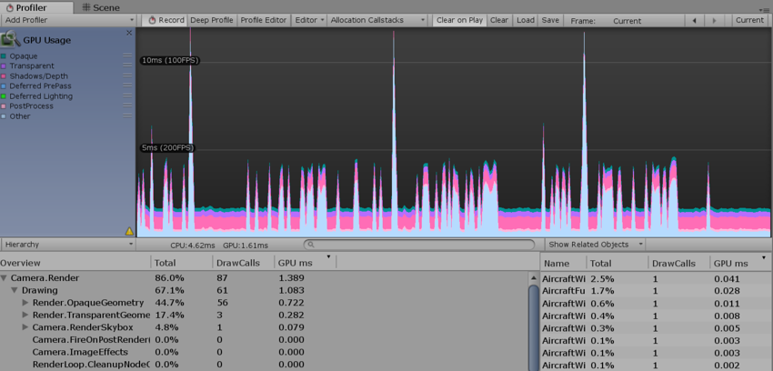

# GPU 性能分析器 (GPU Profiler)

GPU Usage Profiler 显示游戏中的 GPU 时间使用情况。选择此性能分析器后，下方面板将显示所选帧的层级时间数据。从层级视图中选择一项即可在右侧面板中查看贡献的细分情况。请参阅有关 [Profiler 窗口](https://docs.unity3d.com/Manual/ProfilerWindow.html)的文档以了解关于性能分析器的更多信息。

请注意，在 __Player Settings__ 中启用 __Graphics Jobs (Experimental)__ 的情况下将禁用 GPU 性能分析。请参阅有关[独立平台播放器设置](https://docs.unity3d.com/550/Documentation/Manual/class-PlayerSettingsStandalone.html)的文档以了解更多信息。在 macOS 上，GPU 性能分析仅适用于 OSX 10.9 Mavericks 及更高版本。

## 远程性能分析支持

| 平台| 图形 API | 状态 |
|:---|:---|:---| 
| Windows| D3D9、D3D11、D3D12、OpenGL Core、OpenGL ES 2.0、OpenGL ES 3.x、Vulkan  | 受支持。 |
| Mac OS X| OpenGL Core | 受支持。 |
| | Metal | 不可用。改用 XCode 的 GPU 帧调试器 UI。 |
| Linux| OpenGL Core、Vulkan | 受支持。 |
| PlayStation 4| libgnm | 受支持（另一种选择是 Razor）。 |
| Xbox One| D3D11 | 受支持（另一种选择是 PIX）。 |
| WebGL| WebGL 1.0 和 WebGL 2.0 | 不可用。 |
| Android| OpenGL ES 2.0、OpenGL ES 3.x | 仅在运行 NVIDIA 或 Intel GPU 的设备上受支持。 |
| | Vulkan | 受支持 |
| iOS、tvOS| Metal、OpenGL ES 2.0、OpenGL ES 3.0 | 不可用。改用 XCode 的 GPU 帧调试器 UI。 |
| Tizen | OpenGL ES 2.0 | 不可用。 |

## 在 Unity Editor 中进行性能分析

Editor 仅支持在装有 Direct3D 9 和 Direct3D 11 API 的 Windows 上进行性能分析。此做法有利有弊：便于快速分析，因为意味着不需要构建播放器；但是，性能分析器受运行 Unity Editor 的开销所影响，可能会使性能分析结果不够准确。

---
* 2017-11-21 Page published with limited [editorial review](DocumentationEditorialReview.html)

* 删除了三星电视支持。
