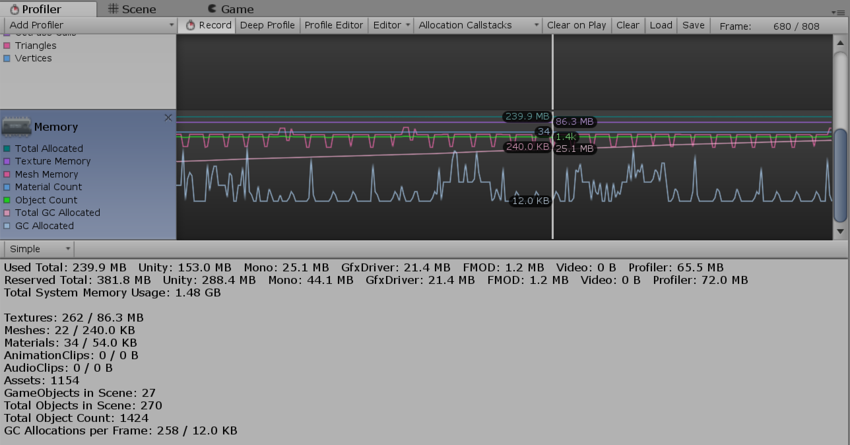
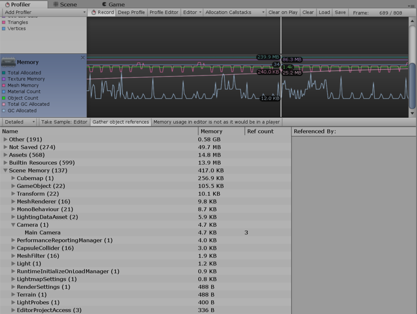

# 内存性能分析器 (Memory Profiler)

Memory Profiler 中提供了两种模式来检查应用程序的内存使用情况。在下方面板左上角的下拉选单中可选择模式。

## Simple

__Simple__ 视图提供每个帧在整个 Unity 中的实时内存使用量的简单概况。

 

Unity 保留了可供分配的内存池，以免过于频繁向操作系统索取内存。此部分显示为保留量以及已用量。

此部分涵盖的方面包括：

* **Unity**：本机 Unity 代码中的分配所跟踪的内存量
* **Mono**：托管代码使用的总堆大小和已用堆大小。此内存量是垃圾收集量
* **GfxDriver**：驱动程序对纹理、渲染目标、着色器和网格数据使用的估计内存量。
* **FMOD**：音频驱动程序的估计内存使用量
* **Profiler**：用于性能分析器数据的内存

显示的数字与任务管理器或活动监视器不同，因为 Memory Profiler 未对某些用途进行跟踪。这些用途包括一些驱动程序使用的内存和用于可执行代码的内存。

此性能分析器会显示某些最常见的资源/对象类型的内存统计信息。这些统计信息包括计数和已用内存（主内存和视频内存）：

* **纹理 (Textures)**
* **网格 (Meshes)**
* **材质 (Materials)**
* **动画 (Animations)**
* **音频 (Audio)**
* **对象计数 (Object Count)**

__Object Count__ 是创建的对象总数。如果此数字随着时间的推移而上升，表明游戏创建了一些永不销毁的对象。

##Detailed

__Detailed__ 视图用于创建当前状态的快照。使用 __Take Sample__ 按钮可捕获详细的内存使用情况。获取此数据需要一些时间，因此不要期望 Detailed 视图能提供实时详细信息。在采样之后，Profiler 窗口将更新为树视图，可在其中查看内存使用情况。

 

此视图将显示各个资源和游戏对象的内存使用情况。此外还显示游戏对象位于内存中的原因。常见原因包括：

* **Assets**：从用户或本机代码引用的资源
* **Built-in Resources**：Unity Editor 资源或 Unity 默认资源
* **Not Saved**：标记为 DontSave 的游戏对象
* **Scene Memory**：游戏对象和附加的组件
* **Other**：未在上述类别中标记的游戏对象

单击列表中的游戏对象可在 Project 或 Scene 视图中查看该游戏对象。

在 Editor 中进行性能分析时，Memory Profiler 显示的所有数字都表示 Editor 中的内存使用情况。这些数字通常比在播放器中运行时更大，因为运行 Unity Editor 会增加额外的内存。如需了解应用程序更精确的数字和内存使用情况，请使用性能分析器连接来连接到正在运行的播放器。这样将给出目标设备上的实际使用情况。

在 `System.ExecutableAndDlls` 下报告的内存是只读内存，因此操作系统可能会根据需要丢弃这些页面，然后从文件系统重新加载它们。这样可以降低内存使用量，而且通常不会直接导致操作系统决定终止应用程序。此外，其中一些页面也可能与使用相同框架的其他应用程序共享。
