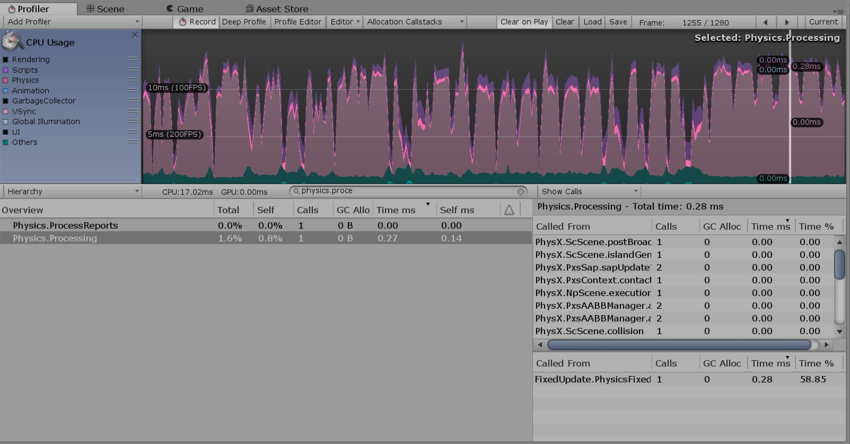

物理性能分析器 (Physics Profiler)
================

Physics Profiler 显示物理引擎在场景中已处理的物理统计信息。此信息有助于诊断和解决与场景中的物理相关的性能问题或意外差异。

另请参阅[物理调试可视化](PhysicsDebugVisualization.html)。

属性
----------

|**属性** |**功能** |
|:---|:---|
|__Active Dynamic__|非睡眠的非运动刚体组件的数量。|
|__Active Kinematic__|非睡眠的运动刚体组件的数量。请注意，已附加关节的运动刚体组件可能每帧被处理多次，这会计入显示的数量中。在帧中调用 [MovePosition](../ScriptReference/Rigidbody.MovePosition.html) 或 [MoveRotation](../ScriptReference/Rigidbody.MoveRotation.html) 时，运动刚体处于活动状态，并在下一帧中保持活动状态。|
|__Static Colliders__|未附加刚体组件或父游戏对象未附加刚体组件的游戏对象上的碰撞体组件数。如果此类游戏对象或其父游戏对象具有刚体组件，则碰撞体将不计为静态碰撞体。这些碰撞器称为复合碰撞体。这有助于以方便的方式排列多个碰撞体，而不是将所有碰撞体放在与刚体组件相同的游戏对象上。|
|**Rigidbody**|物理引擎处理的刚体组件数量（与组件的睡眠状态无关）。|
|__Trigger Overlaps__|重叠触发器的数量（成对计数）。|
|__Active Constraints__|物理引擎处理的原始约束的数量。约束用作关节的构建块以及碰撞响应。例如，限制 [ConfigurableJoint](../ScriptReference/ConfigurableJoint.html) 的线性或旋转自由度涉及每个限制的基本约束。|
|__Contacts__|场景中所有碰撞体之间的触点对总数，也包括触发器重叠对的数量。请注意，一旦每个碰撞体对之间的距离低于特定的用户可配置限制，该碰撞体对就会创建一个触点对，因此可能会看到针对尚未接触或重叠的刚体组件生成的触点。有关更多详细信息，请参阅 [Collider.contactOffset](../ScriptReference/Collider-contactOffset.html) 和 [ContactPoint.separation](../ScriptReference/ContactPoint-separation.html)。|

**注意**：

* 这些数字可能与场景中具有物理组件的游戏对象的确切数量不对应。这是因为有些物理组件以不同的速率处理，具体取决于其他组件产生的影响（例如，附加的关节组件）。要计算附加了特定物理组件的游戏对象的确切数量，请使用 [FindObjectsOfType](https://docs.unity3d.com/ScriptReference/Object.FindObjectsOfType.html) 函数编写自定义脚本。

* Physics Profiler 不显示睡眠刚体组件的数量。这些是与物理引擎无关的组件，因此不由 Physics Profiler 处理。有关睡眠刚体组件的更多信息，请参阅[刚体概述：睡眠](RigidbodiesOverview.html)。

##使用 Physics Profiler 了解性能问题

物理模拟在主逻辑更新循环的单独固定频率更新周期中运行，只能通过每次调用的 `Time.fixedDeltaTime` 推进时间。这类似于 `Update()` 和 `FixedUpdate() ` 之间的区别（有关更多信息，请参阅关于 [Time Manager](class-TimeManager.html) 的文档）。

当出现需要很长时间的复杂逻辑或图形帧时，Physics Profiler 必须每帧多次调用物理模拟。这意味着已经占用大量资源的帧会占用更多的时间和资源，这很容易导致物理模拟因为 __Maximum Allowed Timestep__ 值（可在 __Edit__ > __Project Settings__ > __Time__ 中设置）而暂时停止。

可在项目中检测到这一点，方法是选择 [CPU Usage Profiler](ProfilerCPU.html) 并在 __Overview__ 部分中检查 __Physics.Processing__ 或 __Physics.Simulate__ 的调用次数。

在此示例图中，__Calls__ 列中的值 1 表示物理模拟在最后一个逻辑帧上被调用一次。

调用计数接近 10 可能表示存在问题。第一种解决方案是降低物理模拟的频率；如果问题仍然存在，请检查在 Physics Profiler 必须使用大量模拟调用以便追赶游戏时间之前可能是什么原因导致了大型帧。有时，大型的图形帧可能会导致稍后在场景中进行更多物理模拟调用。

如需了解场景中的物理模拟的更多详细信息，请单击三角形箭头以展开 __Physics.Processing__，如上面的截屏所示。此时可看到为更新场景而运行的物理引擎任务的实际名称。可能会看到的两个最常见的名称为：

* __Pxs__：“PhysX 解算器”(PhysX solver) 的缩写，是关节所需的以及用于解算重叠体触点的物理引擎任务。

* __ScScene__：更新场景、运行宽阶段和窄阶段以及整合刚体（由于力和冲量将它们移动到空间中）所需的任务。请参阅 [Steven M. LaValle 的“规划算法”(Planning Algorithms)](http://planning.cs.uiuc.edu/node214.html) 了解两阶段碰撞检测阶段的定义。
