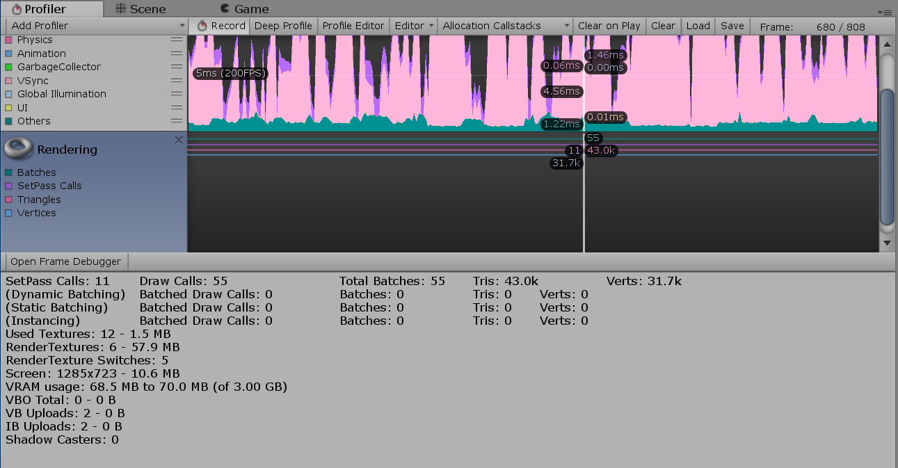

#渲染性能分析器 (Rendering Profiler)

 

Rendering Profiler 显示渲染统计信息。时间轴显示渲染的批次 (Batches)、SetPass 调用 (SetPass Calls)、三角形 (Triangles) 和顶点 (Vertices) 的数量。下方面板将显示更多渲染统计信息，这些统计信息与 GameView [Rendering Statistics](RenderingStatistics.html) 窗口中显示的统计信息非常接近。
