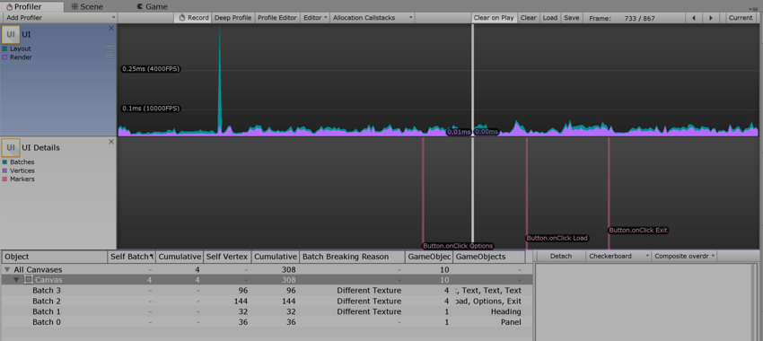

#UI 性能分析器 (UI Profiler)

UI Profiler 是专用于游戏内 UI 的性能分析器模块。

可通过 [Profiler 窗口](ProfilerWindow.html)的菜单 __Add Profiler__ > __UI and UI Details__ 访问该模块。

使用此功能有助于了解 UI 批处理、对象的批处理原因和方式、UI 的哪一部分负责减速，还可在拖动时间轴时预览 UI 或其某个部分。

请注意，与其他性能分析器模块类似，此性能分析器非常耗费资源。

##设置

UI Details 图表具有可切换的 __Markers__ 组，类似于 CPU 图表提供的组。
在预览面板中，有一个 __Detach__ 按钮和两个下拉菜单。

* Markers 开关在 UI Details 图表上显示或隐藏事件标记。

* Detach 在单独的窗口中弹出预览内容。

* 两个下拉菜单可用于选择预览背景（黑色、白色或棋盘）和预览类型（原始渲染、过度绘制或复合过度绘制）。

##有用的注意事项

* 标记可能会让人眼花缭乱，具体取决于所分析的用例。在需要时隐藏或显示标记有助于提高图表的可读性。

* 为了更清晰可见，可根据要预览的 UI 选择预览背景。例如，白色背景上的白色 UI 不易辨识，因此可以更改。

* 将预览内容分离出来有助于更好管理屏幕空间。

* 过度绘制和复合过度绘制用于确定 UI 的哪些部分是无用的。

##定义

__标记 (Marker)__：用户与 UI 交互（单击按钮、更改滑动条值等）时将记录标记，然后绘制（如果启用）为图表上的垂直线和标签。

__批次 (Batch)__：UI 系统尝试批量处理绘制调用。两个对象无法一起批处理的原因有很多。
 

**批次中断原因**

* 不与画布共面： 批处理需要对象的矩形变换与画布共面（未旋转）。

* 画布注入索引： CanvasGroup 组件存在并强制新建批次，即在其余部分上显示组合框的下拉列表时。

* 不同的材质实例、矩形裁剪、纹理、A8 纹理用法： 只有具有相同材质、遮罩、纹理、纹理 Alpha 通道用法的对象才能一起批处理。
  

## 提示

Treeview 行有一个上下文菜单，其中包含“在场景中查找匹配对象”(find matching object in scene) 条目，也可通过双击某一行触发。

  

---

* 2017-05-17  Page published with limited [editorial review](DocumentationEditorialReview.html)

* Unity [2017.1](../Manual/30_search.html?q=newin20171) 中的新功能 NewIn20171

