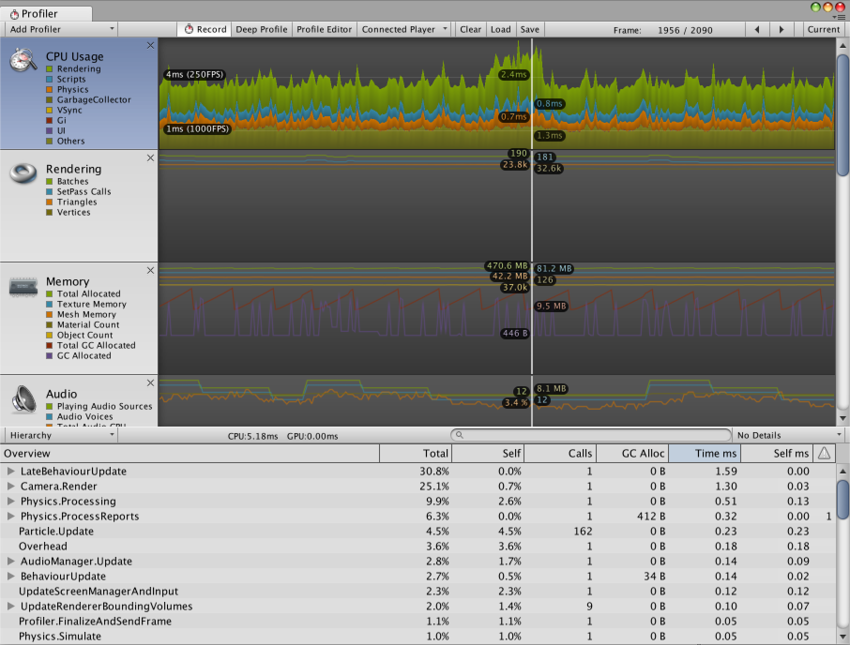
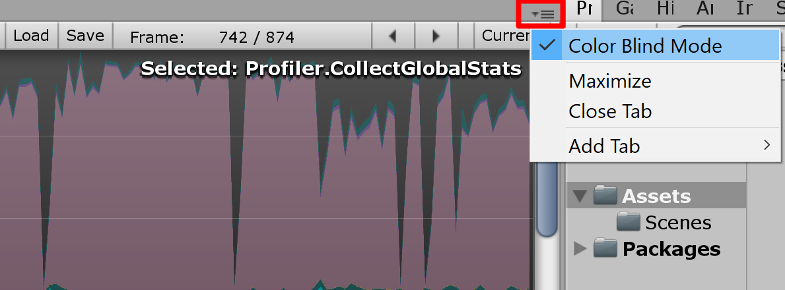
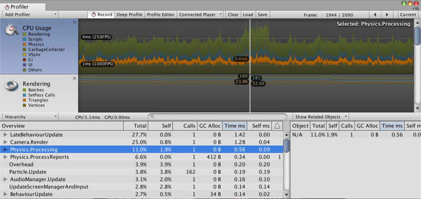

#Profiler 窗口

在 Unity Editor 中通过工具栏 __Window__ > __Profiler__ 访问 Profiler 窗口。

请参阅[性能分析器概述](Profiler.html)以大致了解性能分析器的工作原理。




##性能分析器控件


 

性能分析器控件位于窗口顶部的工具栏中。使用这些控件可打开和关闭性能分析以及并浏览分析的帧。转移控件位于工具栏的最右端。请注意，当游戏正在运行且性能分析器正在收集数据时，单击任何这些转移控件会暂停游戏。这些控件可分别转到第一个记录的帧、后退一个帧、前进一个帧以及转到最后一帧。

性能分析器不会保留所有记录的帧，因此_第一_帧的概念应该是仍然保留在内存中的最早的帧。“当前”转移按钮使性能分析统计窗口显示实时收集的数据。Active Profiler 弹出菜单用于选择是在 Editor 中还是在单独的播放器中进行性能分析（例如，在连接的 iOS 设备上运行的游戏）。使用 Save 按钮可以将记录的帧写入文件。相应地，Load 按钮读取先前保存的数据。还可以加载由播放器写出的二进制性能分析数据（生成日志时，设置 [Profiler.enableBinaryLog](../ScriptReference/Profiling.Profiler-enableBinaryLog.html) 以启用二进制格式）。如果在按下 Shift 键的同时单击“Load”按钮，文件内容将附加到内存中的当前性能分析帧。


###深度性能分析 (Deep Profiling)

打开 __Deep Profile__ 后，将分析_所有_的脚本代码，也就是说会记录所有函数调用。这有助于了解游戏代码中的确切时间使用情况。

请注意，深度性能分析会产生**非常大的开销**并占用大量内存，因此在性能分析时游戏的运行速度会明显变慢。如果脚本代码很复杂，可能根本无法进行深度性能分析。对于使用简单脚本编写的小游戏，深度性能分析应该足够快。如果发现整个游戏的深度性能分析导致帧率下降太多以至于游戏几乎无法运行，应考虑不使用此方法，而是使用下面描述的方法。在设计游戏并决定如何以最佳方式实现关键功能时，可能适合使用深度性能分析。请注意，对于大型游戏，深度性能分析可能会导致 Unity 耗尽内存，因此可能无法进行深度性能分析。

手动分析脚本代码块的开销比使用深度性能分析要小。使用 [Profiler.BeginSample](../ScriptReference/Profiling.Profiler.BeginSample.html) 和 [Profiler.EndSample](../ScriptReference/Profiling.Profiler.EndSample.html) 脚本函数可启用和禁用关于代码段的性能分析。

###Color Blind Mode

The Profiler window features a **Color Blind Mode**, which uses higher contrast colors in the graphs to enhance visibility for users with  red-green color blindness (such as deuteranopia, protanopia, or tritanopia). To enable it, click the context menu in the upper-right corner of the Profiler window, and click **Color Blind Mode**.


###View SyncTime

以固定帧率运行或与垂直空白空间同步运行时，Unity 会记录“Wait For Target FPS”中的等待时间。默认情况下，性能分析器中不会显示此时间量。要查看用于等待的时间，可切换“View SyncTime”。这也可用于衡量丢帧之前的余量时间。

##Profiler 时间轴


 

Profiler 窗口的上半部分显示随时间推移的性能数据。运行游戏时，每帧都会记录数据，并显示最近几百帧的历史记录。单击特定帧将在窗口的下半部分显示其详细信息。根据当前选择的时间轴区域会显示不同的详细信息。

时间轴的垂直刻度是自动管理的，并会尝试填充窗口的垂直空间。请注意，要显示更多详细信息，比如 CPU Usage 区域中的信息，可删除 Memory 和 Rendering 区域。此外，可选择时间轴和统计信息区域之间的分割线并向下拖动，从而增加用于时间轴图表的屏幕区域。

时间轴包含几个区域：CPU Usage、Rendering 和 Memory。单击面板中的关闭按钮可删除这些区域，而使用性能分析器控件栏中的 _Add Area_ 下拉选单可重新添加这些区域。

请注意，标签区域中的彩色方块可以控制是否显示关联的时间轴。要从显示中删除样本，请单击颜色键。该键将变暗，且数据将从图表中删除。此功能很有用，例如，可用于找出 CPU 图中产生尖峰的原因。


##WebGL

与任何其他平台上一样，可在 WebGL 上使用 Unity Profiler。但有一个重要的区别，即无法附加到 WebGL 中运行的播放器，因为 WebGL 使用 WebSocket 进行通信，导致不允许浏览器端的传入连接。相反，需要使用 Build Settings 中的“Autoconnect Profiler”复选框。还要注意，目前无法为 WebGL 分析绘制调用。

##远程性能分析


要分析在另一台设备上运行的游戏或在另一台计算机上运行的 Unity 播放器的性能，可将 Unity Editor 连接到该设备或计算机。__Active Profiler__ 下拉选单会显示本地网络上运行的所有 Unity 播放器。这些播放器由玩家类型和运行播放器的主机名进行标识，如“iPhonePlayer (Toms iPhone)”。

为了能够连接到 Unity 播放器，必须将 Unity 播放器作为 __Development build__（菜单：__File__ > __Build Settings...__）启动。

在对话框中选中 __Development Build__ 选项。在此处还可选中 __Autoconnect Profiler__ 以确保 Editor 和播放器在启动时自动连接。

###iOS


按照以下步骤在 iOS 设备上启用远程性能分析：

1.将 iOS 设备连接到 WiFi 网络。（性能分析器使用本地 WiFi 网络将性能分析数据从您的设备发送到 Unity Editor。）
1.在 Unity Editor 的 __Build Settings__ 对话框（菜单：__File__ > __Build Settings...__）中，选中 __Autoconnect Profiler__ 复选框。
1.通过线缆将设备连接到 Mac。在 Unity Editor 的 __Build Settings__ 对话框（菜单：__File__ > __Build Settings...__）中，选中 __Autoconnect Profiler__ 复选框，并选择 __Build & Run__。
1.在设备上启动应用程序时，在 Unity Editor 中打开 Profiler 窗口 (__Window__ > __Profiler__)。

如果使用了防火墙，需要确保防火墙出站规则中的端口 54998 至 55511 已打开；这些是 Unity 用于远程性能分析的端口。

**注意：**有时，Unity Editor 可能无法自动连接到设备。在这种情况下，可从 Profiler 窗口 __Active Profiler__ 下拉菜单中选择适当的设备来启动性能分析器连接。

###Android

可使用两种方法以 Android 设备上启用远程性能分析：WiFi 或 [ADB](http://developer.android.com/guide/developing/tools/adb.html)。

要进行 WiFi 性能分析，请遵循以下步骤：

1.确保在 Android 设备上禁用移动数据 (Mobile Data)。
1.将 Android 设备连接到 WiFi 网络。（性能分析器使用本地 WiFi 网络将性能分析数据从您的设备发送到 Unity Editor。）
1.通过线缆将设备连接到 Mac 或 PC。在 Unity 的 Build Settings 对话框中选中 __Development Build__ 和 __Autoconnect Profiler__ 复选框，然后在 Unity Editor 中单击 __Build & Run__。
1.在设备上启动应用程序时，在 Unity Editor 中打开 Profiler 窗口（菜单：__Window__ > __Profiler__）。
1.如果 Unity Editor 无法自动连接到设备，请从 Profiler 窗口 __Active Profiler__ 下拉菜单中选择适当的设备。


**注意：**Android 设备和主机（运行 Unity Editor）必须位于同一[子网](http://en.wikipedia.org/wiki/Subnetwork)上才能正常进行设备检测。

要进行 ADB 性能分析，请遵循以下步骤：

* 通过线缆将设备连接到 Mac 或 PC，并确保 ADB 能识别该设备（即显示在 _adb 设备_列表中）。
* 在 Unity Editor 的 __Build Settings__ 对话框（菜单：__File__>__Build Settings...__）中，选中 __Development Build__ 复选框并选择 __Build & Run__。
* 在设备上启动应用程序时，在 Unity Editor 中打开 Profiler 窗口（菜单：__Window__ > __Profiler__）。
* 从 Profiler 窗口 __Active Profiler__ 下拉菜单中选择 _AndroidProfiler(ADB@127.0.0.1:34999)_。
**注意：**单击 __Build & Run__ 时，Unity Editor 会自动为应用程序创建一个 adb 通道。
如果要分析其他应用程序或重新启动 adb 服务器，必须手动设置此通道。为此，请打开终端窗口/CMD 提示窗口，并输入：

````
adb forward tcp:34999 localabstract:Unity-{在此处插入 Bundle ID}
````

**注意：**仅当所选目标为 Android 时，才会显示下拉菜单中的条目。

如果使用了防火墙，需要确保防火墙出站规则中的端口 54998 至 55511 已打开；这些是 Unity 用于远程性能分析的端口。


---

<span class="page-edit">• 2017-05-16  Page amended with no [editorial review](DocumentationEditorialReview.html)
</span><br/>


