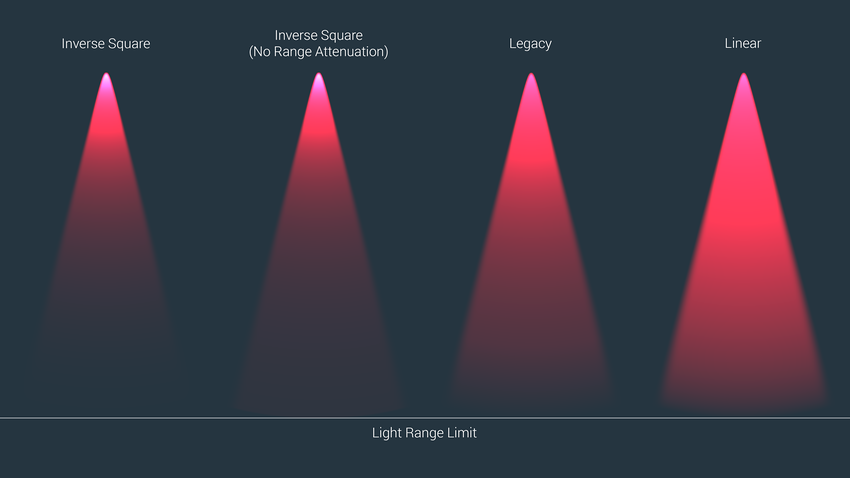

# 自定义衰减

在现实世界中，光线会在远处消失，而且昏暗的光线比明亮的光线具有更低的有效范围。“衰减”一词是指光衰速率。除了 Unity 的默认衰减光照行为外，还可以使用自定义衰减设置。

渐进式光照贴图 (Progressive Lightmapper) 提供自定义衰减预设，您可以通过脚本来实现这些预设。请参阅表下方的图像以查看这些预设的工作原理的可视化表示，并参阅图像下方的代码示例来了解此功能的用法示例。

| **属性** | **功能** |
|:---|:---|
|`InverseSquared`|应用距离平方倒数法衰减模型。意味着，光照强度与位置到光源的距离的平方成反比减小。有关更多信息，请参阅 Wikipedia：平方反比定律 (Inverse-square law)。此选项在物理上是最准确的。|
|`InverseSquaredNoRangeAttenuation`|应用距离平方倒数法衰减模型，但没有平滑范围衰减。此选项的原理与 `InverseSquared` 此相同，但光照系统不考虑准时光源（即点光源和聚光灯）的范围参数的衰减。|
|`Legacy`|应用二次衰减模型。该模型将光衰减基于光源的范围。随着光线远离光源，强度会减弱，但衰减会有非常明显且不自然的下降，视觉效果也不太现实。|
|`Linear`|应用线性衰减模型。在此模型中，衰减与距光源的距离成反比，且衰减以固定的速率从光源开始减弱。|




```
using System.Collections;
using System.Collections.Generic;
using UnityEngine;
using UnityEngine.Experimental.GlobalIllumination;
using UnityEngine.SceneManagement;

[ExecuteInEditMode]
public class ExtractFalloff : MonoBehaviour
{
    public void OnEnable()
    {
        Lightmapping.RequestLightsDelegate testDel = (Light[] requests, Unity.Collections.NativeArray<LightDataGI> lightsOutput) =>
        {
            DirectionalLight dLight = new DirectionalLight();
            PointLight point = new PointLight();
            SpotLight spot = new SpotLight();
            RectangleLight rect = new RectangleLight();
            LightDataGI ld = new LightDataGI();

            for (int i = 0; i < requests.Length; i++)
            {
                Light l = requests[i];
                switch (l.type)
                {
                    case UnityEngine.LightType.Directional: LightmapperUtils.Extract(l, ref dLight); ld.Init(ref dLight); break;
                    case UnityEngine.LightType.Point: LightmapperUtils.Extract(l, ref point); ld.Init(ref point); break;
                    case UnityEngine.LightType.Spot: LightmapperUtils.Extract(l, ref spot); ld.Init(ref spot); break;
                    case UnityEngine.LightType.Area: LightmapperUtils.Extract(l, ref rect); ld.Init(ref rect); break;
                    default: ld.InitNoBake(l.GetInstanceID()); break;
                }

	      ld.falloff = FalloffType.InverseSquared;
                lightsOutput[i] = ld;
            }
        };

        Lightmapping.SetDelegate(testDel);
    }

    void OnDisable()
    {
        Lightmapping.ResetDelegate();
    }
}
```

---

<span class="page-history">在 [2018.1](https://docs.unity3d.com/2018.1/Documentation/Manual/30_search.html?q=newin20181) 版中添加了渐进光照贴图 <span class="search-words">NewIn20181</span></span>

<span class="page-edit"> 2018-03-28  Page published with limited [editorial review](DocumentationEditorialReview.html)
</span>
