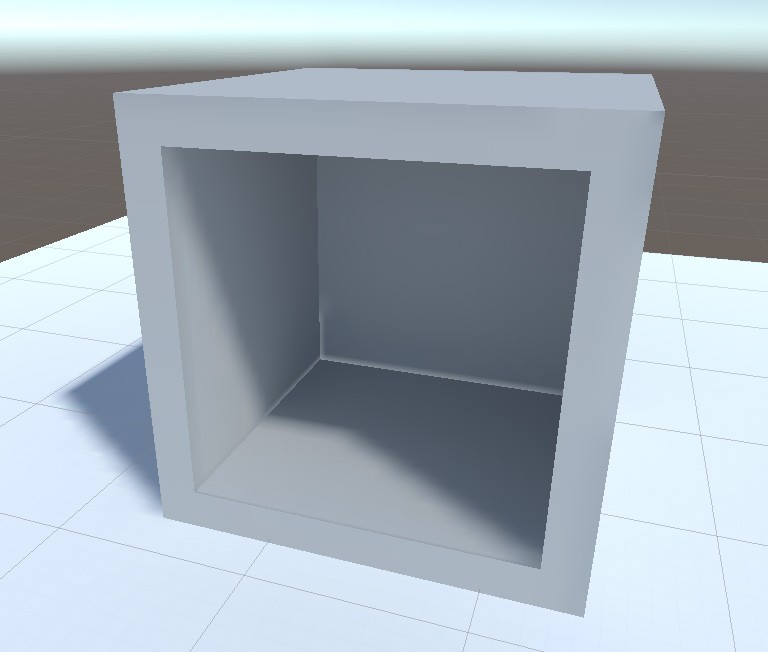
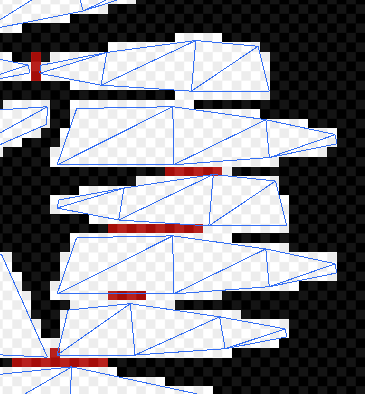
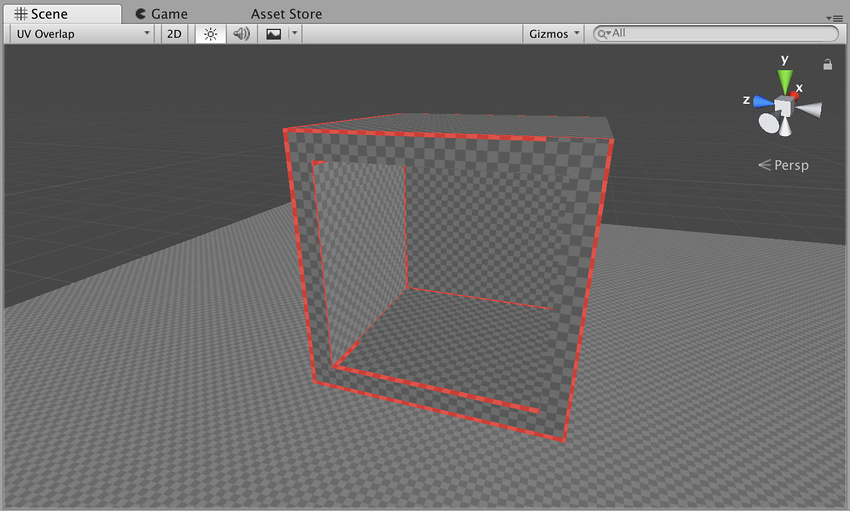
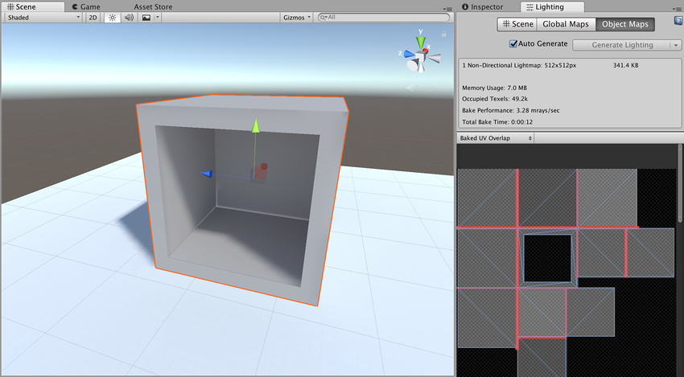
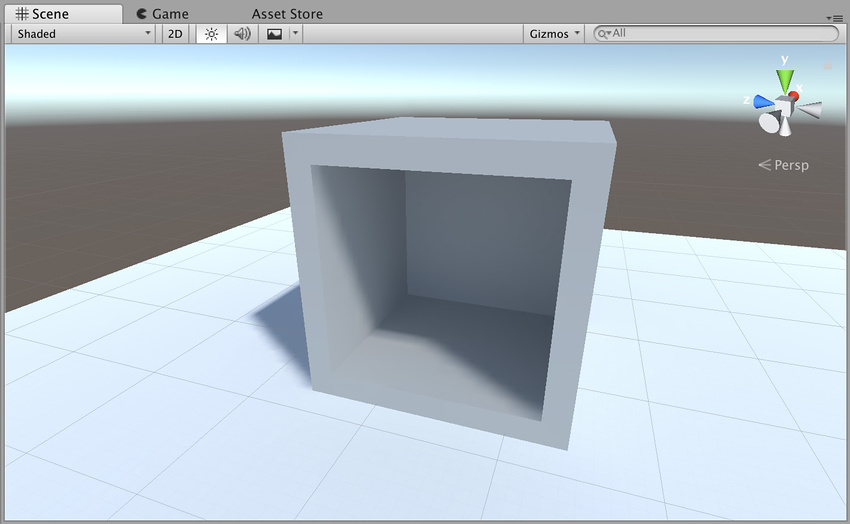

# UV 重叠结果

每个光照贴图都包含许多__图表__。在运行时，Unity 将这些图表映射到网格面上，并使用图表的光照数据来计算最终外观。由于 GPU 采样的工作原理，如果两个图表彼此距离太近，一个图表中的数据就可能渗漏到另一个图表。这种情况下通常会导致意外的锯齿、像素化和其他图形化结果（这些问题称为瑕疵）。

为避免光渗，图表之间必须有足够的空间。当 GPU 对光照贴图进行采样时，光照系统会从最接近采样点的四个纹理像素计算最终采样值（假设使用双线性过滤）。这四个纹理像素称为采样点的双线性“邻域”。如果图表重叠（也就是说，如果图表中任何点的邻域与另一个图表中任何点的邻域重叠），表示图表太靠近。在下图中，白色像素表示图表邻域，红色像素表示重叠的邻域。

确定最佳图表放置位置和间距可能会很困难，因为它取决于多个参数（例如光照贴图分辨率、网格 UV 和导入器设置）。基于此原因，Unity 提供了轻松识别这些问题的能力，如以下部分所述。

## 识别

有三种方法可识别重叠：

* 密切关注 Unity 的控制台。如果 Unity 检测到重叠的 UV，它会打印一条警告消息，其中包含受影响游戏对象的列表。

* 使用 Scene 视图中的 __UV Overlap__ 绘制模式（有关更多信息，请参阅 [Scene 视图中的 GI 可视化](GIVis.html)）。启用此模式后，Unity 会以红色突出显示图表中的哪些像素纹理过于靠近其他图表中的纹理像素。如果您在 Scene 视图中发现瑕疵，并希望快速检查是否由 UV 重叠导致了此问题，则此方法尤其有用。

* 使用 Lighting 选项卡中的 Object Maps。选择一个对象，前往 Lighting 选项卡，然后选择 Object Maps。确保在下拉选单中选择 Baked UV Overlap。有问题的纹理像素在此视图中显示为红色。

## 解决方案

UV 重叠没有唯一的解决方案，因为有很多问题可能导致这种情况。以下是最常见的解决方案：

* 如果由 Unity 自动创建光照贴图 UV，则可以增加 __Pack Margin__。为此，请导航到网格 (Mesh) 导入设置的 [Model 选项卡](FBXImporter-Model.html)。确保已启用 __Generate Lightmap UVs__，然后展开 __Advanced__ 并使用 __Pack Margin__ 滑动条来增大值。这样会在图表之间产生更大间距，从而降低重叠的可能性。但是，这也会增加光照贴图的总空间要求，因此请尝试应用足够的间距来避免瑕疵，但不要过量。有关 Unity 自动创建的光照贴图 UV 的更多信息，请参阅有关[生成光照贴图 UV](LightingGiUvs-GeneratingLightmappingUVs.html) 的文档。

* 如果由您自己提供光照贴图 UV，可尝试使用建模包添加边距。

* 提高整个光照贴图的分辨率。这样将增加图表之间的像素数量，从而降低发生渗漏的可能性。缺点是光照贴图可能会变得太大。您可以在 __Lightmapper Settings__ 下的 __Lighting__ 选项卡中执行此操作。

* 提高单个游戏对象的分辨率。这种情况下可以仅为具有重叠 UV 的游戏对象提高光照贴图分辨率。这也可能增加光照贴图的大小，但可能性较小。您可以在 __Lightmap Settings__ 下的 Mesh Renderer 中更改游戏对象的光照贴图分辨率。

---

在 [2018.1](https://docs.unity3d.com/2018.1/Documentation/Manual/30_search.html?q=newin20181) 版中添加了渐进光照贴图 NewIn20181

 2018-03-28  Page published with limited [editorial review](DocumentationEditorialReview.html)

