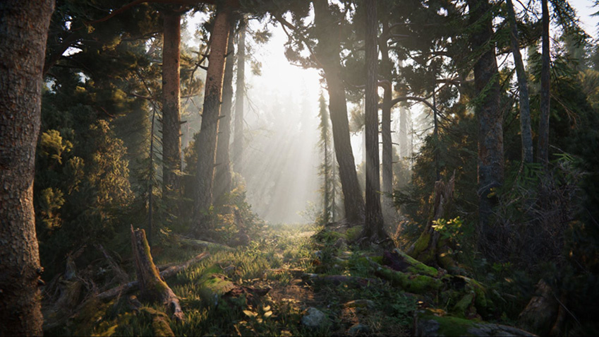
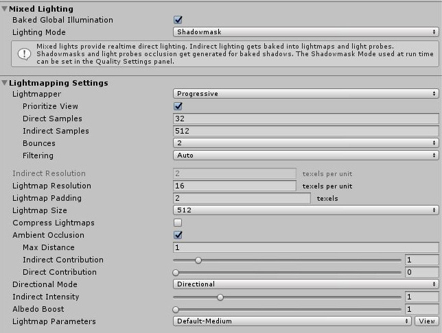
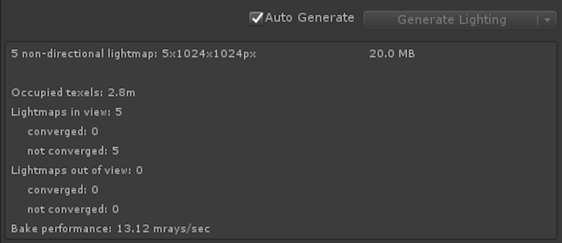
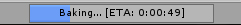
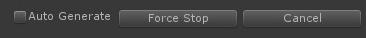

# 渐进光照贴图 (Progressive Lightmapper)

 

渐进式光照贴图是一种基于路径追踪的光照贴图系统，提供了能在Edtior中逐渐刷新的烘焙光照贴图和光照探针。要求不重叠的 UV 具有较小的面积和角度误差，以及棋盘格图表（charts）之间有足够的填充。

渐进式光照贴图采取了一个短暂的准备步骤来处理几何体与实例的更新，同时生成 G-buffer 和图表遮罩（chart masks）。然后，它会立即生成输出，并随着时间的推移逐步细化输出，以实现更完善的交互式照明工作流。此外，烘焙时间更加可预测，因为渐进光照贴图在烘焙时提供估计时间。

渐进光照贴图还可单独为每个纹理像素分别以光照贴图分辨率烘焙全局光照 (GI)，无需采用上采样方案或依赖任何辐照度缓存或其他全局数据结构。因此，渐进光照贴图具有强大的功能，并允许您烘焙光照贴图的选定部分，从而更快测试和迭代场景。

如需观看介绍交互式工作流程的深入视频，请参阅 Unity 的视频演练：[开发中 - 渐进光照贴图 (In Development - Progressive Lightmapper) (YouTube)](https://youtu.be/foMZJrwRGr0)。

## 设置

要打开设置，请选择 __Window__ &gt; __Lighting__ &gt; __Settings__。

 

| __Property:__ |__Function:__ |||||
|:---|:---|
| __Lighting Mode__ | Specifies which lighting mode Unity should use for all mixed lights in the Scene. Options are [Baked Indirect](LightMode-Mixed-BakedIndirect.html), [Distance Shadowmask](LightMode-Mixed-DistanceShadowmask.html), [Shadowmask](LightMode-Mixed-Shadowmask.html), and [Subtractive](LightMode-Mixed-Subtractive.html). |||||
| __Lightmapper__ | Use this to specify which internal lighting calculation software to use to calculate lightmaps in the Scene. The options are __Progressive __and __Enlighten__. The default value is __Progressive__. If you want to use the Enlighten system, see documentation on [Enlighten](https://docs.google.com/document/d/1-Vll44vg4UX4enb98JNS3AjIP8IguWF8lhbCRQLgkJ8/edit#heading=h.dq1ep1102yb8).  |||||
| __Prioritize View__ | Enable this to make the Progressive Lightmapper apply changes to the texels that are currently visible in the Scene View, then apply changes to the out-of-view texels. |||||
| __Direct Samples__ | The number of samples (paths) shot from each texel. This setting controls the number of samples Progressive Lightmapper uses for direct lighting calculations. Increasing this value can improve the quality of lightmaps, but increases the baking time. |||||
| __Indirect Samples__ | The number of samples (paths) shot from each texel. This setting controls the number of samples Progressive Lightmapper uses for indirect lighting calculations. For some Scenes, especially outdoor Scenes, 100 samples should be enough. For indoor Scenes with emissive geometry, increase the value until you see the result you want. |||||
| __Bounces__ | Use this value to specify the number of indirect bounces to do when tracing paths. For most Scenes, two bounces is enough. For some indoor Scenes, more bounces might be necessary. |||||
| __Filtering__| Configure the post-processing of lightmaps to limit noise. You can set it to __None__, __Auto__ or __Advanced__. The Advanced option offers three additional parameters for manual configuration. In Auto mode, the default values from the Advanced mode are used. For every parameter, Gaussian or A-Trous filter can be used separately. |||||
|| __Auto__ | Uses default values for post-processing lightmaps. |||||
|| __Advanced__ | Offers three additional parameters for manual configuration. You can use the Gaussian or A-Trous filters separately for direct and indirect settings. Note that the __Gaussian__ filter values define the radius, while the __A-Trous__ filter value defines the "sigma". Sigma is a parameter that determines the threshold at which the filter acts on differences in the image. ||||
|  || __Direct Filter__ | Select a filter to use for direct light in the lightmap. |||
|  ||| __Gaussian__ | Select this to use a Gaussian filter for direct light in the lightmap. ||
|  |||| __Direct Radius__ | The radius of the Gaussian filter in texels for direct light in the lightmap. A higher radius increases the blur strength. |
|  ||| __A-Trous__ | Select this to use an A-Trous filter for direct light in the lightmap. ||
|  |||| __Direct Sigma__ | The sigma of the A-Trous filter in texels for direct light in the lightmap. A higher sigma increases the blur strength. |
|  ||| __None__ |  Select this to use no filter for direct light in the lightmap. ||
| || __Indirect Filter__ | Select a filter to use for indirect light in the lightmap. |||
|  ||| __Gaussian__ |  Select this to use a Gaussian filter for indirect light in the lightmap. ||
| |||| __Indirect Radius__ | The radius of the Gaussian filter in texels for indirect light in the lightmap. A higher radius increases the blur strength. |
|  ||| __A-Trous__ | Select this to use an A-Trous filter for indirect light in the lightmap. ||
| |||| __Indirect Sigma__ | The sigma of the A-Trous filter in texels for indirect light in the lightmap. A higher sigma increases the blur strength. |
| || __Ambient Occlusion Filter__  | Select a filter to use for Ambient Occlusion (see below) in the lightmap. Filter only available when you enable __Ambient Occlusion__.|||
| ||| __Gaussian__ | Select this to use a Gaussian filter for Ambient Occlusion in the lightmap. ||
| |||| __Ambient Occlusion Radius__ | The radius of the Gaussian filter in texels for Ambient Occlusion in the lightmap. A higher radius increases the blur strength. |||
|  ||| __A-Trous__ |  Select this to use an A-Trous filter for Ambient Occlusion in the lightmap. ||
|  |||| __Ambient Occlusion Sigma__ |  The sigma of the A-Trous filter in texels for Ambient Occlusion in the lightmap. A higher sigma increases the blur strength. |
| | __None__ |  Select this to use no filter for indirect light in the lightmap. |||||
| | __Lightmap Resolution__ | Use this to specify the number of texels per unit to use for lightmaps. Increasing this value improves lightmap quality, but also increases bake times. Note that doubling this value causes the number of texels to quadruple (because the value refers to both the height and width of the lightmap). Check the __Occupied texels__ count in the stats, documented below this table. |||||
| | __Lightmap Padding__ | Use this to specify the separation (in texel units) between separate shapes in the baked lightmap. The default value is 2. |||||
| | __Lightmap Size__ | The size (in pixels) of the full lightmap texture, which incorporates separate regions for the individual GameObject textures. The default value is 1024. |||||
| | __Compress Lightmaps__ | A compressed lightmap requires less storage space, but the compression process can introduce unwanted visual effects into the texture. Tick this checkbox to compress lightmaps, or untick it to keep them uncompressed. The checkbox is ticked by default. ||||
| | __Ambient Occlusion__ | Tick this checkbox to open a group of settings which allow you to control the relative brightness of surfaces in [ambient occlusion](LightingBakedAmbientOcclusion.html). Higher values indicate a greater contrast between the occluded and fully lit areas. This only applies to the indirect lighting calculated by the GI system. This setting is enabled by default. |||||
| || __Max Distance__ | Set a value to control how far the lighting system casts rays in order to determine whether or not to apply occlusion to an object. A larger value produces longer rays and contributes more shadows to the lightmap, while a smaller value produces shorter rays that contribute shadows only when objects are very close to one another. A value of 0 casts an infinitely long ray that has no maximum distance. The default value is 1. ||||
| || __Indirect Contribution__ | Use the slider to scale the brightness of indirect light as seen in the final lightmap (that is, ambient light, or light bounced and emitted from objects) from a value between 0 and 10. The default value is 1. Values less than 1 reduce the intensity, while values greater than 1 increase it. ||||
| || __Direct Contribution__ | Use the slider to scale the brightness of direct light from a value between 0 and 10. The default value is 0. The higher this value is, the greater the contrast applied to the direct lighting. ||||
| | __Directional Mode__ | You can set the lightmap up to store information about the dominant incoming light at each point on the objects’ surfaces. See documentation on [Directional Lightmapping](LightmappingDirectional.html) for further details. The default mode is __Directional__. ||||
| || __Directional__ | In __Directional__ mode, Unity generates a second lightmap to store the dominant direction of incoming light. This allows diffuse normal mapped materials to work with the GI. Directional mode requires about twice as much storage space for the additional lightmap data. Directional lightmaps cannot be decoded on SM2.0 hardware or when using GLES2.0. They fall back to Non-Directional lightmaps. |||
| || __Non-directional__ |__Non-directional__ mode switches Directional option off.  |||
| | __Indirect Intensity__ | Use this slider to control the brightness of indirect light stored in realtime and baked lightmaps, from a value between 0 and 5. A value above 1 increases the intensity of indirect light while a value of less that 1 reduces indirect light intensity. The default value is 1. ||||
| | __Albedo Boost__ | Use this slider to control the amount of light Unity bounces between surfaces, from a value between 1 and 10. To do this, Unity intensifies the albedo of materials in the Scene. Increasing this draws the albedo value towards white for indirect light computation. The default value of 1 is physically accurate. ||||
| | __Lightmap Parameters__ | Unity uses a set of general parameters for the lightmapping in addition to properties of the Lighting window. A few defaults are available from the menu for this property but you can also create your own lightmap parameter file using the __Create New__ option. See the [Lightmap Parameters](class-LightmapParameters.html) page for further details. The default value is __Default-Medium__. ||||

## 统计信息

 

__Auto Generate__ 和 __Generate Lighting__ 选项下方的面板将显示有关光照贴图的统计信息，包括：

* Unity 已创建的光照贴图数量

* __内存使用量 (Memory Usage)__：当前光照贴图所需的内存量。

* __占用的纹理像素 (Occupied Texels)__：在光照贴图 UV 空间中占用的纹理像素数量。

* __视图中的光照贴图 (Lightmaps in view)__：Scene 视图中的光照贴图数量。

* __不在视图中的光照贴图 (Lightmaps not in view)__：不在视图中的光照贴图数量。

    * __融合 (Converged)__：这些光照贴图的所有计算都已完成。

    * __未融合 (Not Converged)__：这些光照贴图的烘焙仍在进行中。

* __烘焙性能 (Bake Performance)__：每秒的光线数量。如果此值很低（即小于 2），则应调整设置或硬件以便一次处理更多光线。

在 __Auto__ 模式下，Unity 会自动计算光照贴图和光照探针。如果禁用 __Auto__，则需要按 __Build__ 按钮开始烘焙。

## 在烘焙期间

渐进光照贴图提供了在必要时监控和停止烘焙的选项。

### ETA

 

Unity 烘焙光照贴图时出现的进度条提供了“预计到达时间”（显示为 __ETA__）。这是完成当前烘焙的估计时间（秒）。这样可以实现更加可预测的烘焙时间，并可让您快速了解当前光照设置所需的烘焙时间。

### 强制停止 (Force Stop)

 

在手动烘焙过程中，随时按下 __Force Stop__ 即可停止烘焙过程。此按钮可让您在看到结果很理想时立即停止该过程。

---

在 [2018.1](https://docs.unity3d.com/2018.1/Documentation/Manual/30_search.html?q=newin20181) 版中添加了渐进光照贴图 NewIn20181

 2018-03-28  Page amended with limited [editorial review](DocumentationEditorialReview.html)

