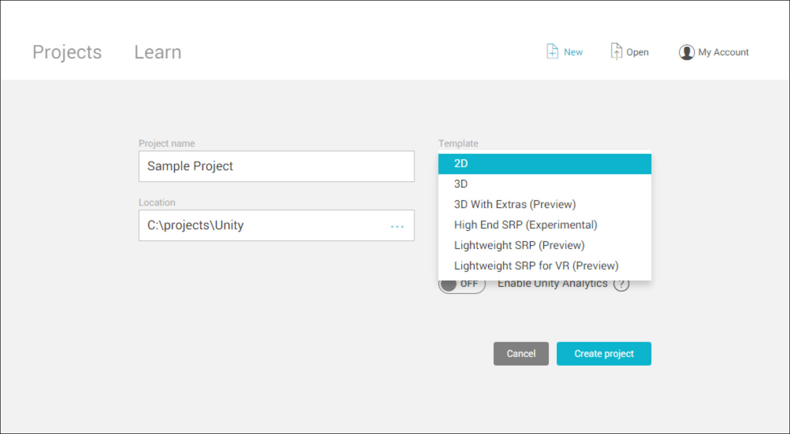

# 项目模板

项目模板基于项目的共同最佳实践而提供预选的设置。这些设置针对 Unity 支持的所有平台上的 2D 和 3D 项目进行了优化。

模板可加快准备初始项目、目标游戏类型或视觉保真度的过程。通过使用模板，您可能发现一些未曾了解的设置以及[可编程渲染管线](https://github.com/Unity-Technologies/ScriptableRenderPipeline/wiki)、[着色器图](https://github.com/Unity-Technologies/ShaderGraph/wiki)和[后期处理](https://github.com/Unity-Technologies/PostProcessing/wiki)等功能。

创建项目时，选择用于初始化项目的模板。

## 模板类型

Unity 提供以下可用于初始化项目的模板：

### 2D

此模板可配置 2D 应用程序的项目设置，包括[纹理（图像）导入](class-TextureImporter.html)、[Sprite Packer](SpritePacker.html)、[Scene 视图](UsingTheSceneView.html)、[光照](LightingOverview.html)和[正交摄像机](class-Camera.html)。

### 3D

配置使用 Unity 内置[渲染管线](SL-RenderPipeline.html)的 3D 应用程序的项目设置。

### 3D With Extras (Preview)

配置使用 Unity 内置渲染器和后期处理功能的 3D 应用程序的项目设置。此项目类型包括新的后期处理栈、几个用于快速启动开发的[预设](Presets.html)以及一些示例内容。

有关后期处理的更多信息，请参阅关于后期处理 GitHub 代码仓库的 [wiki](https://github.com/Unity-Technologies/PostProcessing/wiki) 页面。

### High Definition RP (Preview)

配置使用高端平台（支持着色器模型 5.0（DX11 及更高版本））的项目的项目设置。此模板使用高清可编程渲染管线 (SRP)，这是一种现代渲染管线 (RP)，包括高级材质类型和可配置的混合平铺/集群延迟/前向光照架构。此模板还包括新的后期处理栈、几个用于快速启动开发的预设以及一些示例内容。

此模板为项目添加以下功能：

* HD 渲染管线 - 有关更多信息，请参阅关于可编程渲染管线代码仓库的 [wiki](https://github.com/Unity-Technologies/ScriptableRenderPipeline/wiki) 页面。
* 后期处理栈 - 后期处理栈使美术师和设计师能够使用适合美术师的界面将全屏滤镜应用于场景。有关更多信息，请参阅关于后期处理 GitHub 代码仓库的 [wiki](https://github.com/Unity-Technologies/PostProcessing/wiki) 页面。

__注意：__高清可编程渲染管线目前正在开发中，因此请考虑到该功能可能不完整且可能会随时发生变化（API、UX、范围）。因此，未包括在常规 Unity 支持中。Unity 正在寻求有关该功能的反馈。要询问有关该功能的问题，请访问 [Unity 预览论坛](https://forum.unity.com/forums/graphics-experimental-previews.110/)。

### Lightweight SRP (Preview)

配置以性能为主要考虑因素的项目以及使用主要烘焙光照解决方案的项目的项目设置。此模板使用轻量级可编程渲染管线，这是一种单通道前向渲染器。此模板还包括新的后期处理栈、几个用于快速启动开发的预设以及一些示例内容。

使用轻量级管线可减少项目的[绘制调用](DrawCallBatching.html)次数，因此提供了适合低端硬件的解决方案。

此项目模板使用以下功能：

* 轻量级渲染管线 - 有关更多信息，请参阅关于可编程渲染管线代码仓库的 [wiki](https://github.com/Unity-Technologies/ScriptableRenderPipeline/wiki) 页面。
* 着色器图工具 - 此工具允许使用可视节点编辑器而无需编写代码来创建着色器。有关着色器图的更多信息，请参阅关于着色器图代码仓库的 [wiki](https://github.com/Unity-Technologies/ShaderGraph/wiki) 页面。
* 后期处理栈 - 后期处理栈使美术师和设计师能够使用适合美术师的界面将全屏滤镜应用于场景。有关更多信息，请参阅关于后期处理 GitHub 代码仓库的 [wiki](https://github.com/Unity-Technologies/PostProcessing/wiki) 页面。

__注意__：轻量级可编程渲染管线目前正在开发中，因此请考虑到该功能可能不完整且可能会随时发生变化（API、UX、范围）。因此，未包括在常规 Unity 支持中。Unity 正在寻求有关该功能的反馈。要询问有关该功能的问题，请访问 [Unity 预览论坛](https://forum.unity.com/forums/graphics-experimental-previews.110/)。

### Lightweight SRP for VR (Preview)

配置以性能为主要考虑因素的项目以及使用主要烘焙光照解决方案的虚拟现实 (VR) 项目的项目设置。此模板使用轻量级可编程渲染管线，这是一种单通道前向渲染器。此模板还包括新的后期处理栈、几个用于快速启动开发的预设以及一些示例内容。

__注意：__此项目旨在与虚拟现实设备结合使用。在使用此模板之前，必须确保为要开发的设备准备好正确的 SDK。

此项目模板使用以下功能：

* VR - 有关更多信息，请参阅 [VR 概述](VROverview.html)。
* 轻量级渲染管线 - 有关更多信息，请参阅关于可编程渲染管线代码仓库的 [wiki](https://github.com/Unity-Technologies/ScriptableRenderPipeline/wiki) 页面。
* 着色器图工具 - 此工具允许使用可视节点编辑器而无需编写代码来创建着色器。有关着色器图工具的更多信息，请参阅关于着色器图代码仓库的 [wiki](https://github.com/Unity-Technologies/ShaderGraph/wiki) 页面。
* 后期处理栈 - 后期处理栈使美术师和设计师能够使用适合美术师的界面将全屏滤镜应用于场景。有关更多信息，请参阅关于后期处理 GitHub 代码仓库的 [wiki](https://github.com/Unity-Technologies/PostProcessing/wiki) 页面。

__注意__：轻量级可编程渲染管线目前仍在开发中，因此请考虑到该功能可能不完整且可能会随时发生变化（API、UX、范围）。因此，未包括在常规 Unity 支持中。Unity 正在寻求有关该功能的反馈。要询问有关该功能的问题，请访问 [Unity 预览论坛](https://forum.unity.com/forums/graphics-experimental-previews.110/)。

 2017-03-28  Page published with limited [editorial review](DocumentationEditorialReview.html)

[2018.1](https://docs.unity3d.com/2018.1/Documentation/Manual/30_search.html?q=newin20181) 中的新功能 NewIn20181

