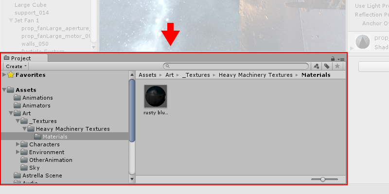
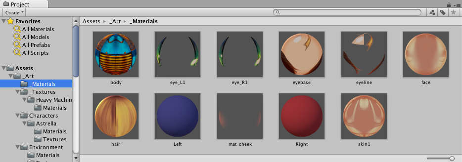

#Project 窗口

 

在此视图中，可访问和管理属于项目的资源。

 

浏览器的左侧面板将项目的文件夹结构显示为层级列表。通过单击从列表中选择文件夹时，文件夹内容将显示在右侧面板中。可单击小三角形来展开或折叠文件夹，显示文件夹包含的任何嵌套文件夹。单击时按住 Alt 键将以递归方式展开或折叠所有嵌套文件夹。

各个资源在右侧面板中显示为图标，这些图标指示了资源的类型（脚本、材质、子文件夹等）。可使用面板底部的滑动条调整图标大小；如果滑动条移动到最左侧，这些图标将替换为层级列表视图。滑动条左侧的空白位置显示当前选定项，包括该项的完整路径（如果正在执行搜索）。

项目结构列表上方是 **Favorites** 部分，可在其中保存常用项以方便访问。可将所需项从项目结构列表拖动到 Favourites 部分，也可在此处保存搜索查询结果（请参阅下面的**搜索**）。

面板上方是一个“痕迹导航路径”，显示当前正在查看的文件夹的路径。可单击此路径的单独元素，以便围绕文件夹层级视图轻松导航。搜索时，此栏会更改为显示正在搜索的区域（根 Assets 文件夹、所选文件夹或 Asset Store）以及 Asset Store 中可用的免费和付费资源计数（以斜线分隔）。Unity 的 Preferences 窗口的 _General_ 部分中有一个选项可禁止显示 Asset Store 命中计数（如果不需要）。

沿窗口顶部边缘的是浏览器的工具栏。

 

位于工具栏左侧的 __Create__ 菜单允许将新资源和子文件夹添加到当前文件夹。右侧的一组工具用于搜索项目中的资源。

Window 菜单提供了切换到 Project 视图单列版本（基本上就是没有图标视图的层级结构列表）的选项。该菜单旁边的锁图标允许使用与 Inspector 锁类似的方式“冻结”视图的当前内容（即阻止其他地方的事件更改这些内容）。

##搜索

浏览器具有强大的搜索功能，对于在大型或不熟悉的项目中查找资源特别有用。基本搜索将根据搜索框中输入的文本过滤资源

 

如果输入多个搜索词，则搜索范围会缩小，因此如果输入 _coastal scene_，只会查找名称中同时包含“coastal”和“scene”的资源（即，搜索词通过 AND 逻辑结合）。

搜索栏右侧有三个按钮。第一个按钮可根据资源类型进一步过滤搜索到的资源。

 

继续向右的下一个按钮根据资源标签来过滤资源（可在 [Inspector](UsingTheInspector.html) 中为资源设置标签）。由于标签的数量可能非常庞大，因此标签菜单有自己的迷你搜索过滤框。

 

请注意，这些过滤条件的工作原理是在搜索文本中添加额外的搜索词。以“t:”开头的搜索词按指定的资源类型进行过滤，而“l:”按标签过滤。如果知道要查找的具体内容，可直接在搜索框中输入这些搜索词，无需使用菜单。一次可搜索多个类型或标签。添加几个类型将使搜索扩展以便包括所有指定的类型（即，多个类型通过 OR 逻辑结合）。添加多个标签会将搜索范围缩小到具有所有指定标签的项（即，多个标签通过 AND 逻辑结合）。

 

最右边的按钮通过将项添加到资源列表的 Favourites 部分来保存搜索。

###搜索 Asset Store

Project Browser 的搜索也可应用于 Unity __Asset Store__ 中可用的资源。如果从痕迹导航栏的菜单中选择 __Asset Store__，则会显示 Asset Store 中与查询匹配的所有免费和付费资源。按类型和标签搜索的工作方式与 Unity 项目相同。首先根据资源名称检查搜索查询词，然后按顺序检查资源包名称、资源包标签和资源包描述（因此，名称中包含搜索词的项的排名将高于资源包描述中包含该搜索词的项）。

 

如果从列表中选择一项，该项的详细信息将显示在 Inspector 中，同时还提供购买和/或下载选项。有些资源类型在此部分中提供了预览，因此可以在购买前旋转 3D 模型。Inspector 还提供了一个选项允许在常规 Asset Store 窗口中查看资源以了解更多详细信息。

##快捷键

当浏览器视图获得焦点时，可使用以下键盘快捷键。请注意，其中一些快捷键仅在视图使用双列布局时才起作用（可使用右上角的面板菜单在单列和双列布局之间切换）。

| | |
|:---|:---|
|**F** |定格所选项（即，在包含文件夹中显示所选资源） |
|**Tab** |在第一列和第二列之间移动焦点（两列）|
|**Ctrl/Cmd + F** |聚焦搜索字段|
|**Ctrl/Cmd + A** |选择列表中的所有可见项|
|**Ctrl/Cmd + D** |复制所选资源|
|**Delete** |删除并显示对话框 (Win)|
|**Delete + Shift** |删除而不显示对话框 (Win)|
|**Delete + Cmd** |删除而不显示对话框 (OSX)|
|**Enter** |开始重命名所选项 (OSX)|
|**Cmd + 向下箭头** |打开所选资源 (OSX)|
|**Cmd + 向上箭头** |跳转到父文件夹（OSX，两列）|
|**F2** |开始重命名所选项 (Win)|
|**Enter** |打开所选资源 (Win)|
|**Backspace** |跳转到父文件夹（Win，两列）|
|**向右箭头** |展开所选项（树视图和搜索结果）。如果该项已展开，则将选择其第一个子项。 |
|**向左箭头** |折叠所选项（树视图和搜索结果）。如果该项已折叠，则将选择其父项。 |
|**Alt + 向右箭头** |将资源显示为预览时展开项 |
|**Alt + 向左箭头** |将资源显示为预览时折叠项 |
