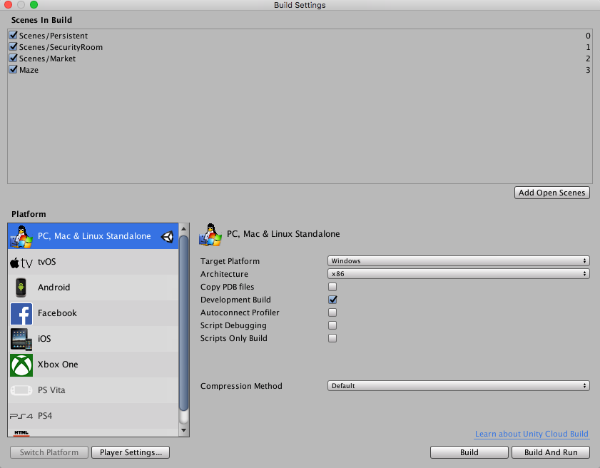

#发布构建

在创建游戏的任何时候，都可能希望看到游戏在 Editor 之外独立构建和运行时的外观。本部分将介绍如何访问 __Build Settings__ 以及如何创建不同版本的游戏。

应通过 __File__ &gt; __Build Settings...__ 菜单项访问 Build Settings 窗口。此时会弹出一个可编辑的场景列表，这些场景将在构建游戏时包含在其中。

第一次在项目中查看此窗口时，它将显示为空白。如果在此列表为空白时构建游戏，则只有当前打开的场景才会包含在构建中。如果希望快速构建只有一个场景文件的测试播放器，只需构建一个带有空白场景列表的播放器即可。

可以轻松将场景文件添加到列表中来进行多场景构建。有两种方式可以添加场景文件。第一种方式是单击 __Add Open Scenes__ 按钮。此时将看到当前打开的场景出现在列表中。添加场景文件的第二种方式是将它们从 __Project 视图__拖到列表中。

此时，请注意每个场景都有不同的索引值。__Scene 0__ 是构建游戏时将加载的第一个场景。如果要加载新场景，请在脚本中使用 [SceneManager.LoadScene](../ScriptReference/SceneManagement.SceneManager.LoadScene.html)。

如果添加了多个场景文件并想要重新排列它们，只需在列表中单击场景并上下拖动，直到按所需顺序排列它们为止。

如果要从列表中删除场景，请单击场景以使其突出显示，然后按 __Command-Delete__。该场景将从列表中消失，不会包含在构建中。

当准备好发布构建时，请选择 __Platform__ 并确保平台旁边出现 Unity 徽标；如果没有，请单击 __Switch Platform__ 按钮让 Unity 知道您的目标构建平台。最后，按 __Build__ 按钮。随后可使用标准的 Save 对话框为游戏选择名称和位置。单击 __Save__ 时，Unity 便会立即构建游戏。就是这么简单。如果不确定要将构建的游戏保存到何处，请考虑将其保存到项目根文件夹中。不能将构建保存到 Assets 文件夹中。

在播放器上启用 __Development Build__ 复选框将启用[性能分析器 (Profiler)](ProfilerWindow.html) 功能，并提供 Autoconnect Profiler 和 Script Debugging 选项。

有关 Build Settings 窗口的更多信息，请参阅 [Build Settings](BuildSettings.html) 页面。

##构建独立平台播放器

使用 Unity 可为 Windows、Mac 和 Linux 构建独立应用程序。只需在 Build Settings 对话框中选择构建目标，然后点击“Build”按钮即可。
构建独立平台播放器时，生成的文件将根据构建目标而有所不同。如果是 Windows 构建目标，则会构建可执行文件 (.exe) 以及包含应用程序所有资源的 Data 文件夹。如果是 Mac 构建目标，则会构建一个应用程序捆绑包，其中包含运行应用程序所需的文件以及资源。

在 Mac 上分发独立版其实就是提供应用程序捆绑包（所有内容都包含在此包中）。在 Windows 上，则需要提供 .exe 文件和 Data 文件夹以供其他人运行。可以这样想：就像 Unity 为您构建的结果文件一样，其他人也必须在他们的计算机上拥有相同的文件，这样才能运行您的游戏。

##构建过程详解

构建过程将在指定的任何位置放置构建的游戏应用程序的空白副本。然后，对构建设置中的场景列表进行处理，在 Editor 中逐个打开场景，对场景进行优化，然后将场景集成到应用程序包中。此外，还会计算这些场景所需的所有资源，并将这些数据存储在应用程序包中的单独文件内。

* 场景中使用“EditorOnly”标记的所有__游戏对象__都不会包含在发布的构建中。这些游戏对象对于调试脚本非常有用，但不需要包含在最终游戏中。

* 加载新关卡时，前一关卡中的所有对象都将被销毁。要阻止此行为，请对不希望销毁的对象使用 [DontDestroyOnLoad()](../ScriptReference/Object.DontDestroyOnLoad.html)。此功能最常用于在加载关卡时保持音乐播放，或者供游戏控制器脚本用于保持游戏状态和进度。

* 使用 [SceneManager.sceneLoaded](../ScriptReference/SceneManagement.SceneManager-sceneLoaded.html) 可定义在加载新关卡后发送给所有激活状态游戏对象的消息。

* 有关创建具有多个场景的游戏的更多信息，请参阅我们的[教程](http://unity3d.com/learn/tutorials/modules)。

##预加载

发布的构建会在场景加载时自动预加载场景中的所有资源。此规则的例外是 Scene 0。这是因为第一个场景通常是一个启动画面，所以希望尽快显示它。

要确保预加载所有内容，可创建一个调用 __Application.LoadLevel(1)__ 的空场景。在构建设置中，使此空场景的索引为 0。所有后续关卡都将进行预加载。

##现在准备好构建游戏了

到目前为止，已经学习了如何使用 Unity 的界面、如何使用资源、如何创建场景以及如何发布构建。所以，尽情制作自己梦想的游戏吧！在此过程中肯定还需要学习更多知识，我们乐意随时为您提供帮助。

要了解有关构建游戏关卡的更多信息，请参阅关于[创建场景](CreatingScenes.html)的部分。

要了解有关脚本的更多信息，请参阅[脚本部分](ScriptingSection.html)。

要了解有关创建艺术资源和导入资源的更多信息，请参阅本手册的[资源工作流程](AssetWorkflow.html)。

如需在 Unity 用户和开发人员社区中进行交流，请访问 [Unity Forums](http://forum.unity3d.com)。在论坛中可以提问，分享项目，建立团队，做想做的任何事情。至少务必访问一次论坛，可展示自己制作的游戏，或寻求其他开发人员的支持。
