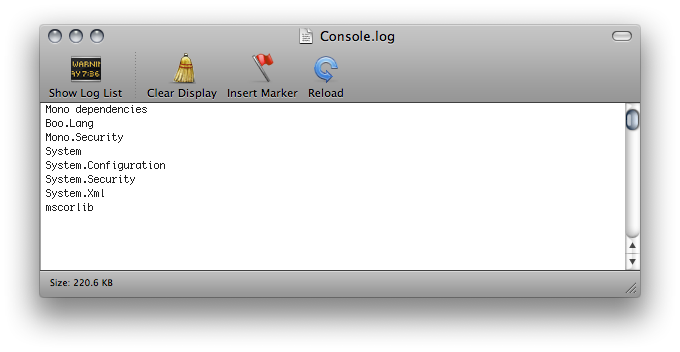

#减小构建的文件大小

将构建的应用程序的文件大小保持在最低限度非常重要，尤其是对于移动设备或施加了大小限制的应用商店而言。减小大小的第一步是确定哪些资源对最终大小的影响最大，因为这些资源最有可能是需要优化的目标。执行构建后，可在 Editor 日志中找到此信息。选择 Console 窗口（菜单：__Window__ &lt; __Console__），单击右上角的小下拉选单面板，然后选择 __Open Editor Log__。

Editor 日志提供按类型细分的资源摘要，然后按大小比例顺序列出所有各个资源。通常，纹理 (Textures)、声音 (Sounds) 和动画 (Animations) 等内容占用的空间最多，而脚本 (Scripts)、关卡 (Levels) 和着色器 (Shaders) 一般影响最小。列表中显示的__文件标头 (File headers)__ 不是资源，实际上是添加到“原始”资源文件的额外数据，用于存储引用和设置。这些标头通常与资源大小差别很小，但如果在 Resources 文件夹中有许多大型资源，则该值可能会很大。

Editor 日志有助于识别可能要删除或优化的资源，但在开始之前应考虑以下事项：

* Unity 将导入的资源重新编码为其自己的内部格式，因此源资源类型的选择不是相关因素。例如，如果项目中有一个多层 Photoshop 纹理，在构建之前将其展平并压缩。将纹理导出为 .png 文件对构建大小没有任何影响，因此应该坚持使用在开发过程中最方便的格式。

* Unity 在构建期间会剥离大多数未使用的资源，因此无法通过从项目中手动删除资源来获得任何优化效果。唯一不会删除的资源是脚本（但无论如何，这些脚本通常都非常小）和 Resources 文件夹中的资源（因为 Unity 无法确定哪些是需要的，而哪些不是）。考虑到这一点，应确保 Resources 文件夹中的所有资源都是游戏所必需的资源。也许可以使用 [AssetBundle](AssetBundlesIntro.html) 替换 Resources 文件夹中的资源；这样一来，Unity 就会动态加载资源，从而减小播放器大小。

##关于减小构建大小的建议

###纹理

纹理通常在构建中占据最多空间。第一个解决方案是使用压缩的纹理格式。请参阅有关[特定于平台的纹理压缩](class-TextureImporterOverride.html)的文档以了解更多信息。

如果这样做不足以减小文件大小，请尝试减小纹理图像的物理大小（以像素为单位）。若要在不修改实际源内容的情况下执行此操作，请在 Project 视图中选择该纹理，然后在 Inspector 窗口中减小 __Max Size__。要查看纹理在游戏中的外观，请放大使用该纹理的游戏对象，然后调整 __Max Size__，直至该纹理在 Scene 视图中的外观开始变差。更改最大纹理大小不会影响纹理资源，只会影响纹理在游戏中的分辨率。

默认情况下，Unity 在导入时会压缩所有纹理。要在 Editor 中加快工作流程，请选择 __Unity__ &lt; __Preferences__ 并取消选中 __Compress Assets on Import__ 的复选框。无论此设置如何，所有纹理都会在构建中进行压缩。

###网格和动画

可以压缩[网格](class-Mesh.html)和导入的动画剪辑，使它们在游戏文件中占用较少的空间。要启用网格压缩，请选择网格，然后在 Inspector 窗口中将 __Mesh Compression__ 设置为 __Low__、__Medium__ 或 __High__。网格和动画压缩使用量化技术，这意味着占用更少的空间，但压缩可能会带来一定程度的不准确性。请针对具体模型尝试找到可接受的压缩程度。

请注意，网格压缩只是生成较小的数据文件，在运行时不会减少使用的内存。减少动画关键帧会生成较小的数据文件，并会在运行时减少使用的内存；通常应始终启用该功能。请参阅有关[动画剪辑](class-AnimationClip.html)的文档以了解与此相关的更多信息。

###DLL

默认情况下，Unity 在构建的播放器中仅包含以下 DLL：

* mscorlib.dll

* Boo.Lang.dll

* UnityScript.Lang.dll

* UnityEngine.dll

构建播放器时，应避免依赖 *System.dll* 和 *System.Xml.dll*。默认情况下，Unity 不会在构建的播放器中包含这些文件，但如果使用了它们的类，则会包含它们。这些 DLL 将为播放器的存储大小增加大约 1 兆字节。如果需要在游戏中解析 XML，可使用诸如 [Mono.Xml.zip](https://docs.unity3d.com/550/Documentation/uploads/Examples/Mono.Xml.zip) 之类较小的库来替代系统库。大多数通用容器都包含在 mscorlib 中，只有堆栈和极少内容位于 System.dll 中，所以如果可能，应避免使用它们。

### 减小移动端 .NET 库大小

Unity 对某些移动设备支持两个 .NET API 兼容性级别：.NET 2.0 和 .NET 2.0 的子集。请在 [Player Settings](class-PlayerSettings.html) 中为构建选择适当的兼容性级别。

.NET 2.0 API 配置文件与完整的 .NET 2.0 API 类似。大多数库例程都是完全实现的，因此该选项提供了与预先存在的 .NET 代码之间的最佳兼容性。但是，对于许多游戏，并不需要完整的库，而多余的代码会占用宝贵的内存空间。

为了避免浪费内存，Unity 还支持 .NET 2.0 Subset API 配置文件。此配置文件与 Mono“monotouch”配置文件非常相似，因此“monotouch”配置文件的许多局限性也适用于 Unity 的 .NET 2.0 Subset 配置文件。有关更多信息，请参阅 Mono Project 关于 [MonoTouch 局限性](http://www.mono-project.com/archived/monotouchlimitations/)的文档。游戏中不常用的许多库例程都不在此配置文件中，因此可节省内存。但是，这也意味着依赖于这些例程的代码将无法正常工作。此方案可能是一种有用的优化，但应检查现有代码在应用此方案后是否仍然有效。
