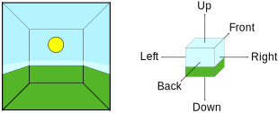

#反射探针

CG 电影和动画通常具有高度逼真的反射，这对于实现场景对象之间的“连通性”感觉是很重要的。然而，这些反射的准确性伴随着处理器时间的高成本，虽然这对于电影来说不是问题，但它在实时游戏中严重限制了对反射对象的使用。

传统上，游戏使用一种称为_反射贴图_的技术来模拟来自对象的反射，同时将处理开销保持在可接受的水平。此技术假定场景中的所有反射对象都可以“看到”（因此会反射）完全相同的周围环境。如果游戏的主角（比如闪亮的汽车）处于开放空间中，此技术将非常有效，但是当角色进入不同的周围环境时，便看起来不真实；如果一辆汽车驶入隧道但天空仍然在窗户上产生明显反射，看起来就很奇怪。

Unity 通过使用__反射探针__改进了基本反射贴图，这种探针可在场景中的关键点对视觉环境进行采样。通常情况下，应将这些探针放置在反射对象外观发生明显变化的每个点上（例如，隧道、建筑物附近区域和地面颜色变化的地方）。当反射对象靠近探针时，探针采样的反射可用于对象的反射贴图。此外，当几个探针位于彼此附近时，Unity 可在它们之间进行插值，从而实现反射的逐渐变化。因此，使用反射探针可以产生非常逼真的反射，同时将处理开销控制在可接受的水平。

##反射探针的工作原理

场景中某个点的视觉环境可由[立方体贴图](class-Cubemap.html)表示。立方体贴图在概念上很像一个在内部表面绘有六个方向（上、下、左、右、前、后）平面图像的盒子。

为了让对象显示反射，其着色器必须能够访问表示立方体贴图的图像。对象表面的每个点都可在表面朝向的方向（即表面法向矢量的方向）上“看到”立方体贴图的一小块区域。着色器在此处使用立方体贴图的颜色来计算对象表面应该是什么颜色；镜面材质可能会准确反射颜色，而闪亮的汽车可能会略微褪色和着色。

如上所述，传统的反射贴图仅使用单个立方体贴图来表示整个场景的周围环境。立方体贴图可由美术师绘制，也可通过从场景中的一个点进行六次“快照”（每个立方体面对应一次快照）获得。反射探针在这方面进行了改进，允许您在场景中设置许多预定义的点，在这些位置点可创建立方体贴图快照。因此，您可以在场景中存在明显不同反射的任何位置点记录周围视图。

除了视点之外，探针还有一个由场景中的不可见盒体形状定义的效果区域。在探针区域内通过的反射对象的反射立方体贴图由该探针临时提供。当对象从一个区域移动到另一个区域时，立方体贴图会相应改变。

