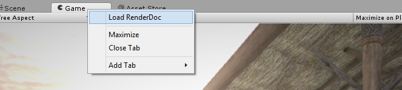
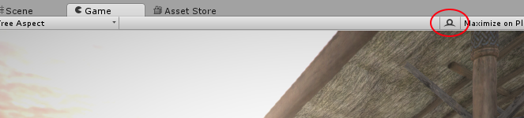
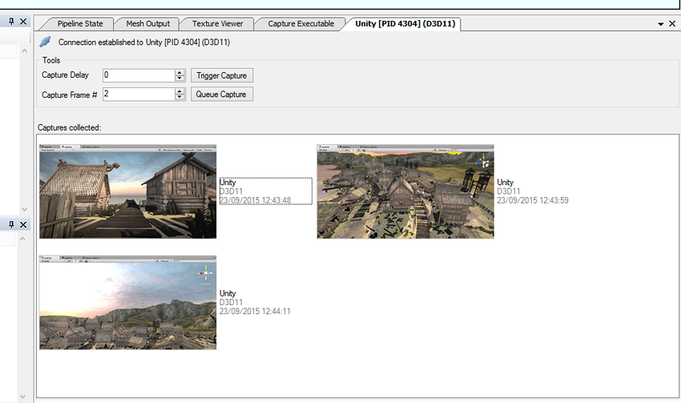

RenderDoc 集成
===============================================

Editor 支持启动集成的 [RenderDoc](https://github.com/baldurk/renderdoc) 图形调试器并进行捕获，从而进行详细的帧自检和调试。

只支持集成 RenderDoc 版本 0.26 或更高版本，因此如果当前安装的是早期版本，至少需要更新至版本 0.26。

**注意：**虽然集成仅在 Editor 中可用，但很有可能无需在独立平台播放器构建中进行额外设置，即可正常使用 RenderDoc。

**注意：**仅当 Unity 在 RenderDoc 支持的平台和 API 上运行时才能捕获帧；在撰写此文时仅支持 Windows 以及 DirectX 11 或 OpenGL Core 配置文件。如果正在使用其他 API，则会暂时禁用 RenderDoc 集成，直到启用支持的 API 为止。

## 加载 RenderDoc

如果检测到 RenderDoc 安装，则在加载 Editor 之后的任何时间，均可右键单击 [Game 视图](GameView.html)或 [Scene 视图](UsingTheSceneView.html)的选项卡，然后单击“Load RenderDoc”选项。这样就会重新加载图形设备，因此必须保存所有更改，但随后 RenderDoc 将可以直接捕获而无需重新启动 Editor 或构建独立平台播放器。

**注意：**也可以照常通过 RenderDoc 启动 Editor，或者传递 -load-renderdoc 命令行选项以从启动中加载 RenderDoc。

## 使用 RenderDoc 捕获帧

当检测到兼容版本的 RenderDoc 加载到 Editor 中时，Game 和 Scene 视图上的工具栏右侧会出现一个新按钮。

按此按钮将触发捕获视图的下一帧渲染。如果尚未打开 RenderDoc 工具 UI，则会启动一个新实例来显示捕获，如果已在运行，则最新的捕获将自动显示在其中。从此处可以使用该工具打开捕获结果并进行调试。

## 包含着色器调试信息

默认情况下，为了优化 DirectX11 着色器的大小，会删除调试信息。这意味着，常量和资源将没有名称，并且着色器源代码将不可用。要在着色器中包含此调试信息，请在着色器的 CGPROGRAM 代码块中包含 **#pragma enable_d3d11_debug_symbols**。

## 备用图形调试技术

如果使用 D3D11 来构建独立平台播放器，则可使用 [Visual Studio 图形调试器](SL-DebuggingD3D11ShadersWithVS.html) 捕获帧并进行调试。
