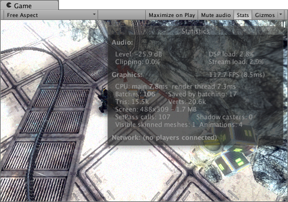

渲染 Statistics 窗口
===========================

__Game 视图__的右上角有一个 __Stats__ 按钮。按下此按钮时将显示一个覆盖窗口，其中显示实时渲染统计信息，这对于优化性能非常有用。显示的具体统计信息根据构建目标而有所不同。

Statistics 窗口包含以下信息：

| | |
|:---|:---|
|__Time per frame and FPS__ |处理和渲染一个游戏帧所花费的时间（及其倒数，即每秒帧数）。请注意，此数字仅包括进行帧更新和渲染 Game 视图所用的时间；不包括在 Editor 中绘制 Scene 视图、检视面板处理和其他仅限于 Editor 的处理所花费的时间。 |
|__Batches__ | “批处理 (Batching)”可让引擎尝试将多个对象的渲染组合到一个内存块中以便减少由于资源切换而导致的 CPU 开销。 |
|__Saved by batching__ | 合并的批次数。为确保良好的批处理，应尽可能在不同对象之间共享材质。更改渲染状态会将批次分成具有相同状态的组。 |
|__Tris__ 和 __Verts__ |绘制的三角形和顶点的数量。在[针对低端硬件进行优化](OptimizingGraphicsPerformance.html)时，这一点非常重要 |
|__Screen__ |屏幕大小以及抗锯齿级别和内存使用情况。 | 
|__SetPass__ |渲染 pass 的数量。每个 pass 都需要 Unity 运行时绑定一个新的着色器，这可能会带来 CPU 开销。 |
|__Visible Skinned Meshes__ |渲染的蒙皮网格的数量。 |
|__Animations__ |播放的动画的数量。 |

另请参阅 [Profiler 窗口的 Rendering 部分](ProfilerRendering.html)，了解这些统计信息更详细和完整的版本。

