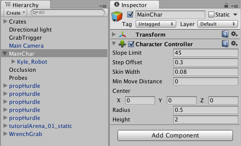
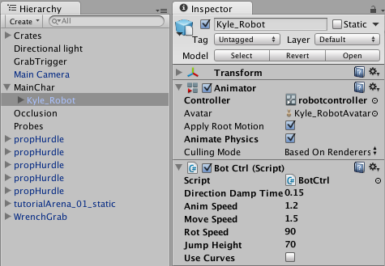
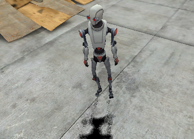
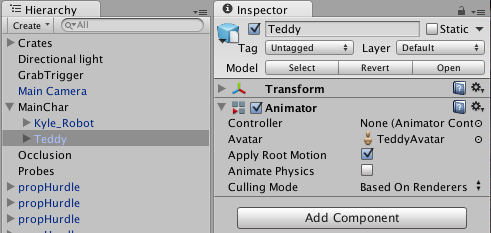
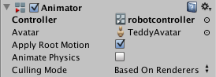
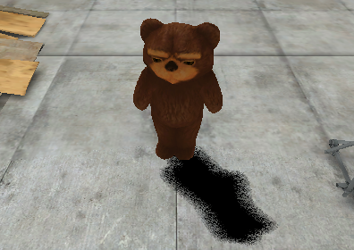

重定向人形动画
==================================

Mecanim 的最强大功能之一是重定向人形动画。这意味着您可以相对轻松地将同一组动画应用于各种角色模型。重定向只适用于已配置了 Avatar 的人形模型，因为这可以让我们在模型的骨骼结构之间建立对应关系。

建议的层级视图结构
-------------------------------

使用 Mecanim 动画时，您可以期望场景包含以下元素：

* 已导入的具有  Avatar 的角色模型。
* 引用 Animator Controller 资源的 Animator 组件。
* 从 Animator Controller 引用的一组动画剪辑。
* 角色的脚本。
* 角色相关组件，例如角色控制器。

项目还应包含具备有效  Avatar 的另一个角色模型。

如果对术语有疑问，请参考[动画术语表](AnimationGlossary.html)

建议的设置是：

* 在层级视图中，创建包含角色相关组件的游戏对象

 

* 将模型作为游戏对象的子代与 Animator 组件放在一起

 

* 确保引用 Animator 的脚本正在寻找子代（而不是根）中的 Animator；使用 GetComponentInChildren&lt;Animator&gt;() 而不是 GetComponent&lt;Animator&gt;()。

 

然后，为了在另一个模型上复用相同动画，您需要：

* 禁用原始模型
* 将所需模型作为游戏对象的另一子代拖入

 

* 确保新模型的 Animator Controller 属性正在引用同一控制器资源

 

* 调整顶级游戏对象上的角色控制器、变换和其他属性以确保动画与新模型顺利融合。
* 任务完成！

 

