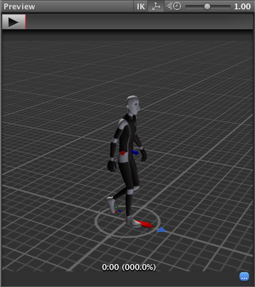

根运动 - 工作原理
==========================

身体变换
--------------

身体变换是角色的质心。它用于 Mecanim 的重定向引擎，并提供最稳定的移位模型。身体方向是相对于 Avatar T 形姿势的下身和上身方向的平均值。

身体变换和方向存储在__动画剪辑__中（使用 Avatar 中设置的[肌肉定义](MuscleDefinitions.html)）。它们是__动画剪辑__中存储的唯一世界空间曲线。所有其他：肌肉曲线和 IK（反向动力学）目标（手和脚）都是相对于身体变换进行存储的。

根变换
--------------

根变换是身体变换在 Y 平面上的投影，并在运行时计算。在每一帧都会计算根变换的变化。变换的此变化随后应用于游戏对象以使其移动。

动画剪辑检视面板 (Animation Clip Inspector)
------------------------

动画剪辑编辑器设置 - __Root Transform Rotation__、__Root Transform Position (Y)__ 和__Root Transform Position (XZ)__ - 可让您从身体变换控制根变换的投影。根据这些设置，身体变换的某些部分可能会转移到根变换。例如，您可以决定是否希望运动 Y 位置成为根运动（轨迹）的一部分或姿势（身体变换）的一部分（称为 __Baked into Pose__）。

 

Root Transform Rotation
-----------------------

__Bake into Pose__：方向将保持在身体变换（或姿势）上。根方向将是常量，增量方向将是标识。这意味着游戏对象根本不会被__动画剪辑 (AnimationClip)__ 旋转。

只有具有相似的开始和停止根方向的动画剪辑才应使用此选项。您将在 UI 上看到绿色指示灯，表示__动画剪辑__是合理的候选项。合适候选项将是直走或奔跑。

__Based Upon__：此选项用于设置剪辑的方向。使用 __Body Orientation__ 会将剪辑定向以跟随身体的向前矢量。此默认设置适用于大多数动作捕捉 (Mocap) 数据（如行走、奔跑和跳跃），但是对于诸如扫射一样的运动（此类情况下，运动垂直于身体的向前矢量），此设置将会失败。在这些情况下，可使用 __Offset__ 设置来手动调整方向。最后还可选择 __Original__ 设置，此设置会自动添加位于导入的剪辑中的创作偏移量。此设置通常与关键帧数据一起使用以遵循美术师设定的方向。

__Offset__：为 __Based Upon__ 选择该选项时用于输入偏移量。

Root Transform Position (Y)
---------------------------

此部分涉及的概念与 Root Transform Rotation 部分所述的概念相同。

__Bake Into Pose__：运动的 Y 分量将保留在身体变换（姿势）上。根变换的 Y 分量将是常量，增量根位置 Y 将为 0。这意味着此剪辑不会更改游戏对象高度。您再次看到绿色指示灯，表示剪辑是将 Y 运动烘焙到姿势中的合理候选项。

大多数__动画剪辑__将启用此设置。只有会改变__游戏对象__高度的剪辑才应该将此设置关闭，比如向上跳或向下跳。

注意：`Animator.gravityWeight` 通过 Bake Into Pose 位置 Y 驱动。启用时，如果 `disabled = 0`，则 `gravityWeight = 1`。在状态之间过渡时会为剪辑混合 __gravityWeight__。

__Based Upon__：与 __Root Transform Rotation__ 的情况相似，可选择 __Original__ 或 __Mass Center (Body)__。此外还有一个 __Feet__ 选项对于会改变高度的__动画剪辑__（禁用 __Bake Into Pose__）而言非常方便。使用 __Feet__ 时，对于所有帧，Root Transform Position Y 将与位置最低的脚 Y 匹配。因此，混合点始终保持在脚周围，从而防止在混合或过渡时发生浮动问题。

__Offset__：与 __Root Transform Rotation__ 的情况相似，可利用 __Offset__ 设置来手动调整__动画剪辑__高度。

Root Transform Position (XZ)
----------------------------

同样，此部分涉及的概念与 __Root Transform Rotation__ 和 __Root Motion Position (Y)__ 部分所述的概念相同。

__Bake Into Pose__ 通常用于“空闲”状态，此情况您会希望将增量位置 (XZ) 强制设置为 0。此选项将阻止多次评估后小增量漂移发生积累。对于 __Based Upon__ 设置为 __Original__ 的关键帧剪辑，此选项还可强制使用美术师设置的创作位置。

循环姿势 (Loop Pose)
---------

循环姿势（类似于混合树或过渡中的姿势混合）发生在根变换的引用中。计算根变换后，姿势变为相对于根变换。计算开始帧和停止帧之间的相对姿势差，并分布于 0-100% 的剪辑范围内。

通用根运动和循环姿势
---------------------------------

工作原理与人形根运动基本相同，但不使用身体变换来计算/投射根变换，而是使用__根节点__中设置的变换。姿势（在根运动骨骼下变换的所有骨骼）都是相对于根变换创建的。
