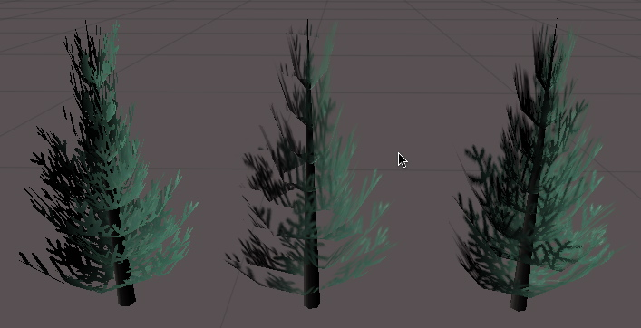

#ShaderLab：旧版 Alpha 测试

Alpha 测试是拒绝将像素写入屏幕的最后机会。

***注意：**使用[片元程序](SL-ShaderPrograms.html)时，AlphaTest 命令无效；在大多数平台上，使用 HLSL clip() 函数在着色器中完成 Alpha 测试。建议现在使用可编程着色器，而不是 SetTexture 命令。*


在计算出最终输出颜色之后，颜色可选择性地将其 Alpha 值与固定值进行比较。如果测试失败，则不会将像素写入显示屏。


##语法

````
AlphaTest Off
````
渲染所有像素（默认值），或者...

````
AlphaTest comparison AlphaValue
````
设置 Alpha 测试以仅渲染 Alpha 值在特定范围内的像素。


###Comparison
Comparison 是以下词语之一：

| | |
|:---|:---|
|**Greater** |仅渲染 Alpha 大于 _AlphaValue_ 的像素。 |
|**GEqual** |仅渲染 Alpha 大于或等于 _AlphaValue_ 的像素。 |
|**Less** |仅渲染 Alpha 值小于 _AlphaValue_ 的像素。 |
|**LEqual** |仅渲染 Alpha 值小于或等于 _AlphaValue_ 的像素。 |
|**Equal** |仅渲染 Alpha 值等于 _AlphaValue_ 的像素。 |
|**NotEqual** |仅渲染 Alpha 值不等于 _AlphaValue_ 的像素。 |
|**Always** |渲染所有像素。这在功能上等同于 _AlphaTest Off_。 |
|**Never** |不渲染任何像素。 |

###AlphaValue
一个介于 0 到 1 之间的浮点数。这也可以是 float 或 range 属性的变量引用，在这种情况下，应使用标准方括号表示法 (_[VariableName]_) 来编写。


##详细信息

在渲染具有透明部分的凹面对象时，Alpha 测试很重要。显卡将保留写入屏幕的每个像素的深度记录。如果新像素比已经渲染的像素更远，则新像素不会写入显示屏。这意味着即使是使用[混合](SL-Blend.html)，对象也不会穿透显示。


 

在此图中，左侧的树是使用 **AlphaTest** 渲染的。请注意其中的像素是完全透明还是不透明。中间的树是仅使用 **Alpha 混合**渲染的；注意由于深度缓冲区的原因，附近树枝的透明部分如何覆盖远处的树叶。右侧的树是使用最后一个示例着色器渲染的；它实现了混合和 Alpha 测试的组合，可隐藏所有瑕疵。


##示例

以下是最简单的示例，为其指定带有 Alpha 通道的纹理。仅当 Alpha 大于 0.5 时，该对象才可见


````
Shader "Simple Alpha Test" {
	Properties {
		_MainTex ("Base (RGB) Transparency (A)", 2D) = "" {}
	}
	SubShader {
		Pass {
			// 仅渲染 Alpha 大于 50% 的像素
			AlphaTest Greater 0.5
			SetTexture [_MainTex] { combine texture }
		}
	}
}
````

只有光秃秃一棵树并不好看。让我们添加一些光照并使剔除值可调整：


````
Shader "Cutoff Alpha" {
	Properties {
		_MainTex ("Base (RGB) Transparency (A)", 2D) = "" {}
		_Cutoff ("Alpha cutoff", Range (0,1)) = 0.5
	}
	SubShader {
		Pass {
			// 使用上面定义的 Cutoff 参数确定
			// 要渲染的内容。
			AlphaTest Greater [_Cutoff]
			Material {
				Diffuse (1,1,1,1)
				Ambient (1,1,1,1)
			}
			Lighting On
			SetTexture [_MainTex] { combine texture * primary }
		}
	}
}
````


渲染植物和树木时，许多游戏都具有 Alpha 测试常见的硬边。解决这个问题的方法是将对象渲染两次。在第一个通道中，我们使用 Alpha 测试仅渲染不透明度超过 50％ 的像素。在第二个通道中，我们将图形在被剪切的部分中进行 Alpha 混合，但不记录像素的深度。随着更远的树枝覆盖附近的树枝，我们可能会有点混淆，但在实践中，很难遇到这种情况，因为树叶中有很多视觉细节。


````
Shader "Vegetation" {
	Properties {
		_Color ("Main Color", Color) = (.5, .5, .5, .5)
		_MainTex ("Base (RGB) Alpha (A)", 2D) = "white" {}
		_Cutoff ("Base Alpha cutoff", Range (0,.9)) = .5
	}
	SubShader {
		// 设置基本光照
		Material {
			Diffuse [_Color]
			Ambient [_Color]
		}
		Lighting On

		// 渲染正面和背面多边形。
		Cull Off

		// 第一个通道：
		// 渲染所有超过 [_Cutoff] 不透明度的像素
		Pass {
			AlphaTest Greater [_Cutoff]
			SetTexture [_MainTex] {
				combine texture * primary, texture
			}
		}

		// 第二个通道：
		// 渲染半透明细节。
		Pass {
			// 不要写入深度缓冲区
			ZWrite off
			// 不要写入我们已经写入的像素。
			ZTest Less
			// 仅渲染小于或等于该值的像素
			AlphaTest LEqual [_Cutoff]

			// 设置 Alpha 混合
			Blend SrcAlpha OneMinusSrcAlpha

			SetTexture [_MainTex] {
				combine texture * primary, texture
			}
		}
	}
}
````

请注意，我们在 SubShader 中进行设置，而不是在个别通道中。SubShader 中设置的任何状态都将作为默认值继承到着色器内的通道中。
