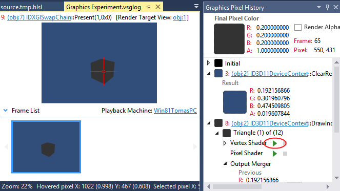

使用 Visual Studio 来调试 DirectX 11 着色器
===============================================

在 Visual Studio 2012 中，Microsoft 引入了图形调试器，可用于从 Unity Editor、Windows 独立平台或通用 Windows 平台等平台捕获帧。

建议使用 Visual Studio 2013，因为它包含几个适用于图形调试器的修订。

**注意：**Unity Editor 中包含多个子窗口，这可能会导致图形调试器从不正确的窗口捕获帧，为了确保捕获正确的窗口，选中“Maximize on Play”选项卡，然后在捕获前点击 Play 按钮，但即便如此也无法保证将捕获正确的窗口，这就是为什么不建议使用 Unity Editor 来捕获帧的原因。

**注意：**只有 Unity 在 DirectX 11 下运行时才能捕获帧，您可以从 Player Settings (PC, Mac & LinuxStandalone) > Other Settings 中选择 DirectX 11。


从 Unity Editor 或 Windows 独立平台中捕获帧的步骤：

 * 启动 Visual Studio 2013
 * 选择 File > New > Project > Visual C++ > Empty Project
 * 选择 Project > Properties > Configuration Properties > Debugging
 * 在 **Command** 字段中，将 $(TargetPath) 替换为 Unity Editor 或 Windows 独立平台的路径，例如 C:\MyApp\MyApp.exe
 *（可选）在 **Command Arguments** 中，指定 **-force-d3d11**，这将强制 Windows 独立平台或 Unity Editor 在 DirectX 11 下运行
 * 
 * 现在已准备好运行图形调试器，请选择 Debug > Graphics > Start Diagnostics
 * 如果全部配置都正确，在应用程序的左上角应该看到以下消息：“Use 'Print Screen' key to capture a frame”。请参阅以下截屏。
 * 

调试 DirectX 11 着色器的步骤：

 * 要调试着色器，必须使用调试符号进行编译，为此，必须插入 **#pragma enable_d3d11_debug_symbols**
 * 我们来尝试创建一个基本示例：
    * 创建一个新的 Unity 项目
    * 在 Assets 窗口中创建一个新的着色器
    * 插入 **#pragma enable_d3d11_debug_symbols**
    * 创建新材质并选择自定义着色器
    * 为某个对象（例如，立方体）分配材质
    * 构建 Windows 独立平台应用程序
    * 使用上述步骤来捕获帧
  
着色器应如下所示：

````
Shader "Custom/NewShader" {
	Properties {
		_MainTex ("Base (RGB)", 2D) = "white" {}
	}
	SubShader {
		Tags { "RenderType"="Opaque" }
		LOD 200
		
		CGPROGRAM
		#pragma surface surf Lambert
		#pragma enable_d3d11_debug_symbols
		sampler2D _MainTex;

		struct Input {
			float2 uv_MainTex;
		};

		void surf (Input IN, inout SurfaceOutput o) {
			half4 c = tex2D (_MainTex, IN.uv_MainTex);
			o.Albedo = c.rgb;
			o.Alpha = c.a;
		}
		ENDCG
	} 
	FallBack "Diffuse"
}

````

如果正确执行了所有操作，应看到以下捕获的帧，右键单击并选择 **Pixel History**，然后选择分配了自定义着色器的对象的像素。



单击 **Vertex Shader** 旁边的 **Play** 按钮（以上截屏中用红色圈出），应该能够调试顶点着色器。


### 通用 Windows 平台

对于通用 Windows 平台，这更容易一些，因为 Unity 已经创建了项目，所以不需要创建虚拟 Visual Studio 项目。

捕获帧和进行着色器调试的步骤与 Unity Editor 或 Windows 独立平台的步骤相同。

## 备用着色器调试技术

在 Unity Editor 中，还可使用 [RenderDoc](RenderDocIntegration.html) 来调试着色器，方法是在 Editor 中捕获场景并在独立工具中进行调试。
