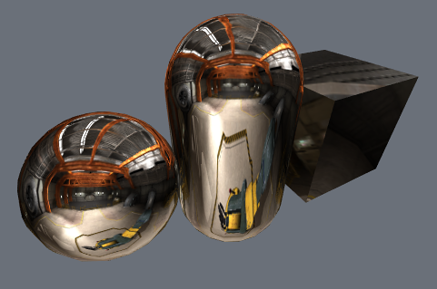
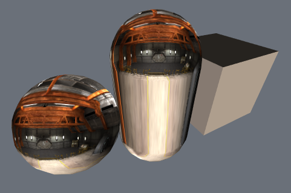
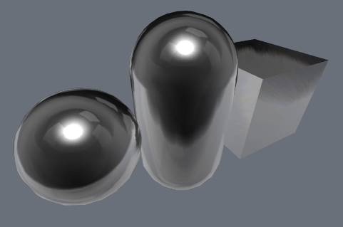

# 在着色器中实现固定函数 TexGen

在 Unity 5 之前，[纹理属性](SL-Properties.html)可以将选项括在
花括号代码块中，例如 `TexGen CubeReflect`。这些纹理属性用于控制固定函数
纹理坐标的生成。Unity 5.0 中删除了此功能；如果现在需要 
texgen，应编写一个[顶点着色器](SL-ShaderPrograms.html)来代替。

本页面显示了如何实现 Unity 4 中的每种固定函数 TexGen 模式。


## 立方体贴图反射 (TexGen CubeReflect)

`TexGen CubeReflect` 通常用于简单的[立方体贴图](class-Cubemap.html)反射。
它反映了视图空间中沿法线的视图方向，并将其用作 UV 
坐标。

 


````
Shader "TexGen/CubeReflect" {
Properties {
    _Cube ("Cubemap", Cube) = "" { /* used to be TexGen CubeReflect */ }
}
SubShader { 
	Pass { 
        CGPROGRAM
        #pragma vertex vert
        #pragma fragment frag
        #include "UnityCG.cginc"
        
        struct v2f {
            float4 pos : SV_POSITION;
            float3 uv : TEXCOORD0;
        };

        v2f vert (float4 v : POSITION, float3 n : NORMAL)
        {
            v2f o;
            o.pos = UnityObjectToClipPos(v);

            // TexGen CubeReflect：
            // 反映视图空间中沿法线的
            // 视图方向
            float3 viewDir = normalize(ObjSpaceViewDir(v));
            o.uv = reflect(-viewDir, n);
            o.uv = mul(UNITY_MATRIX_MV, float4(o.uv,0));
            return o;
        }

        samplerCUBE _Cube;
        half4 frag (v2f i) : SV_Target
        {
            return texCUBE(_Cube, i.uv);
        }
        ENDCG 
    } 
}
}
````

## 立方体贴图法线 (TexGen CubeNormal)

`TexGen CubeNormal` 通常也与[立方体贴图](class-Cubemap.html)一起使用。
它使用视图空间法线作为 UV 坐标。

 

````
Shader "TexGen/CubeNormal" {
Properties {
    _Cube ("Cubemap", Cube) = "" { /* used to be TexGen CubeNormal */ }
}
SubShader { 
    Pass { 
        CGPROGRAM
        #pragma vertex vert
        #pragma fragment frag
        #include "UnityCG.cginc"
        
        struct v2f {
            float4 pos : SV_POSITION;
            float3 uv : TEXCOORD0;
        };

        v2f vert (float4 v : POSITION, float3 n : NORMAL)
        {
            v2f o;
            o.pos = UnityObjectToClipPos(v);

            // TexGen CubeNormal：
            // 使用对象的视图空间法线
            o.uv = mul((float3x3)UNITY_MATRIX_IT_MV, n);
            return o;
        }

        samplerCUBE _Cube;
        half4 frag (v2f i) : SV_Target
        {
            return texCUBE(_Cube, i.uv);
        }
        ENDCG 
    } 
}
}
````

## 对象空间坐标 (TexGen ObjectLinear)

`TexGen ObjectLinear` 使用了对象空间顶点位置作为 UV 坐标。

 

````
Shader "TexGen/ObjectLinear" {
Properties {
    _MainTex ("Texture", 2D) = "" { /* used to be TexGen ObjectLinear */ }
}
SubShader { 
    Pass { 
        CGPROGRAM
        #pragma vertex vert
        #pragma fragment frag
        #include "UnityCG.cginc"
        
        struct v2f {
            float4 pos : SV_POSITION;
            float3 uv : TEXCOORD0;
        };

        v2f vert (float4 v : POSITION)
        {
            v2f o;
            o.pos = UnityObjectToClipPos(v);

            // TexGen ObjectLinear：
            // 使用对象空间顶点位置
            o.uv = v.xyz;
            return o;
        }

        sampler2D _MainTex;
        half4 frag (v2f i) : SV_Target
        {
            return tex2D(_MainTex, i.uv.xy);
        }
        ENDCG 
    } 
}
}
````

## 视图空间坐标 (TexGen EyeLinear)

`TexGen EyeLinear` 使用了视图空间顶点位置作为 UV 坐标。

 

````
Shader "TexGen/EyeLinear" {
Properties {
    _MainTex ("Texture", 2D) = "" { /* used to be TexGen EyeLinear */ }
}
SubShader { 
    Pass { 
        CGPROGRAM
        #pragma vertex vert
        #pragma fragment frag
        #include "UnityCG.cginc"
        
        struct v2f {
            float4 pos : SV_POSITION;
            float3 uv : TEXCOORD0;
        };

        v2f vert (float4 v : POSITION)
        {
            v2f o;
            o.pos = UnityObjectToClipPos(v);

            // TexGen EyeLinear：
            // 使用视图空间顶点位置
            o.uv = UnityObjectToViewPos(v);
            return o;
        }

        sampler2D _MainTex;
        half4 frag (v2f i) : SV_Target
        {
            return tex2D(_MainTex, i.uv.xy);
        }
        ENDCG 
    } 
}
}
````


## 球形环境贴图 (TexGen SphereMap)

`TexGen SphereMap` 计算球形环境贴图的 UV 坐标。
请参阅 [OpenGL TexGen 参考](http://docs.gl/gl2/glTexGen)以了解公式。

 


````
Shader "TexGen/SphereMap" {
Properties {
    _MainTex ("Texture", 2D) = "" { /* used to be TexGen SphereMap */ }
}
SubShader { 
    Pass { 
        CGPROGRAM
        #pragma vertex vert
        #pragma fragment frag
        #include "UnityCG.cginc"
        
        struct v2f {
            float4 pos : SV_POSITION;
            float2 uv : TEXCOORD0;
        };

        v2f vert (float4 v : POSITION, float3 n : NORMAL)
        {
            v2f o;
            o.pos = UnityObjectToClipPos(v);

            // TexGen SphereMap
            float3 viewDir = normalize(ObjSpaceViewDir(v));
            float3 r = reflect(-viewDir, n);
            r = mul((float3x3)UNITY_MATRIX_MV, r);
            r.z += 1;
            float m = 2 * length(r);
            o.uv = r.xy / m + 0.5;

            return o;
        }

        sampler2D _MainTex;
        half4 frag (v2f i) : SV_Target
        {
            return tex2D(_MainTex, i.uv);
        }
        ENDCG 
    } 
}
}
````
