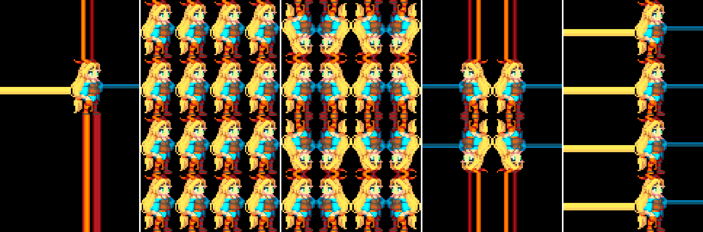

# 使用采样器状态


## 耦合的纹理和采样器

大多数情况下，在着色器中采样纹理时，纹理采样状态应来自[纹理设置](class-TextureImporter.html)；本质上，纹理和采样器会耦合在一起。使用 DX9 风格的着色器语法时，这是默认行为：

```
sampler2D _MainTex;
// ...
half4 color = tex2D(_MainTex, uv);
```

使用 HLSL 关键字 sampler2D、sampler3D 和 samplerCUBE 可声明纹理和采样器。

大部分情况下，这是您想要的结果，而且在较旧的图形 API (OpenGL ES) 中，这是唯一受支持的选项。

## 单独的纹理和采样器

很多图形 API 和 GPU 都允许使用的采样器数量少于纹理，而耦合的纹理+采样器语法可能不允许编写更复杂的着色器。例如，Direct3D 11 允许在单个着色器中最多使用 128 个纹理，但最多仅允许使用 16 个采样器。

Unity 允许使用 DX11 风格的 HLSL 语法来声明纹理和采样器，但需要通过一个特殊的命名约定来让它们匹配：名称为“sampler”+TextureName 格式的采样器将从该纹理中获取采样状态。

以上部分中的着色器代码片段可以用 DX11 风格的 HLSL 语法重写，并且也会执行相同的操作：

```
Texture2D _MainTex;
SamplerState sampler_MainTex; //“sampler”+“_MainTex”
// ...
half4 color = _MainTex.Sample(sampler_MainTex, uv);
```

但这样一来，就可以编写着色器来重复使用其他纹理中的采样器，同时采样多个纹理。在以下示例中，采样了三个纹理，但仅一个采样器用于所有这些纹理：

```
Texture2D _MainTex;
Texture2D _SecondTex;
Texture2D _ThirdTex;
SamplerState sampler_MainTex; //“sampler”+“_MainTex”
// ...
half4 color = _MainTex.Sample(sampler_MainTex, uv);
color += _SecondTex.Sample(sampler_MainTex, uv);
color += _ThirdTex.Sample(sampler_MainTex, uv);
```

但是请注意，DX11 风格的 HLSL 语法在某些较旧的平台（例如，OpenGL ES 2.0）上无效，请参阅[着色语言](SL-ShadingLanguage.html)以了解详细信息。您可能希望指定 `#pragma target 3.5`（请参阅[着色器编译目标](SL-ShaderCompileTargets.html)）以避免较旧的平台使用着色器。

Unity 提供了一些着色器宏帮助您使用这种“单独采样器”方法来声明和采样纹理，请参阅[内置宏](SL-BuiltinMacros.html)。以上示例可以采用所述的宏重写为下列形式：

```
UNITY_DECLARE_TEX2D(_MainTex);
UNITY_DECLARE_TEX2D_NOSAMPLER(_SecondTex);
UNITY_DECLARE_TEX2D_NOSAMPLER(_ThirdTex);
// ...
half4 color = UNITY_SAMPLE_TEX2D(_MainTex, uv);
color += UNITY_SAMPLE_TEX2D_SAMPLER(_SecondTex, _MainTex, uv);
color += UNITY_SAMPLE_TEX2D_SAMPLER(_ThirdTex, _MainTex, uv);
```

以上代码将在 Unity 支持的所有平台上进行编译，但会在 DX9 等旧平台上回退到使用三个采样器。

## 内联采样器状态

除了能识别名为“sampler”+TextureName 的 HLSL SamplerState 对象，Unity 还能识别采样器名称中的某些其他模式。这对于直接在着色器中声明简单硬编码采样状态很有用。例如：

```
Texture2D _MainTex;
SamplerState my_point_clamp_sampler;
// ...
half4 color = _MainTex.Sample(my_point_clamp_sampler, uv);
```

名称 “my_point_clamp_sampler”将被识别为应该使用点（距离最近）纹理过滤和钳制纹理包裹模式的采样器。

采样器名称被识别为“内联”采样器状态（全都不区分大小写）：

*“Point”、“Linear”或“Trilinear”（必需）设置纹理过滤模式。

*“Clamp”、“Repeat”、“Mirror”或“MirrorOnce”（必需）设置纹理包裹模式。

    * 可根据每个轴 (UVW) 来指定包裹模式，例如“ClampU_RepeatV”。

*“Compare”（可选）设置用于深度比较的采样器；与 HLSL SamplerComparisonState 类型和 SampleCmp/SampleCmpLevelZero 函数配合使用。

以下是分别使用 `sampler_linear_repeat` 和 `sampler_point_repeat` 采样器状态进行纹理采样的示例，说明了如何通过名称控制过滤模式：

 

以下是分别使用 `SmpClampPoint`、`SmpRepeatPoint`、`SmpMirrorPoint`、`SmpMirrorOncePoint` 和 `Smp_ClampU_RepeatV_Point` 采样器状态的示例，说明了如何通过名称控制包裹模式。在上一个示例中，为水平轴 (U) 和垂直轴 (V) 设置了不同的包裹模式。在任何情况下，纹理坐标的范围都是从 -2.0 到 +2.0。

 

就像单独的纹理+采样器语法一样，某些平台不支持内联采样器状态。目前在 Direct3D 11/12、PS4、XboxOne 和 Metal 上实现了内联采样器状态。

请注意，大部分移动端 GPU/API 上不支持“MirrorOnce”纹理包裹模式，并将在不支持的情况下回退到 Mirror 模式。
<br/>
<br/>

---
*  <span class="page-edit">2017-06-01  Page published with no [editorial review](DocumentationEditorialReview.html)
</span>

* <span class="page-history">[2017.1](https://docs.unity3d.com/2017.1/Documentation/Manual/30_search.html?q=newin20171) 中的新功能 <span class="search-words">NewIn20171</span></span>
