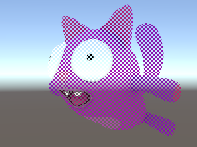

# 着色器语义

编写 HLSL [着色器程序](SL-ShaderPrograms.html)时，
输入和输出变量需要通过**语义**来表明
其“意图”。这是 HLSL 着色器语言中的
标准概念；请参阅 [MSDN 上的语义 (Semantics) 文档](https://msdn.microsoft.com/en-us/library/windows/desktop/bb509647.aspx)以了解更多详细信息。

*可在[此处](../uploads/Examples/UnityShaderDocExamples.zip)下载以下显示的示例（以 Unity 项目压缩包的形式提供）。*

## 顶点着色器输入语义

主顶点着色器函数（由 `#pragma vertex`
指令表示）需要在所有输入参数上都有语义。
这些对应于各个[网格](class-Mesh.html)数据元素，如顶点位置、法线网格和纹理坐标。
有关更多详细信息，请参阅[顶点程序输入](SL-VertexProgramInputs.html)。

以下是一个简单的顶点着色器的示例，它采用顶点位置
和纹理坐标作为输入。像素着色器
将纹理坐标可视化为颜色。

```
Shader "Unlit/Show UVs"
{
    SubShader
    {
        Pass
        {
            CGPROGRAM
            #pragma vertex vert
            #pragma fragment frag

            struct v2f {
                float2 uv : TEXCOORD0;
                float4 pos : SV_POSITION;
            };

            v2f vert (
                float4 vertex : POSITION, // 顶点位置输入
                float2 uv : TEXCOORD0 // 第一个纹理坐标输入
                )
            {
                v2f o;
                o.pos = UnityObjectToClipPos(vertex);
                o.uv = uv;
                return o;
            }
            
            fixed4 frag (v2f i) : SV_Target
            {
                return fixed4(i.uv, 0, 0);
            }
            ENDCG
        }
    }
}
```

 

不必逐个拼写出所有的每个输入，
可以声明一个输入结构，并在该结构的
每个单独成员变量上指示语义。
请参阅[着色器程序示例](SL-VertexFragmentShaderExamples.html)
以了解如何执行此操作。


## 片元着色器输出语义

通常，片元（像素）着色器会输出颜色，并具有
`SV_Target` 语义。上面示例中的片元着色器
完全就是这样的：

```
fixed4 frag (v2f i) : SV_Target
```

函数 `frag` 的返回类型为 `fixed4`（低精度
RGBA 颜色）。因为它只返回一个值，所以语义
由函数自身指示`: SV_Target`。

也可以返回包含输出的结构。
上面的片元着色器也可以按如下所示重写，
功能完全相同：

```
struct fragOutput {
    fixed4 color : SV_Target;
};            
fragOutput frag (v2f i)
{
    fragOutput o;
    o.color = fixed4(i.uv, 0, 0);
    return o;
}
```

从片元着色器返回结构对于不止返回单个颜色的
着色器非常有用。片元着色器
输出支持的其他语义如下。

#### SV_TargetN：多个渲染目标

`SV_Target1`、`SV_Target2` 等等：这些是着色器写入的附加颜色。这在一次渲染到多个渲染目标（称为“多渲染目标”渲染技术，简称 MRT）时使用。`SV_Target0` 等同于 `SV_Target`。

#### SV_Depth：像素着色器深度输出

通常情况下，
片元着色器不会覆盖 Z 缓冲区值，并使用
常规三角形栅格化中的默认值。但是，
对于某些效果，输出每个像素的自定义 Z 缓冲区深度值很有用。

请注意，在许多 GPU 上，这会关闭一些深度缓冲区优化，因此如果没有充分的理由，请不要覆盖 Z 缓冲区值。`SV_Depth` 产生的成本取决于 GPU 架构，但总体上与 Alpha 测试（使用 HLSL 中的内置 `clip()` 函数）的成本非常相似。通过渲染着色器在所有常规不透明着色器之后修改深度（例如，使用 `AlphaTest` [渲染队列](SL-SubShaderTags.html)）。

深度输出值必须为单个 `float`。


## 顶点着色器输出和片元着色器输入

顶点着色器需要输出顶点的最终裁剪空间位置，以便 GPU 知道屏幕上的栅格化位置以及深度。此输出需要具有 `SV_POSITION` 语义，并为 `float4` 类型。

顶点着色器生成的所有其他输出（“插值器”或“变化”）都是您的特定着色器需要的。从顶点着色器输出的值将在渲染三角形的面上进行插值，并且每个像素的值将作为输入传递给片元着色器。

许多现代 GPU 并不真正关心这些变量的语义；然而，一些旧系统（最主要的是 Direct3D 9 上的着色器模型 2 GPU）存在关于语义的特殊规则：

* `TEXCOORD0`、`TEXCOORD1` 等语义用于指示任意高精度数据，如纹理坐标和位置。
* 顶点输出和片元输入的 `COLOR0` 和 `COLOR1` 语义用于低精度 0 到 1 范围的数据（如简单的颜色值）。

为了获得最佳的跨平台支持，应将顶点输出和
片元输入标记为 `TEXCOORDn` 语义。

请参阅[着色器程序示例](SL-VertexFragmentShaderExamples.html)
以查看示例。


#### 插值器数量限制

对于总共可以使用多少个插值器变量将信息
从顶点传递到片元着色器，存在一些限制。该限制
取决于平台和 GPU，一般准则如下：

* **最多 8 个插值器：**OpenGL ES 2.0 (iOS/Android)、Direct3D 11 9.x 级别
 (Windows Phone) 和 Direct3 9 着色器模型 2.0（老旧 PC）。由于插值器
数量受到限制，但每个插值器可以是一个 4 分量矢量，
所以一些着色器将内容打包在一起以便不会超过限制。例如，两个纹理
坐标可以在一个 `float4` 变量中传递（.xy 表示一个坐标，.zw
 表示第二个坐标）。
* **最多 10 个插值器**：Direct3D 9 着色器模型 3.0 (`#pragma target 3.0`)。
* **最多 16 个插值器**：OpenGL ES 3.0 (iOS/Android) 和 Metal (iOS)。
* **最多 32 个插值器**：Direct3D 10 着色器模型 4.0 (`#pragma target 4.0`)。

无论特定目标硬件如何，出于性能原因，通常最好使用尽可能少的插值器。


## 其他特殊语义

#### 屏幕空间像素位置：VPOS

片元着色器可以接收渲染为特殊 `VPOS` 语义的像素的位置。
此功能仅从着色器模型 3.0 开始存在，因此着色器需要具有 `#pragma target 3.0` 编译指令。

在不同的平台上，屏幕空间位置输入的基础类型会有所不同，因此为了获得最大的可移植性，请对其使用 `UNITY_VPOS_TYPE` 类型（在大多数平台上将是 `float4`，在 Direct3D 9 上将是 float2）。

另外，使用像素位置语义将导致难以让裁剪空间位置 (SV_POSITION) 和 VPOS 处于相同的顶点到片元结构中。因此顶点着色器应将裁剪空间位置输出为单独的“out”变量。请参阅以下示例着色器：

```
Shader "Unlit/Screen Position"
{
    Properties
    {
        _MainTex ("Texture", 2D) = "white" {}
    }
    SubShader
    {
        Pass
        {
            CGPROGRAM
            #pragma vertex vert
            #pragma fragment frag
            #pragma target 3.0

            // 注意：此结构中没有 SV_POSITION
            struct v2f {
                float2 uv : TEXCOORD0;
            };

            v2f vert (
                float4 vertex : POSITION, // 顶点位置输入
                float2 uv : TEXCOORD0, // 纹理坐标输入
                out float4 outpos : SV_POSITION // 裁剪空间位置输出
                )
            {
                v2f o;
                o.uv = uv;
                outpos = UnityObjectToClipPos(vertex);
                return o;
            }

            sampler2D _MainTex;

            fixed4 frag (v2f i, UNITY_VPOS_TYPE screenPos : VPOS) : SV_Target
            {
                // screenPos.xy 将包含像素整数坐标。
                // 使用它们来实现一个跳过渲染 4x4 像素块的
                // 棋盘图案

                // 棋盘图案中 4x4 像素块的 checker 值
                // 为负
                screenPos.xy = floor(screenPos.xy * 0.25) * 0.5;
                float checker = -frac(screenPos.r + screenPos.g);

                // 如果值为负，则 clip HLSL 指令停止渲染像素
                clip(checker);

                // 对于保留的像素，读取纹理并将其输出
                fixed4 c = tex2D (_MainTex, i.uv);
                return c;
            }
            ENDCG
        }
    }
}
```

 


#### 面对方向：VFACE

片元着色器可以接收一种指示渲染表面是面向摄像机还是背对摄像机的变量。这在渲染应从两侧可见的几何体时非常有用 - 通常用于树叶和类似的薄型物体。`VFACE` 语义输入变量将包含表示正面三角形的正值，以及表示背面三角形的负值。

此功能从着色器模型 3.0 开始才存在，因此着色器需要具有 `#pragma target 3.0` 编译指令。

```
Shader "Unlit/Face Orientation"
{
    Properties
    {
        _ColorFront ("Front Color", Color) = (1,0.7,0.7,1)
        _ColorBack ("Back Color", Color) = (0.7,1,0.7,1)
    }
    SubShader
    {
        Pass
        {
            Cull Off // 关闭背面剔除

            CGPROGRAM
            #pragma vertex vert
            #pragma fragment frag
            #pragma target 3.0

            float4 vert (float4 vertex : POSITION) : SV_POSITION
            {
                return UnityObjectToClipPos(vertex);
            }

            fixed4 _ColorFront;
            fixed4 _ColorBack;

            fixed4 frag (fixed facing : VFACE) : SV_Target
            {
                // 正面的 VFACE 输入为正，
                // 背面的为负。根据这种情况
                // 输出两种颜色中的一种。
                return facing > 0 ?_ColorFront : _ColorBack;
            }
            ENDCG
        }
    }
}
```

上面的着色器使用 [Cull](SL-CullAndDepth.html) 状态来关闭背面剔除（默认情况下，根本不会渲染背面三角形）。以下是应用于一组四边形网格（以不同的方向旋转）的着色器：

 


#### 顶点 ID：SV_VertexID

顶点着色器可以接收具有“顶点编号”（为无符号整数）的变量。当您想要从纹理或 [ComputeBuffer](ComputeShaders.html) 中
获取额外的每顶点数据时，这非常有用。

此功能从 DX10（着色器模型 4.0）和 GLCore/OpenGL ES 3 开始才存在，因此着色器需要具有 `#pragma target 3.5` 编译指令。

```
Shader "Unlit/VertexID"
{
    SubShader
    {
        Pass
        {
            CGPROGRAM
            #pragma vertex vert
            #pragma fragment frag
            #pragma target 3.5

            struct v2f {
	fixed4 color : TEXCOORD0;
                float4 pos : SV_POSITION;
            };

            v2f vert (
                float4 vertex : POSITION, // 顶点位置输入
                uint vid : SV_VertexID // 顶点 ID，必须为 uint
                )
            {
                v2f o;
                o.pos = UnityObjectToClipPos(vertex);
                // 基于顶点 ID 输出时髦颜色
                float f = (float)vid;
                o.color = half4(sin(f/10),sin(f/100),sin(f/1000),0) * 0.5 + 0.5;
                return o;
            }

            fixed4 frag (v2f i) : SV_Target
            {
	return i.color;
            }
            ENDCG
        }
    }
}
```


 

*（可在[此处](../uploads/Examples/UnityShaderDocExamples.zip)下载上文中显示的示例（以 Unity 项目压缩包的形式提供））*
